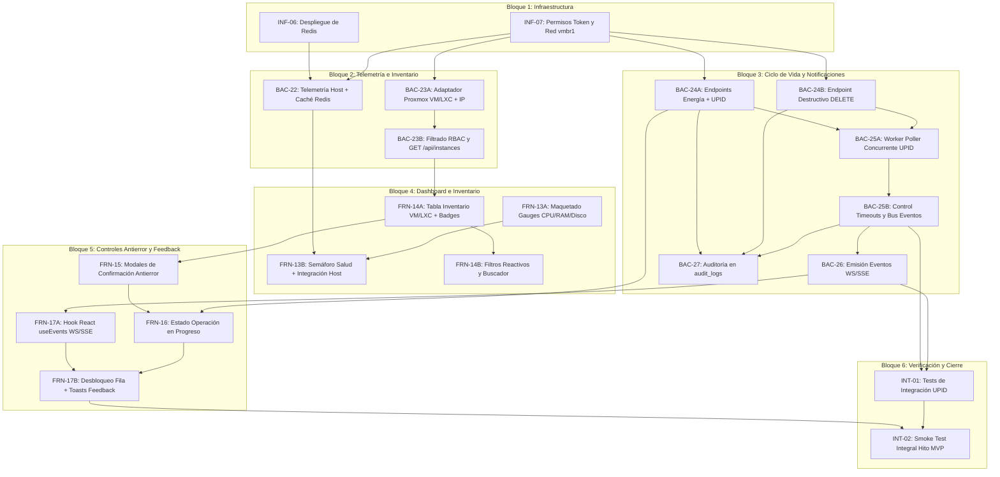

# Etapa 1: Core Operativo de Proxmox y MVP

> **Estado:** Planificada (Desglose optimizado a tareas $\le$ 2.5 h)  
> **Dependencia previa:** Cierre de etapa base (`actual.md`, `futuro.md`, `terminado.md` con hito `LOGIN-04` aprobado e infraestructura base operativa).  
> **Requerimientos cubiertos:** `RF-02` (Dashboard Host), `RF-03` (Inventario completo), `RF-04` (Ciclo de Vida con UPID) y `RF-11` parcial (notificación en tiempo real de fin de tarea).

---

## 1. Criterio de Planificación y Decisiones de Arquitectura

1. **Regla de Granularidad ($\le$ 3 h):** Ninguna tarea supera las 2.5 horas de estimación. Cada ítem tiene una responsabilidad técnica única (separando capa de datos, lógica de negocio y capa visual) para evitar bloqueos, fatiga cognitiva y permitir entregas continuas en ClickUp.
2. **Premisa de Nodo Fijo:** Esta etapa opera asumiendo un **único nodo Proxmox VE fijo** configurado por variables de entorno. El soporte multi-nodo (`RNF-07`) queda fuera del MVP.
3. **Exclusiones Explícitas:**
   - `RF-12` (organizaciones / multi-tenant) permanece descartado. Ninguna tabla o payload debe incluir `organization_id`.
   - La consola web remota (SSH, noVNC, xterm.js) queda excluida por motivos de seguridad operacional.
   - Métricas históricas (`RF-05`), aprovisionamiento (`RF-07`) y snapshots (`RF-06`) corresponden a las Etapas 2 y 3.
4. **Caché Compartida (Redis):** La telemetría del nodo (`GET /api/node/status`) consulta `/nodes/{node}/status` en Proxmox VE. Los datos se almacenan en Redis con un TTL corto (5 a 10 segundos) para no saturar al hipervisor y permitir escalabilidad horizontal del backend.
5. **Reutilización de Cimientos Base:**
   - **Auditoría (`BAC-18`):** Toda acción de ciclo de vida y borrado se persiste en la tabla append-only `audit_logs` con `user_id`, `resource_type`, `resource_id`, `upid` y resultado.
   - **Contrato de Eventos (`BAC-21`):** Las notificaciones de fin de tarea emitidas por el worker de UPID respetan el schema genérico unificado de la etapa base (`TASK_FINISHED`).
6. **Poller de UPID Desacoplado:** El backend responde `HTTP 202 Accepted` de inmediato con el identificador de tarea devuelto por Proxmox y delega el seguimiento a un worker pool concurrente en segundo plano.
7. **Diseño Antierror en Frontend:** Patrón "Operación en progreso": al confirmar una acción, los controles de esa instancia se bloquean con spinner, impidiendo dobles envíos y órdenes conflictivas hasta recibir la confirmación vía WebSocket/SSE.

---

## 2. Mapa de Dependencias de la Etapa 1



---

## 3. Desglose Detallado de Tareas (ClickUp)

### Bloque 1: Infraestructura y Entorno

#### `INF-06` - Despliegue de Redis para caché distribuida
- **Área:** Infraestructura
- **Asignados:** Nico y Lucas
- **Estimación:** 2.0 h
- **Depende de:** `INF-03` e `INF-04` (red interna `vmbr1` operativa).
- **Entregable:** Servicio de Redis incorporado al Docker Compose / contenedor LXC en la red `vmbr1`, configurado con credenciales seguras y variables de entorno documentadas para el backend.
- **Criterio de éxito:** Conexión validada desde el contenedor backend ejecutando `PING`, `SET` con expiración y `GET` contra la instancia de Redis.

#### `INF-07` - Permisos granulares de API Token y conectividad Proxmox
- **Área:** Infraestructura / Backend
- **Asignado:** Nico
- **Estimación:** 2.0 h
- **Depende de:** ninguna.
- **Entregable:** API Token de Proxmox VE con separación de privilegios activa y permisos mínimos requeridos: `Sys.Audit` (telemetría host), `VM.Audit` (lectura de instancias e IPs) y `VM.PowerMgmt` (acciones de energía y tareas). Verificación de resolución DNS y conectividad HTTPS vía `vmbr1`.
- **Criterio de éxito:** Comprobación con `curl` desde el entorno del backend hacia `/nodes/{node}/status` y `/nodes/{node}/qemu` retornando `200 OK` con el token.

---

### Bloque 2: Backend - Telemetría e Inventario Operativo

#### `BAC-22` - Adaptador de telemetría del nodo con caché en Redis (`RF-02`)
- **Área:** Backend
- **Asignada:** Tayra
- **Estimación:** 2.5 h
- **Depende de:** `INF-06`, `INF-07`.
- **Entregable:** Endpoint `GET /api/node/status` consumiendo `/nodes/{node}/status` de Proxmox.
  - Normaliza: porcentaje y cores de CPU, conversión de bytes a GB para RAM y almacenamiento, y uptime en segundos.
  - Almacena el resultado en Redis con TTL de 5 a 10 segundos para blindar a Proxmox ante ráfagas de consultas.
- **Criterio de éxito:** Respuesta en < 50 ms en caso de cache hit; ante expiración consulta Proxmox, actualiza Redis y responde HTTP 200 con payload validado.

#### `BAC-23A` - Adaptador y normalización de inventario Proxmox (QEMU / LXC / IP)
- **Área:** Backend
- **Asignado:** Lisandro
- **Estimación:** 2.5 h
- **Depende de:** `BAC-14` (lectura inicial base), `INF-07`.
- **Entregable:** Servicio en Go que consulta los endpoints de Proxmox `/nodes/{node}/qemu` y `/nodes/{node}/lxc`, unifica ambos tipos en una estructura de datos común y resuelve la IP asignada mediante QEMU Guest Agent o configuración de red LXC.
- **Criterio de éxito:** Función interna que retorna la lista consolidada de instancias; las instancias apagadas o sin Guest Agent devuelven `ip: null` sin generar errores ni demoras excesivas.

#### `BAC-23B` - Filtrado RBAC por recursos y endpoint `GET /api/instances` (`RF-03`)
- **Área:** Backend
- **Asignada:** Tayra
- **Estimación:** 2.0 h
- **Depende de:** `BAC-23A`, `BAC-08` (middleware de permisos por recurso).
- **Entregable:** Endpoint público autenticado `GET /api/instances` que aplica la matriz de control de acceso:
  - Si el rol es `ADMIN`, retorna el 100% de las instancias del host.
  - Si el rol es `OPERATOR`, filtra cruzando contra la tabla `user_instances` y retorna únicamente sus instancias autorizadas.
- **Criterio de éxito:** Un operador autenticado solo puede visualizar sus máquinas asignadas; llamadas no autenticadas devuelven `401` y llamadas sin permisos devuelven lista vacía.

---

### Bloque 3: Backend - Ciclo de Vida Asíncrono, UPID y Notificaciones

#### `BAC-24A` - Endpoints de ciclo de vida con captura de UPID (`RF-04`)
- **Área:** Backend
- **Asignado:** Lisandro
- **Estimación:** 2.5 h
- **Depende de:** `BAC-08`, `BAC-23B`, `INF-07`.
- **Entregable:** Endpoint `POST /api/instances/{id}/status/{action}` (`start`, `shutdown`, `stop`, `reboot`).
  - Valida el permiso del usuario en `user_instances`.
  - Valida el estado previo de la instancia (ej. no enviar `start` a una máquina ya en ejecución).
  - Envía la orden a Proxmox VE, captura el string `UPID` de respuesta y retorna `HTTP 202 Accepted` con `{ "message": "Action accepted", "upid": "UPID:..." }`.
- **Criterio de éxito:** Toda orden autorizada devuelve HTTP 202 con el UPID oficial; un usuario no asignado a la instancia recibe `403 Forbidden` sin que se envíe tráfico a Proxmox.

#### `BAC-24B` - Endpoint de eliminación destructiva `DELETE /api/instances/{id}`
- **Área:** Backend
- **Asignado:** Lisandro
- **Estimación:** 2.0 h
- **Depende de:** `BAC-08`, `BAC-23B`, `INF-07`.
- **Entregable:** Endpoint `DELETE /api/instances/{id}` para destrucción de instancias VM/LXC.
  - Verifica que la instancia se encuentre en estado `stopped` antes de solicitar el borrado en Proxmox (regla del hipervisor).
  - Captura el `UPID` de eliminación y retorna `HTTP 202 Accepted`.
- **Criterio de éxito:** Intento de borrado sobre instancia encendida responde `HTTP 409 Conflict`; sobre instancia detenida envía la orden y devuelve el UPID.

#### `BAC-25A` - Worker pool concurrente de sondeo de UPID
- **Área:** Backend
- **Asignado:** Lisandro
- **Estimación:** 2.5 h
- **Depende de:** `BAC-24A`, `BAC-24B`.
- **Entregable:** Servicio en segundo plano (goroutines + canal de tareas) que recibe los UPIDs despachados y consulta periódicamente `/nodes/{node}/tasks/{upid}/status` en la API de Proxmox hasta que la tarea cambie su estado a `stopped`.
- **Criterio de éxito:** Sondeo no bloqueante que detecta la culminación de tareas de Proxmox en < 2 segundos desde su finalización real.

#### `BAC-25B` - Control de timeouts, reintentos y bus interno de eventos
- **Área:** Backend
- **Asignada:** Tayra
- **Estimación:** 2.0 h
- **Depende de:** `BAC-25A`.
- **Entregable:** Módulo de resiliencia para el worker de UPID:
  - Manejo de timeout máximo configurable (ej. 3 minutos) para evitar tareas huérfanas si Proxmox no responde.
  - Publicación del resultado procesado (`exitstatus: "OK"` o mensaje de error) en el bus interno (canal Go / pubsub) para consumo de `BAC-26` y `BAC-27`.
- **Criterio de éxito:** Tareas colgadas se cancelan con estado de error controlado; el bus interno recibe de forma confiable todos los eventos resueltos.

#### `BAC-26` - Emisión de eventos de fin de tarea vía WebSocket / SSE (`RF-11` parcial)
- **Área:** Backend
- **Asignada:** Tayra
- **Estimación:** 2.5 h
- **Depende de:** `BAC-21` (contrato base de eventos), `BAC-25B`.
- **Entregable:** Canal en tiempo real (`/api/events` vía WebSockets o Server-Sent Events) que escucha el bus interno y emite el payload estructurado de `BAC-21` a los clientes web conectados:
  ```json
  {
    "type": "TASK_FINISHED",
    "severity": "INFO",
    "resource_type": "VM",
    "resource_id": "101",
    "message": "VM 101 started successfully",
    "timestamp": "2026-09-22T01:30:00Z",
    "payload": { "upid": "UPID:...", "action": "start", "exitstatus": "OK" }
  }
  ```
- **Criterio de éxito:** Los clientes conectados reciben el mensaje JSON inmediatamente al terminar la tarea; no se filtran eventos hacia usuarios sin permiso sobre la instancia.

#### `BAC-27` - Auditoría de acciones de ciclo de vida en `audit_logs` (`RF-08`)
- **Área:** Backend
- **Asignada:** Tayra
- **Estimación:** 2.0 h
- **Depende de:** `BAC-18` (tabla append-only `audit_logs`), `BAC-24A`, `BAC-24B`, `BAC-25B`.
- **Entregable:** Registro estricto en la tabla inmutable `audit_logs`:
  - Entrada 1: Registro de la orden despachada (`action`, `user_id`, `resource_id`, `upid`, `status: "PENDING"`).
  - Entrada 2: Registro de resolución final (`status: "SUCCESS"` o `"FAILED"`, `exitstatus`).
- **Criterio de éxito:** Auditoría trazable de cada clic operativo en la base de datos sin requerir migraciones de esquema adicionales.

---

### Bloque 4: Frontend - Vistas del Host e Inventario

#### `FRN-13A` - Maquetado y medidores de recursos del Host (CPU / RAM / Almacenamiento)
- **Área:** Frontend
- **Asignada:** Belinda
- **Estimación:** 2.0 h
- **Depende de:** ninguna (maquetado con mocks de datos).
- **Entregable:** Tarjetas de métricas visuales con Tailwind y componentes de shadcn:
  - Barras / gauges de CPU (% y núcleos).
  - Uso de memoria RAM (GB utilizados vs total).
  - Uso de almacenamiento local (GB / TB utilizados vs total).
- **Criterio de éxito:** Componentes reutilizables y responsive que renderizan correctamente diferentes rangos de valores (0% a 100%) con cambios visuales de color según saturación.

#### `FRN-13B` - Semáforo de salud global e integración con `GET /api/node/status` (`RF-02`)
- **Área:** Frontend
- **Asignada:** Belinda
- **Estimación:** 2.0 h
- **Depende de:** `FRN-13A`, `BAC-22`.
- **Entregable:** Vista principal del Dashboard que conecta los medidores a `GET /api/node/status`:
  - Formateo legible de uptime (días, horas, minutos).
  - Semáforo / Badge de salud global del nodo (`Saludable` en verde, `Advertencia` en amarillo, `Inaccesible` en rojo).
  - Manejo de estados de carga (skeletons) y reintento visual ante desconexión.
- **Criterio de éxito:** Los datos reales del nodo se visualizan en pantalla; si el backend cae, la UI muestra el badge de alerta sin crashear.

#### `FRN-14A` - Tabla interactiva de inventario con badges de estado e IP (`RF-03`)
- **Área:** Frontend
- **Asignada:** Luz
- **Estimación:** 2.5 h
- **Depende de:** `BAC-23B`.
- **Entregable:** Tabla que renderiza el inventario unificado consumiendo `GET /api/instances`:
  - Columnas: ID, Nombre, Tipo (`VM` / `LXC`), Estado (`Running` en verde, `Stopped` en gris/rojo), Dirección IP con botón para copiar al portapapeles y Botonera de acciones.
- **Criterio de éxito:** Renderizado limpio de VMs y LXC en la misma tabla; instancias sin IP muestran indicación clara (`-` o `No detectada`).

#### `FRN-14B` - Filtros reactivos por tipo, estado y buscador dinámico
- **Área:** Frontend
- **Asignada:** Luz
- **Estimación:** 2.0 h
- **Depende de:** `FRN-14A`.
- **Entregable:** Barra de control superior para la tabla de inventario:
  - Input de búsqueda textual en tiempo real (por ID o nombre).
  - Selector de filtro por tipo (Todas, VM, LXC).
  - Selector de filtro por estado (Todas, En ejecución, Detenidas).
  - Contador reactivo de elementos mostrados vs totales.
- **Criterio de éxito:** Filtrado instantáneo en memoria del cliente sin peticiones innecesarias al backend.

---

### Bloque 5: Frontend - Controles de Energía y Gestión de Estados

#### `FRN-15` - Modales de confirmación antierror para acciones operativas
- **Área:** Frontend
- **Asignada:** Belinda
- **Estimación:** 2.5 h
- **Depende de:** `FRN-14A`.
- **Entregable:** Modales de confirmación adaptados según la criticidad de la acción:
  - `Start`: confirmación estándar.
  - `Shutdown` / `Reboot`: modal advirtiendo apagado/reinicio del sistema operativo huésped.
  - `Stop`: modal con advertencia destacada en rojo sobre riesgo de pérdida de datos.
  - `Delete`: modal destructivo que solicita tipear el ID o nombre de la máquina para confirmar.
- **Criterio de éxito:** Ninguna acción se dispara sin pasar por el diálogo modal; cancelar el modal no envía peticiones.

#### `FRN-16` - Máquina de estados "Operación en progreso" por instancia
- **Área:** Frontend
- **Asignado:** Cristian
- **Estimación:** 2.5 h
- **Depende de:** `FRN-14A`, `FRN-15`, `BAC-24A`.
- **Entregable:** Manejo reactivo de estado por fila en la tabla de inventario:
  - Al confirmar en el modal, se dispara la petición y la fila entra en estado `transitioning`.
  - El botón accionado reemplaza su icono por un spinner animado.
  - Se deshabilitan todos los botones de acción de esa máquina específica para evitar dobles órdenes o acciones contradictorias.
- **Criterio de éxito:** Imposible disparar una segunda acción sobre la misma instancia mientras esté ejecutándose una orden previa.

#### `FRN-17A` - Hook de suscripción al canal de eventos en tiempo real
- **Área:** Frontend
- **Asignado:** Cristian
- **Estimación:** 2.0 h
- **Depende de:** `BAC-26`.
- **Entregable:** Hook personalizado en React (`useInstanceEvents` / `useEvents`):
  - Establece y mantiene la conexión SSE o WebSocket hacia `/api/events`.
  - Manejo de reconexión automática con retroceso exponencial.
  - Suscripción y tipado del mensaje bajo el esquema `BAC-21`.
- **Criterio de éxito:** El hook recibe y parsea en la consola los eventos despachados por el backend en tiempo real.

#### `FRN-17B` - Desbloqueo reactivo de instancia y notificación Toast adaptativa
- **Área:** Frontend
- **Asignado:** Cristian
- **Estimación:** 2.0 h
- **Depende de:** `FRN-16`, `FRN-17A`.
- **Entregable:** Integración final del feedback:
  - Al recibir `TASK_FINISHED` correlacionado con una máquina en transición, remueve el estado de bloqueo y spinner.
  - Actualiza el badge visual de estado (`Running` o `Stopped`).
  - Dispara un Toast informativo en verde si la tarea tuvo éxito (`exitstatus: OK`), o un Toast de alerta en rojo con el detalle si falló.
- **Criterio de éxito:** La interfaz actualiza el estado y libera los botones sin requerir que el operador recargue la página (`F5`).

---

### Bloque 6: Integración y Verificación del Hito MVP

#### `INT-01` - Pruebas de integración automatizadas de ciclo de vida y worker UPID
- **Área:** Backend / Testing
- **Asignados:** Tayra y Cristian
- **Estimación:** 2.5 h
- **Depende de:** `BAC-24A`, `BAC-24B`, `BAC-25A`, `BAC-25B`, `BAC-26`, `BAC-27`.
- **Entregable:** Suite de pruebas de integración automáticas que cubra el ciclo completo:
  1. Envío de acción y retorno de UPID con HTTP 202.
  2. Sondeo del worker hasta `exitstatus: OK`.
  3. Despacho del evento por WebSocket con payload de `BAC-21`.
  4. Persistencia inmutable en `audit_logs`.
- **Criterio de éxito:** Suite ejecutable de forma local o en CI pasando al 100% sin dependencias manuales.

#### `INT-02` - Validación integral del Hito MVP Operativo (Smoke Test End-to-End)
- **Área:** Integración / Todo el equipo
- **Asignados:** Equipo completo
- **Estimación:** 2.0 h
- **Depende de:** Todas las tareas anteriores finalizadas.
- **Entregable:** Prueba de aceptación manual de extremo a extremo:
  1. **Login:** Operador inicia sesión con 2FA verificado.
  2. **Dashboard:** Visualiza recursos del host físico en tiempo real.
  3. **Inventario:** Comprueba que solo ve sus instancias autorizadas.
  4. **Ciclo de vida:** Enciende una VM apagada (`Start`), confirma modal, observa spinner y bloqueo.
  5. **Notificación:** Proxmox procesa la tarea, el backend emite el evento, la UI pasa a verde y salta el Toast de éxito.
  6. **Auditoría:** Se valida que la acción figure registrada en `audit_logs`.
- **Criterio de éxito:** Flujo completo sin fallas de consola ni inconsistencias de interfaz.

---

## 4. Resumen de Distribución y Carga de Trabajo

| Tarea | Área | Responsable(s) | Estimación | Dependencias Directas |
|---|---|---|---|---|
| `INF-06` | Infraestructura | Nico, Lucas | 2.0 h | `INF-03`, `INF-04` |
| `INF-07` | Infraestructura | Nico | 2.0 h | Ninguna |
| `BAC-22` | Backend | Tayra | 2.5 h | `INF-06`, `INF-07` |
| `BAC-23A` | Backend | Lisandro | 2.5 h | `BAC-14`, `INF-07` |
| `BAC-23B` | Backend | Tayra | 2.0 h | `BAC-23A`, `BAC-08` |
| `BAC-24A` | Backend | Lisandro | 2.5 h | `BAC-08`, `BAC-23B`, `INF-07` |
| `BAC-24B` | Backend | Lisandro | 2.0 h | `BAC-08`, `BAC-23B`, `INF-07` |
| `BAC-25A` | Backend | Lisandro | 2.5 h | `BAC-24A`, `BAC-24B` |
| `BAC-25B` | Backend | Tayra | 2.0 h | `BAC-25A` |
| `BAC-26` | Backend | Tayra | 2.5 h | `BAC-21`, `BAC-25B` |
| `BAC-27` | Backend | Tayra | 2.0 h | `BAC-18`, `BAC-24A/B`, `BAC-25B` |
| `FRN-13A` | Frontend | Belinda | 2.0 h | Ninguna |
| `FRN-13B` | Frontend | Belinda | 2.0 h | `FRN-13A`, `BAC-22` |
| `FRN-14A` | Frontend | Luz | 2.5 h | `BAC-23B` |
| `FRN-14B` | Frontend | Luz | 2.0 h | `FRN-14A` |
| `FRN-15` | Frontend | Belinda | 2.5 h | `FRN-14A` |
| `FRN-16` | Frontend | Cristian | 2.5 h | `FRN-14A`, `FRN-15`, `BAC-24A` |
| `FRN-17A` | Frontend | Cristian | 2.0 h | `BAC-26` |
| `FRN-17B` | Frontend | Cristian | 2.0 h | `FRN-16`, `FRN-17A` |
| `INT-01` | Testing | Tayra, Cristian | 2.5 h | Bloques 2 y 3 cerrados |
| `INT-02` | Integración | Equipo Completo | 2.0 h | Todas las anteriores |
| **Total** | | | **46.0 h** | **Promedio: 2.19 h / tarea** |
