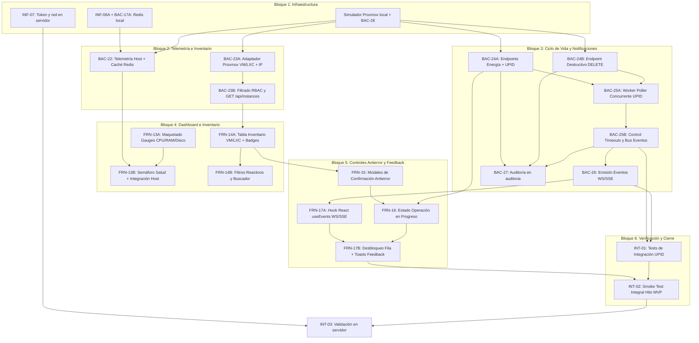

# Etapa 1: Core Operativo de Proxmox y MVP

> **Estado:** Planificada (Desglose optimizado a tareas $\le$ 2.5 h)  
> **Dependencia previa:** Cierre de etapa base (`actual.md`, `futuro.md`, `terminado.md` con hito `LOGIN-04` aprobado e infraestructura base operativa).  
> **Requerimientos cubiertos:** `RF-02` (Dashboard Host), `RF-03` (Inventario completo), `RF-04` (Ciclo de Vida con UPID) y `RF-11` parcial (notificación en tiempo real de fin de tarea).

---

> [!IMPORTANT]
> **Ajustes antes de cargar la Etapa 1 en ClickUp** (del análisis de cierre de la fase base, 26/09/2026; estado al 30/09/2026):
> 1. **Tareas ya resueltas en la fase base:**
>    - `INF-06` (Redis) se dividió en `INF-06A` (Redis local, backend) e `INF-06B` (servidor, infraestructura), las dos en `futuro.md`.
>    - `BAC-23B` ya existe como `GET /api/instances` (`BAC-14`), y su extensión retrocompatible con métricas y `nivelAcceso` es `BAC-21B`.
>    - `BAC-24A` (`/status/:action`) y `BAC-24B` (`DELETE`, solo `ADMIN`, 409 si está encendida) también quedan cubiertas por `BAC-21B`.
>
>    Estas cuatro tareas se toman como verificación de lo hecho, no como desarrollo nuevo.
> 2. **IDs repetidos:** `FRN-13A/B` y `FRN-14A/B` chocan con `FRN-13` (logout) y `FRN-14` (suite de auditoría), que ya están terminadas. Conviene renumerarlas desde `FRN-20` al cargarlas.
> 3. **Nombres de tablas:** las tablas reales son `auditoria`, `tareas_asincronas` y `permisos_instancia`, ya corregidas en este documento.
> 4. **Dependencias que faltaban:**
>    - `FRN-15` y `FRN-16` dependen de `SEC-03` y `FRN-18` (`canOperateInstance`), para mostrar u ocultar botones según el rol y el nivel de acceso.
>    - `BAC-27` depende de `FIX-23`.
> 5. **`INF-07`:** el 29/09/2026 se verificó que el token `centi-api@pve!backend-token` ya tiene `Sys.Audit`, `VM.Audit`, `VM.PowerMgmt`, `VM.Allocate` y `VM.GuestAgent.Audit`. Solo falta documentarlo y confirmar la red.
> 6. **Contrato de errores:** los códigos nuevos (409 por estado inválido, timeout de tarea, Proxmox inaccesible, `INSTANCE_PROTECTED`) se agregan al inventario de `FIX-08` y a Swagger (`RNF-05`) en cada tarea que los introduzca.
> 7. **`RF-11`:** que la notificación enlace al detalle de la instancia queda pospuesto, porque en esta etapa no existe la vista de detalle.

## 1. Criterio de Planificación y Decisiones de Arquitectura

1. **Regla de Granularidad ($\le$ 3 h):** Ninguna tarea supera las 2.5 horas de estimación. Cada ítem tiene una responsabilidad técnica única (separando capa de datos, lógica de negocio y capa visual) para evitar bloqueos, fatiga cognitiva y permitir entregas continuas en ClickUp.
2. **Premisa de Nodo Fijo:** Esta etapa opera asumiendo un **único nodo Proxmox VE fijo** configurado por variables de entorno. El soporte multi-nodo (`RNF-07`) queda fuera del MVP.
3. **Exclusiones Explícitas:**
   - `RF-12` (organizaciones / multi-tenant) permanece descartado. Ninguna tabla o payload debe incluir `organization_id`.
   - La consola web remota (SSH, noVNC, xterm.js) queda excluida por motivos de seguridad operacional.
   - Métricas históricas (`RF-05`), aprovisionamiento (`RF-07`) y snapshots (`RF-06`) corresponden a las Etapas 2 y 3.
4. **Caché Compartida (Redis):** La telemetría del nodo (`GET /api/node/status`) consulta `/nodes/{node}/status` en Proxmox VE. Los datos se almacenan en Redis con un TTL corto (5 a 10 segundos) para no saturar al hipervisor y permitir escalabilidad horizontal del backend.
5. **Reutilización de Cimientos Base:**
   - **Auditoría (`BAC-18`):** Toda acción de ciclo de vida y borrado se persiste en la tabla append-only real **`auditoria`** (protegida por el trigger de `FIX-23`), guardando `upid`, `action` y `resource_type` en `detalles` (JSONB), y el estado de ejecución en **`tareas_asincronas`**. No se crean tablas paralelas (`audit_logs`).
   - **Contrato de Eventos (`BAC-21`):** Las notificaciones de fin de tarea emitidas por el worker de UPID respetan el schema genérico unificado de la etapa base (`TASK_FINISHED`).
6. **Poller de UPID Desacoplado:** El backend responde `HTTP 202 Accepted` de inmediato con el identificador de tarea devuelto por Proxmox y delega el seguimiento a un worker pool concurrente en segundo plano.
7. **Diseño Antierror en Frontend:** Patrón "Operación en progreso": al confirmar una acción, los controles de esa instancia se bloquean con spinner, impidiendo dobles envíos y órdenes conflictivas hasta recibir la confirmación vía WebSocket/SSE.

---

## 2. Mapa de Dependencias de la Etapa 1



---

## 3. Desglose Detallado de Tareas (ClickUp)

### Bloque 1: Infraestructura y Entorno

> [!IMPORTANT]
> **Segmentación local / servidor (30/09/2026).** Se aplica la misma regla que en la fase base con Redis y SMTP: **el backend y el frontend desarrollan y prueban en local, sin esperar al servidor**, e infraestructura configura el servidor en tareas aparte. Las dos partes solo se juntan en la validación final (`INT-03`).
>
> | Lo que necesita el desarrollo | En local (no bloquea) | En el servidor (infraestructura) |
> |---|---|---|
> | Proxmox VE | **Simulador de Proxmox** del backend (`cmd/proxmox-simulador`, commit `de407a5`), más `BAC-28` para lo que le falta | `INF-07`: token y conectividad |
> | Redis | `INF-06A` (Redis local) y `BAC-17A` (cliente), en `futuro.md` | `INF-06B`, en `futuro.md` |
> | SMTP | `INF-08B` (credenciales en el repo), en `futuro.md` | `INF-08A`, en `futuro.md` |
> | Nginx para WebSocket/SSE | No hace falta: en local el frontend habla directo con el backend | `INF-07B`: Nginx |
>
> La tarea `INF-06` de este documento se eliminó: quedó cubierta por `INF-06A` (local) e `INF-06B` (servidor), creadas en la fase base.

#### `INF-07` - Token de Proxmox y conectividad desde el servidor

- **Área:** Infraestructura
- **Asignado:** Nico
- **Estimación:** 1.0 h
- **Depende de:** ninguna.
- **No bloquea al desarrollo:** `BAC-22`, `BAC-23A`, `BAC-24A` y `BAC-24B` se desarrollan contra el simulador. Esta tarea solo hace falta para `INT-03` (el servidor).
- **Estado verificado (29/09/2026):** el token `centi-api@pve!backend-token` ya responde 200 en `/version`, `/nodes/proxmox/status`, `/cluster/resources` y `/cluster/nextid`, y tiene `Sys.Audit`, `VM.Audit`, `VM.PowerMgmt`, `VM.Allocate` y `VM.GuestAgent.Audit`. Eso alcanza para telemetría, inventario, energía, borrado y lectura de IP.
- **Entregable:**
  1. Documentar el token y sus privilegios en `documentacion/api-proxmox.md`, sin el secreto (hoy el secreto está en texto plano en ese archivo y hay que rotarlo).
  2. Verificar con `curl` desde el LXC del backend (pruebas y estable) la conectividad HTTPS hacia `/nodes/{node}/status` y `/cluster/resources`, y cargar `PROXMOX_URL`, `PROXMOX_NODE`, `PROXMOX_TOKEN_ID` y `PROXMOX_TOKEN_SECRET` en el `.env` del servidor.
- **Criterio de éxito:** desde el LXC del backend las dos consultas responden `200 OK` con el token, y el backend desplegado lista las instancias reales.


### Bloque 2: Backend - Telemetría e Inventario Operativo

#### `BAC-22` - Adaptador de telemetría del nodo con caché en Redis (`RF-02`)
- **Área:** Backend
- **Asignada:** Tayra
- **Estimación:** 2.5 h
- **Depende de:** `INF-06A` y `BAC-17A` (Redis local, en `futuro.md`). Se desarrolla contra el simulador de Proxmox; el servidor real se valida en `INT-03`.
- **Entregable:** Endpoint `GET /api/node/status` consumiendo `/nodes/{node}/status` de Proxmox.
  - Normaliza: porcentaje y cores de CPU, conversión de bytes a GB para RAM y almacenamiento, y uptime en segundos.
  - Almacena el resultado en Redis con TTL de 5 a 10 segundos para blindar a Proxmox ante ráfagas de consultas.
- **Criterio de éxito:** Respuesta en < 50 ms en caso de cache hit; ante expiración consulta Proxmox, actualiza Redis y responde HTTP 200 con payload validado.

#### `BAC-23A` - Adaptador y normalización de inventario Proxmox (QEMU / LXC / IP)
- **Área:** Backend
- **Asignado:** Lisandro
- **Estimación:** 2.5 h
- **Depende de:** `BAC-14` (lectura inicial base) y `BAC-28` (IP en el simulador). Se desarrolla contra el simulador de Proxmox.
- **Entregable:** Servicio en Go que consulta los endpoints de Proxmox `/nodes/{node}/qemu` y `/nodes/{node}/lxc`, unifica ambos tipos en una estructura de datos común y resuelve la IP asignada mediante QEMU Guest Agent o configuración de red LXC.
- **Criterio de éxito:** Función interna que retorna la lista consolidada de instancias; las instancias apagadas o sin Guest Agent devuelven `ip: null` sin generar errores ni demoras excesivas.

#### `BAC-23B` - Filtrado RBAC por recursos y endpoint `GET /api/instances` (`RF-03`)
- **Área:** Backend
- **Asignada:** Tayra
- **Estimación:** 2.0 h
- **Depende de:** `BAC-23A`, `BAC-08` (middleware de permisos por recurso).
- **Entregable:** Endpoint público autenticado `GET /api/instances` que aplica la matriz de control de acceso:
  - Si el rol es `ADMIN`, retorna el 100% de las instancias del host.
  - Si el rol es `OPERATOR`, filtra cruzando contra la tabla `permisos_instancia` y retorna únicamente sus instancias autorizadas.
- **Criterio de éxito:** Un operador autenticado solo puede visualizar sus máquinas asignadas; llamadas no autenticadas devuelven `401` y llamadas sin permisos devuelven lista vacía.

---

### Bloque 3: Backend - Ciclo de Vida Asíncrono, UPID y Notificaciones

#### `BAC-24A` - Endpoints de ciclo de vida con captura de UPID (`RF-04`)
- **Área:** Backend
- **Asignado:** Lisandro
- **Estimación:** 2.5 h
- **Depende de:** `BAC-08` y `BAC-23B`. Se desarrolla contra el simulador de Proxmox.
- **Entregable:** Endpoint `POST /api/instances/{id}/status/{action}` (`start`, `shutdown`, `stop`, `reboot`).
  - Valida el permiso del usuario en `permisos_instancia` y exige nivel `FULL_ACCESS` (`SEC-04`).
  - Valida el estado previo de la instancia (ej. no enviar `start` a una máquina ya en ejecución).
  - Envía la orden a Proxmox VE, captura el string `UPID` de respuesta y retorna `HTTP 202 Accepted` con `{ "message": "Action accepted", "upid": "UPID:..." }`.
- **Criterio de éxito:** Toda orden autorizada devuelve HTTP 202 con el UPID oficial; un usuario no asignado a la instancia recibe `403 Forbidden` sin que se envíe tráfico a Proxmox.

#### `BAC-24B` - Endpoint de eliminación destructiva `DELETE /api/instances/{id}`
- **Área:** Backend
- **Asignado:** Lisandro
- **Estimación:** 2.0 h
- **Depende de:** `BAC-08`, `BAC-23B` y `BAC-28` (`DELETE` en el simulador). Se desarrolla contra el simulador de Proxmox.
- **Entregable:** Endpoint `DELETE /api/instances/{id}` para destrucción de instancias VM/LXC.
  - Verifica que la instancia se encuentre en estado `stopped` antes de solicitar el borrado en Proxmox (regla del hipervisor).
  - Captura el `UPID` de eliminación y retorna `HTTP 202 Accepted`.
- **Criterio de éxito:** Intento de borrado sobre instancia encendida responde `HTTP 409 Conflict`; sobre instancia detenida envía la orden y devuelve el UPID.

#### `BAC-25A` - Worker pool concurrente de sondeo de UPID
- **Área:** Backend
- **Asignado:** Lisandro
- **Estimación:** 2.5 h
- **Depende de:** `BAC-24A`, `BAC-24B`.
- **Entregable:** Servicio en segundo plano (goroutines + canal de tareas) que recibe los UPIDs despachados y consulta periódicamente `/nodes/{node}/tasks/{upid}/status` en la API de Proxmox hasta que la tarea cambie su estado a `stopped`.
- **Criterio de éxito:** Sondeo no bloqueante que detecta la culminación de tareas de Proxmox en < 2 segundos desde su finalización real.

#### `BAC-25B` - Control de timeouts, reintentos y bus interno de eventos
- **Área:** Backend
- **Asignada:** Tayra
- **Estimación:** 2.0 h
- **Depende de:** `BAC-25A`.
- **Entregable:** Módulo de resiliencia para el worker de UPID:
  - Manejo de timeout máximo configurable (ej. 3 minutos) para evitar tareas huérfanas si Proxmox no responde.
  - Publicación del resultado procesado (`exitstatus: "OK"` o mensaje de error) en el bus interno (canal Go / pubsub) para consumo de `BAC-26` y `BAC-27`.
- **Criterio de éxito:** Tareas colgadas se cancelan con estado de error controlado; el bus interno recibe de forma confiable todos los eventos resueltos.

#### `BAC-26` - Emisión de eventos de fin de tarea vía WebSocket / SSE (`RF-11` parcial)
- **Área:** Backend
- **Asignada:** Tayra
- **Estimación:** 2.5 h
- **Depende de:** `BAC-21` (contrato base de eventos), `BAC-25B`.
- **Entregable:** Canal en tiempo real (`/api/events` vía WebSockets o Server-Sent Events) que escucha el bus interno y emite el payload estructurado de `BAC-21` a los clientes web conectados:
  ```json
  {
    "type": "TASK_FINISHED",
    "severity": "INFO",
    "resource_type": "VM",
    "resource_id": "101",
    "message": "VM 101 started successfully",
    "timestamp": "2026-09-22T01:30:00Z",
    "payload": { "upid": "UPID:...", "action": "start", "exitstatus": "OK" }
  }
  ```
- **Criterio de éxito:** Los clientes conectados reciben el mensaje JSON inmediatamente al terminar la tarea; no se filtran eventos hacia usuarios sin permiso sobre la instancia.

#### `BAC-27` - Auditoría de acciones de ciclo de vida en `auditoria` (`RF-08`)
- **Área:** Backend
- **Asignada:** Tayra
- **Estimación:** 2.0 h
- **Depende de:** `BAC-18` y `FIX-23` (tabla append-only `auditoria`), `BAC-24A`, `BAC-24B`, `BAC-25B`.
- **Entregable:** Registro estricto en la tabla inmutable `auditoria`:
  - Entrada 1: Registro de la orden despachada (`action`, `user_id`, `resource_id`, `upid`, `status: "PENDING"`).
  - Entrada 2: Registro de resolución final (`status: "SUCCESS"` o `"FAILED"`, `exitstatus`).
- **Criterio de éxito:** Auditoría trazable de cada clic operativo en la base de datos sin requerir migraciones de esquema adicionales.

---

### Bloque 4: Frontend - Vistas del Host e Inventario

#### `FRN-13A` - Maquetado y medidores de recursos del Host (CPU / RAM / Almacenamiento)
- **Área:** Frontend
- **Asignada:** Belinda
- **Estimación:** 2.0 h
- **Depende de:** ninguna (maquetado con mocks de datos).
- **Entregable:** Tarjetas de métricas visuales con Tailwind y componentes de shadcn:
  - Barras / gauges de CPU (% y núcleos).
  - Uso de memoria RAM (GB utilizados vs total).
  - Uso de almacenamiento local (GB / TB utilizados vs total).
- **Criterio de éxito:** Componentes reutilizables y responsive que renderizan correctamente diferentes rangos de valores (0% a 100%) con cambios visuales de color según saturación.

#### `FRN-13B` - Semáforo de salud global e integración con `GET /api/node/status` (`RF-02`)
- **Área:** Frontend
- **Asignada:** Belinda
- **Estimación:** 2.0 h
- **Depende de:** `FRN-13A`, `BAC-22`.
- **Entregable:** Vista principal del Dashboard que conecta los medidores a `GET /api/node/status`:
  - Formateo legible de uptime (días, horas, minutos).
  - Semáforo / Badge de salud global del nodo (`Saludable` en verde, `Advertencia` en amarillo, `Inaccesible` en rojo).
  - Manejo de estados de carga (skeletons) y reintento visual ante desconexión.
- **Criterio de éxito:** Los datos reales del nodo se visualizan en pantalla; si el backend cae, la UI muestra el badge de alerta sin crashear.

#### `FRN-14A` - Tabla interactiva de inventario con badges de estado e IP (`RF-03`)
- **Área:** Frontend
- **Asignada:** Luz
- **Estimación:** 2.5 h
- **Depende de:** `BAC-23B`.
- **Entregable:** Tabla que renderiza el inventario unificado consumiendo `GET /api/instances`:
  - Columnas: ID, Nombre, Tipo (`VM` / `LXC`), Estado (`Running` en verde, `Stopped` en gris/rojo), Dirección IP con botón para copiar al portapapeles y Botonera de acciones.
- **Criterio de éxito:** Renderizado limpio de VMs y LXC en la misma tabla; instancias sin IP muestran indicación clara (`-` o `No detectada`).

#### `FRN-14B` - Filtros reactivos por tipo, estado y buscador dinámico
- **Área:** Frontend
- **Asignada:** Luz
- **Estimación:** 2.0 h
- **Depende de:** `FRN-14A`.
- **Entregable:** Barra de control superior para la tabla de inventario:
  - Input de búsqueda textual en tiempo real (por ID o nombre).
  - Selector de filtro por tipo (Todas, VM, LXC).
  - Selector de filtro por estado (Todas, En ejecución, Detenidas).
  - Contador reactivo de elementos mostrados vs totales.
- **Criterio de éxito:** Filtrado instantáneo en memoria del cliente sin peticiones innecesarias al backend.

---

### Bloque 5: Frontend - Controles de Energía y Gestión de Estados

#### `FRN-15` - Modales de confirmación antierror para acciones operativas
- **Área:** Frontend
- **Asignada:** Belinda
- **Estimación:** 2.5 h
- **Depende de:** `FRN-14A`.
- **Entregable:** Modales de confirmación adaptados según la criticidad de la acción:
  - `Start`: confirmación estándar.
  - `Shutdown` / `Reboot`: modal advirtiendo apagado/reinicio del sistema operativo huésped.
  - `Stop`: modal con advertencia destacada en rojo sobre riesgo de pérdida de datos.
  - `Delete`: modal destructivo que solicita tipear el ID o nombre de la máquina para confirmar.
- **Criterio de éxito:** Ninguna acción se dispara sin pasar por el diálogo modal; cancelar el modal no envía peticiones.

#### `FRN-16` - Máquina de estados "Operación en progreso" por instancia
- **Área:** Frontend
- **Asignado:** Cristian
- **Estimación:** 2.5 h
- **Depende de:** `FRN-14A`, `FRN-15`, `BAC-24A`.
- **Entregable:** Manejo reactivo de estado por fila en la tabla de inventario:
  - Al confirmar en el modal, se dispara la petición y la fila entra en estado `transitioning`.
  - El botón accionado reemplaza su icono por un spinner animado.
  - Se deshabilitan todos los botones de acción de esa máquina específica para evitar dobles órdenes o acciones contradictorias.
- **Criterio de éxito:** Imposible disparar una segunda acción sobre la misma instancia mientras esté ejecutándose una orden previa.

#### `FRN-17A` - Hook de suscripción al canal de eventos en tiempo real
- **Área:** Frontend
- **Asignado:** Cristian
- **Estimación:** 2.0 h
- **Depende de:** `BAC-26`.
- **Entregable:** Hook personalizado en React (`useInstanceEvents` / `useEvents`):
  - Establece y mantiene la conexión SSE o WebSocket hacia `/api/events`.
  - Manejo de reconexión automática con retroceso exponencial.
  - Suscripción y tipado del mensaje bajo el esquema `BAC-21`.
- **Criterio de éxito:** El hook recibe y parsea en la consola los eventos despachados por el backend en tiempo real.

#### `FRN-17B` - Desbloqueo reactivo de instancia y notificación Toast adaptativa
- **Área:** Frontend
- **Asignado:** Cristian
- **Estimación:** 2.0 h
- **Depende de:** `FRN-16`, `FRN-17A`.
- **Entregable:** Integración final del feedback:
  - Al recibir `TASK_FINISHED` correlacionado con una máquina en transición, remueve el estado de bloqueo y spinner.
  - Actualiza el badge visual de estado (`Running` o `Stopped`).
  - Dispara un Toast informativo en verde si la tarea tuvo éxito (`exitstatus: OK`), o un Toast de alerta en rojo con el detalle si falló.
- **Criterio de éxito:** La interfaz actualiza el estado y libera los botones sin requerir que el operador recargue la página (`F5`).

---

### Bloque 6: Integración y Verificación del Hito MVP

#### `INT-01` - Pruebas de integración automatizadas de ciclo de vida y worker UPID
- **Área:** Backend / Testing
- **Asignados:** Tayra y Cristian
- **Estimación:** 2.5 h
- **Depende de:** `BAC-24A`, `BAC-24B`, `BAC-25A`, `BAC-25B`, `BAC-26`, `BAC-27`.
- **Entregable:** Suite de pruebas de integración automáticas que cubra el ciclo completo:
  1. Envío de acción y retorno de UPID con HTTP 202.
  2. Sondeo del worker hasta `exitstatus: OK`.
  3. Despacho del evento por WebSocket con payload de `BAC-21`.
  4. Persistencia inmutable en `auditoria`.
- **Criterio de éxito:** Suite ejecutable de forma local o en CI pasando al 100% sin dependencias manuales.

#### `INT-02` - Validación integral del Hito MVP Operativo en local (Smoke Test End-to-End)
- **Área:** Integración / Todo el equipo
- **Asignados:** Equipo completo
- **Estimación:** 2.0 h
- **Depende de:** todas las tareas de desarrollo de la etapa (backend y frontend). **No depende de infraestructura:** corre en local, con backend, frontend, Redis local y el simulador de Proxmox.
- **Entregable:** Prueba de aceptación manual de extremo a extremo, en local:
  1. **Login:** Operador inicia sesión con 2FA verificado.
  2. **Dashboard:** Visualiza recursos del host físico en tiempo real.
  3. **Inventario:** Comprueba que solo ve sus instancias autorizadas.
  4. **Ciclo de vida:** Enciende una VM apagada (`Start`), confirma modal, observa spinner y bloqueo.
  5. **Notificación:** Proxmox procesa la tarea, el backend emite el evento, la UI pasa a verde y salta el Toast de éxito.
  6. **Auditoría:** Se valida que la acción figure registrada en `auditoria`.
- **Criterio de éxito:** Flujo completo sin fallas de consola ni inconsistencias de interfaz.

#### `INT-03` - Validación del Hito MVP en el servidor contra el Proxmox real

- **Área:** Integración / Infraestructura
- **Asignados:** Nico y un integrante de backend
- **Estimación:** 1.5 h
- **Depende de:** `INT-02`; `INF-07`, `INF-07B`, `INF-06B` e `INF-08A` (servidor); backend y frontend desplegados.
- **Entregable:** repetir en el entorno de pruebas del servidor los pasos 1 a 6 de `INT-02`, pero contra el Proxmox real y a través de Nginx (HTTPS y `/api/events`). Las acciones de energía y borrado se hacen **solo sobre una instancia de prueba creada para la validación** (VMID ≥ 106, obtenido de `/cluster/nextid`). Nunca sobre los VMIDs protegidos 100 a 105.
- **Criterio de éxito:** el flujo completo funciona en el servidor igual que en local: el stream `/api/events` no se corta ni se retiene en buffer, las IPs se leen del guest agent real y la instancia de prueba se enciende, se apaga y se elimina con su auditoría registrada.

---


### Bloque 7: Tareas puente incorporadas desde `futuro.md` (30/09/2026)

*(Se movieron desde `futuro.md` porque dependen de tareas de esta etapa.)*

#### `INF-07B` (`BRG-03`) - Configuración de Nginx para WebSocket/SSE en el servidor (`RNF-06`)

- **Área:** Infraestructura
- **Asignado:** Nico
- **Estimación:** 1,5 h
- **Ventana propuesta:** antes de `INT-03`. **No bloquea** a `BAC-23A`, `BAC-24B` ni `BAC-26`, que se desarrollan en local sin Nginx.
- **Depende de:** `INF-04` y `INF-05`/`FIX-31`.
- **Problema y evidencia (análisis de cierre de la fase base):**
  1. Nginx corta las conexiones de `/api/events` a los 60s o retiene los mensajes SSE en buffer si no tiene configuración específica.
  2. El token de Proxmox de `INF-07` solo tiene `Sys.Audit`, `VM.Audit` y `VM.PowerMgmt`, por lo que Proxmox rechazará `DELETE /api/instances/:id` (requiere `VM.Allocate`) y la lectura de IPs por Guest Agent (requiere `VM.Monitor`).
- **Entregable:**
  1. Agregar en Nginx el bloque `location /api/events` con `proxy_http_version 1.1`, headers `Upgrade` y `Connection`, `proxy_buffering off`, `proxy_cache off` y `proxy_read_timeout 3600s`.
  2. ~~Asignar al API Token los privilegios `VM.Allocate` y `VM.Monitor`.~~ **Ya los tiene** (verificado el 29/09/2026: `VM.Allocate` y `VM.GuestAgent.Audit`, que en Proxmox 9 reemplaza a `VM.Monitor`). Queda dentro de `INF-07`.
- **Criterio de éxito:** El stream `/api/events` funciona en tiempo real a través de Nginx sin cortes ni buffering; el token de Proxmox permite consultar IPs por Guest Agent y eliminar una VM detenida de prueba.

#### `BAC-22B` (`BRG-05-BAC`) - Agregación de conteo de instancias por estado en `GET /api/node/status` (`RF-02`) y métricas por instancia (`RF-03`)

- **Área:** Backend
- **Asignada:** Tayra
- **Estimación:** 1,5 h
- **Ventana propuesta:** Junto a `BAC-22` y `BAC-23A`.
- **Depende de:** `BAC-22`, `BAC-23A`.
- **Problema y evidencia (análisis de cierre de la fase base):** `RF-02` exige que el endpoint del Dashboard incluya la cantidad de VMs y LXC agrupadas por estado, y `RF-03` exige que cada instancia del inventario informe su uso de CPU y RAM.
- **Entregable:**
  1. En `GET /api/node/status` (`BAC-22`), incluir el resumen `instancesSummary: { vms: { running, stopped, paused, total }, lxc: { running, stopped, paused, total } }`.
  2. En el adaptador de inventario (`BAC-23A`), mapear para cada VM y LXC los campos `cpuUsage` (porcentaje `0-100`), `ramUsage` (bytes/GB usados) y `maxRam` (bytes/GB asignados).
- **Criterio de éxito:** `GET /api/node/status` devuelve el desglose de VMs y LXC por estado cacheado en Redis, y `GET /api/instances` devuelve el consumo de CPU y RAM de cada instancia.

#### `FRN-19C` (`BRG-05-FRN`) - Tarjetas de conteo de VMs/LXC con auto-actualización en Dashboard (`RF-02`) y columnas de CPU/RAM en Inventario (`RF-03`)

- **Área:** Frontend
- **Asignadas:** Belinda y Luz
- **Estimación:** 2 h
- **Ventana propuesta:** Junto a las vistas de Dashboard e Inventario de Etapa 1 (renumeradas como `FRN-19A/B` y `FRN-20A/B`).
- **Depende de:** `BAC-22B` (`BRG-05-BAC`).
- **Problema y evidencia (análisis de cierre de la fase base):** El Dashboard no tenía definido el renderizado del conteo de instancias por estado ni cómo actualizarse sin recargar (`RF-02`), y la tabla de inventario no incluía las columnas de CPU y RAM ni la actualización cuando otro usuario cambia el estado de una máquina (`RF-03`).
- **Entregable:**
  1. En el Dashboard (**Belinda**), maquetar las tarjetas de resumen de VMs y LXC (`En ejecución`, `Detenidas`, `Total`) y configurar actualización automática cada 10 segundos (además de revalidar al recibir `TASK_FINISHED`).
  2. En la tabla de inventario (**Luz**), agregar las columnas de uso de CPU (`%`) y RAM (`GB usados / GB totales`), y actualizar el estado de la fila ante cualquier evento `TASK_FINISHED` recibido por `/api/events` aunque la acción la haya iniciado otro usuario.
- **Criterio de éxito:** El Dashboard muestra y refresca sin `F5` las cantidades de VMs y LXC por estado; la tabla de inventario muestra CPU y RAM por instancia y se actualiza en vivo ante cambios de estado globales.

#### `BAC-25C` (`BRG-04-BAC`) - Reanudación de UPIDs en curso al arrancar el Backend (`RNF-04`)

- **Área:** Backend
- **Asignado:** Lisandro
- **Estimación:** 1,5 h
- **Ventana propuesta:** Junto a `BAC-25A/B`.
- **Depende de:** `BAC-25A`, `BAC-21B`.
- **Problema y evidencia (análisis de cierre de la fase base):** Si el backend se reinicia mientras Proxmox ejecuta una orden, el worker en memoria pierde el seguimiento y la tarea queda en `RUNNING`/`PENDING` eternamente.
- **Entregable:**
  1. Al iniciar el backend, consultar en `tareas_asincronas` todas las filas con `estado = 'RUNNING'` y re-encolarlas automáticamente en el Worker Pool (`BAC-25A`) para continuar sondeando `/nodes/{node}/tasks/{upid}/status` hasta su finalización y registro en `auditoria`.
  2. Poblar el campo `activeTask: { upid, action, status } | null` en cada instancia devuelta por `GET /api/instances` cruzando con las tareas en `estado = 'RUNNING'`.
- **Criterio de éxito:** Reiniciar el backend durante una tarea de Proxmox no deja la tarea huérfana: al levantar retoma el sondeo, actualiza `tareas_asincronas` y `auditoria`, y emite `TASK_FINISHED`.

#### `FRN-16B` (`BRG-04-FRN`) - Resincronización del estado "Operación en progreso" tras recarga (`F5`) o reconexión

- **Área:** Frontend
- **Asignado:** Cristian
- **Estimación:** 1,5 h
- **Ventana propuesta:** Junto a `FRN-16` y `FRN-17B`.
- **Depende de:** `BAC-25C` (`BRG-04-BAC`), `FRN-16`.
- **Problema y evidencia (análisis de cierre de la fase base):** Si el usuario recarga la página (`F5`) o sufre un microcorte de red mientras una máquina se está encendiendo o apagando, la tabla pierde el estado en memoria y desbloquea los botones antes de que termine la operación, o pierde el evento `TASK_FINISHED`.
- **Entregable:**
  1. En la tabla de inventario (`FRN-16`), inicializar el estado `transitioning` (spinner + botones bloqueados) de cada fila si el ítem recibido de `GET /api/instances` trae `activeTask !== null`.
  2. Al reconectar el canal `/api/events` tras una caída (`FRN-17C`), disparar un refresh silencioso de `GET /api/instances` para sincronizar los estados finales de las máquinas cuyos eventos hayan terminado durante la desconexión.
- **Criterio de éxito:** Al recargar con `F5` en medio de una acción de energía, la fila continúa mostrando el spinner y los controles bloqueados hasta que llega `TASK_FINISHED` o termina la tarea.


---

## 4. Resumen de Distribución y Carga de Trabajo

| Tarea | Área | Responsable(s) | Estimación | Dependencias Directas |
|---|---|---|---|---|
| `INF-07` | Infraestructura | Nico | 1.0 h | Ninguna (solo servidor) |
| `BAC-28` | Backend | Lisandro | 1.5 h | Ninguna (simulador) |
| `BAC-22` | Backend | Tayra | 2.5 h | `INF-06A`, `BAC-17A` |
| `BAC-23A` | Backend | Lisandro | 2.5 h | `BAC-14`, `BAC-28` |
| `BAC-23B` | Backend | Tayra | 2.0 h | `BAC-23A`, `BAC-08` |
| `BAC-24A` | Backend | Lisandro | 2.5 h | `BAC-08`, `BAC-23B` |
| `BAC-24B` | Backend | Lisandro | 2.0 h | `BAC-08`, `BAC-23B`, `BAC-28` |
| `BAC-25A` | Backend | Lisandro | 2.5 h | `BAC-24A`, `BAC-24B` |
| `BAC-25B` | Backend | Tayra | 2.0 h | `BAC-25A` |
| `BAC-26` | Backend | Tayra | 2.5 h | `BAC-21`, `BAC-25B` |
| `BAC-27` | Backend | Tayra | 2.0 h | `BAC-18`, `BAC-24A/B`, `BAC-25B` |
| `FRN-13A` | Frontend | Belinda | 2.0 h | Ninguna |
| `FRN-13B` | Frontend | Belinda | 2.0 h | `FRN-13A`, `BAC-22` |
| `FRN-14A` | Frontend | Luz | 2.5 h | `BAC-23B` |
| `FRN-14B` | Frontend | Luz | 2.0 h | `FRN-14A` |
| `FRN-15` | Frontend | Belinda | 2.5 h | `FRN-14A` |
| `FRN-16` | Frontend | Cristian | 2.5 h | `FRN-14A`, `FRN-15`, `BAC-24A` |
| `FRN-17A` | Frontend | Cristian | 2.0 h | `BAC-26` |
| `FRN-17B` | Frontend | Cristian | 2.0 h | `FRN-16`, `FRN-17A` |
| `INT-01` | Testing | Tayra, Cristian | 2.5 h | Bloques 2 y 3 cerrados |
| `INT-02` | Integración | Equipo Completo | 2.0 h | Desarrollo de la etapa (local) |
| `INT-03` | Integración / Infra | Nico + backend | 1.5 h | `INT-02`, `INF-07`, `INF-07B`, `INF-06B`, `INF-08A` |
| `INF-07B` (BRG-03) | Infraestructura | Nico | 1.0 h | `INF-04`, `INF-05`/`FIX-31` |
| `BAC-22B` (BRG-05) | Backend | Tayra | 1.5 h | `BAC-22`, `BAC-23A` |
| `FRN-19C` (BRG-05) | Frontend | Belinda, Luz | 2.0 h | `BAC-22B` |
| `BAC-25C` (BRG-04) | Backend | Lisandro | 1.5 h | `BAC-25A`, `BAC-21B` |
| `FRN-16B` (BRG-04) | Frontend | Cristian | 1.5 h | `BAC-25C`, `FRN-16` |
| **Total** | | | **54.0 h** | **Promedio: 2.00 h / tarea** |
