# Etapa 1: Core Operativo de Proxmox y MVP

> **Estado:** Planificada. Revisión del 01/10/2026 contra el código (backend `44a2339`, frontend `3d1e84a`).
> **Dependencia previa:** Cierre de etapa base (`actual.md`, `futuro.md`, `terminado.md` con hito `LOGIN-04` aprobado e infraestructura base operativa). Algunas tareas de `actual.md` frenan tareas puntuales de esta etapa; se indican en cada una y en la §3.
> **Requerimientos cubiertos:** `RF-02` (Dashboard Host), `RF-03` (Inventario completo), `RF-04` (Ciclo de Vida con UPID), `RF-11` parcial (notificación en tiempo real de fin de tarea) y `RNF-04` parcial (reanudación de tareas).

---

> [!IMPORTANT]
> **Revisión del 01/10/2026: qué cambió en este documento**
> 1. **Se revisó el código.** Parte de lo que pedía la etapa ya existe (§2). Esas tareas pasan a ser de **ajuste o verificación** y se reestimaron: `BAC-23B`, `BAC-24A`, `BAC-24B`, `BAC-25A`, `BAC-25B` y `BAC-26`.
> 2. **Contrato de eventos:** vale el de `BAC-21` (terminado), definido en `backend/docs/contrato-eventos.md` y `frontend/centinela/src/types/notifications.ts`:
>    - los campos van en español: `tipo`, `severidad`, `recursoTipo`, `recursoId`, `mensaje`, `fechaHora` y `detalles`;
>    - la correlación con la acción se hace por `detalles.tareaId`, que también devuelve el `202`;
>    - el UPID crudo no viaja al frontend.
>
>    Se corrigió el ejemplo en inglés (`type`, `payload.upid`) que tenía `BAC-26`.
> 3. **`BAC-21B` está en `terminado.md` como implementada con problema, y lo que le falta es `FIX-39` (`futuro.md`).** `BAC-21B` cumple `start` y `stop` con `FULL_ACCESS` y su registro en `tareas_asincronas`. `FIX-39` agrega:
>    - en `GET /api/instances`, los campos `ip`, `cpuUsage`, `ramUsage`, `maxRam` y `activeTask` en `null`, y `nivelAcceso` con su valor real;
>    - `shutdown` y `reboot` con `FULL_ACCESS`;
>    - la auditoría de la orden despachada (`PENDING`) con su `upid`.
>
>    Los campos en `null` los completan `BAC-23B` (IP), `BAC-22B` (CPU y RAM) y `BAC-25C` (`activeTask`), así que `FIX-39` no depende de la Etapa 1. `instancesSummary` va en `GET /api/node/status` (`BAC-22B`), no en cada instancia.
>    - **La ruta no es obligatoria:** `/status/:action` o una ruta por acción (`/start`, `/stop`, `/shutdown`, `/reboot`). Lo que se exige es `FULL_ACCESS` y el registro. La forma que se elija la documenta `BAC-29`.
>    - **El endpoint `DELETE` no existe** y queda entero en `BAC-24B`: solo `ADMIN`, `409` si la instancia está encendida, VMIDs protegidos, seguimiento y auditoría.
> 4. **Contrato primero (`BAC-29`, nueva).** El backend publica los payloads de la etapa antes de implementarlos. El frontend maqueta e integra contra ese contrato con datos de prueba, y cierra cada tarea cuando la tarea de backend correspondiente está terminada.
> 5. **Sentido de las dependencias.** Ninguna tarea de backend depende de infraestructura: todo se desarrolla contra el simulador y Redis local. Infraestructura depende de lo que entrega el backend (endpoints, variables de entorno). El frontend depende del contrato (`BAC-29`) para empezar y de la implementación del backend para cerrar.
> 6. **Tareas nuevas** (lo que falta en el código y no cubría ninguna tarea):
>    - `BAC-29`: contrato de la etapa.
>    - `BAC-24C`: borrar los permisos de una instancia eliminada. Como `/cluster/nextid` reutiliza el menor VMID libre, una VM nueva heredaría los permisos de la eliminada.
>    - `FRN-20C`: se separó de `FRN-19C`.
> 7. **Renumeración del frontend:** `FRN-13A/B` → `FRN-19A/B` y `FRN-14A/B` → `FRN-20A/B`, porque `FRN-13` y `FRN-14` ya existen y están terminadas. `FRN-19C` se divide en `FRN-19C` (Dashboard) y `FRN-20C` (Inventario).
> 8. **Dependencias de la fase base que faltaban:**
>    - `FIX-37`, porque sin ella `canOperateInstance` da `false` para todo OPERATOR;
>    - `SEC-03`, para `PermissionGate`;
>    - `FIX-38`;
>    - `FRN-17C`, que es la conexión del mismo hook;
>    - `BAC-18B`, porque cambia el esquema de `auditoria`;
>    - `FIX-39`, por los campos, `shutdown`/`reboot` y la auditoría de lo despachado.
>
>    `FIX-31` ya está completa: el Nginx del borde está versionado en este repositorio, en `docker/nginx-edge.conf`, y lo usa la suite de pruebas.
> 9. **Se mantienen del análisis del 26/09/2026:**
>    - Las tablas reales son `auditoria`, `tareas_asincronas` y `permisos_instancia`.
>    - Cada código de error nuevo se agrega al inventario de `FIX-08` y a Swagger (`RNF-05`) en la tarea que lo introduce.
>    - El enlace de la notificación al detalle de la instancia (`RF-11`) queda pospuesto, porque en esta etapa no existe esa vista.

## 1. Criterio de Planificación y Decisiones de Arquitectura

1. **Regla de Granularidad ($\le$ 2.5 h):** Ninguna tarea supera las 2.5 horas de estimación. Cada ítem tiene una responsabilidad técnica única (separando capa de datos, lógica de negocio y capa visual).
2. **Premisa de Nodo Fijo:** Esta etapa opera asumiendo un **único nodo Proxmox VE fijo** configurado por variables de entorno (`PROXMOX_NODE`). El soporte multi-nodo (`RNF-07`) queda fuera del MVP.
3. **Exclusiones Explícitas:**
   - `RF-12` (organizaciones / multi-tenant) permanece descartado. Ninguna tabla o payload debe incluir `organization_id`.
   - La consola web remota (SSH, noVNC, xterm.js) queda excluida por motivos de seguridad operacional.
   - Métricas históricas (`RF-05`), aprovisionamiento (`RF-07`), snapshots (`RF-06`) y alertas por correo de `RF-11` corresponden a las Etapas 2 y 3.
4. **Caché Compartida (Redis):** `GET /api/node/status` consulta `/nodes/{node}/status` en Proxmox VE y guarda el resultado en Redis con TTL de 5 a 10 s. Además, guarda el **último estado conocido** para responder si Proxmox no está disponible (`RF-02`, Infraestructura).
5. **Reutilización de Cimientos Base:**
   - **Auditoría (`BAC-18`):** toda acción de ciclo de vida y borrado se registra en la tabla append-only **`auditoria`** (`FIX-23`), con `upid`, `action` y `resource_type` en `detalles` (JSONB). El estado de ejecución va en **`tareas_asincronas`**. No se crean tablas paralelas.
   - **Contrato de Eventos (`BAC-21`):** el fin de tarea se notifica con `TASK_FINISHED` respetando el schema de `backend/docs/contrato-eventos.md`.
   - **Canal en tiempo real (`BAC-21C`):** `/api/events` (SSE con ticket efímero, bus Redis Pub/Sub y filtro por permiso) ya existe. Esta etapa lo usa; no crea un canal nuevo.
6. **Poller de UPID Desacoplado:** El backend responde `HTTP 202 Accepted` de inmediato con `{ upid, tareaId }` y delega el seguimiento a un worker pool concurrente en segundo plano.
7. **Diseño Antierror en Frontend:** Patrón "Operación en progreso": al confirmar una acción, los controles de esa instancia se bloquean con spinner hasta recibir `TASK_FINISHED` con el mismo `tareaId`.
8. **VMIDs protegidos:** las acciones destructivas (`stop`, `shutdown`, `reboot`, `DELETE`) sobre los VMIDs de `PROXMOX_PROTECTED_VMIDS` responden `403 INSTANCE_PROTECTED` (`RejectProtectedInstance`, ya existe para `stop`).

### Decisiones del equipo (tomadas el 01/10/2026)

Cada decisión está aplicada en la tarea de esta etapa que la implementa. Si una decisión cambia código ya terminado, se registra un FIX en `futuro.md`. Hasta ahora, el único caso es `FIX-40`, por D2.

| # | Decisión | Dónde se aplica |
|---|---|---|
| D1 | `GET /api/node/status` lo puede ver **solo un usuario autenticado**, con rol `ADMIN` u `OPERATOR`. Sin token, `401` | `BAC-22`, `BAC-29` |
| D2 | **El backend distingue cada significado del resultado de una acción, y el frontend muestra un mensaje distinto para cada caso.** Respuesta inmediata:<br>• `409 INSTANCE_INVALID_STATE` (la acción no corresponde al estado de la instancia);<br>• `409 INSTANCE_BUSY` (hay otra tarea en curso);<br>• `403 INSTANCE_PROTECTED` (VMID protegido);<br>• `403 INSTANCE_ACCESS_DENIED` (sin permiso);<br>• `502 PROXMOX_UNAVAILABLE` (Proxmox no disponible);<br>• `504 PROXMOX_TIMEOUT` (Proxmox no respondió a tiempo).<br>Resultado asincrónico (`TASK_FINISHED`): `estado` más `detalles.motivo`, que puede ser `PROXMOX_ERROR` (Proxmox terminó la tarea con error) o `TIMEOUT` (venció el seguimiento) | `BAC-29`, `BAC-24A`, `BAC-24B`, `BAC-25B`, `FRN-16`, `FRN-17B`. Por código ya terminado: **`FIX-40`** (hoy `502` y `504` responden los dos `PROXMOX_UNAVAILABLE`) |
| D3 | Semáforo de salud:<br>• `Saludable` si CPU, RAM y disco están por debajo del **70 %**;<br>• `Advertencia` si alguno llega al **70 %** o más;<br>• `Inaccesible` si el backend responde `502`/`504` o no responde.<br>El color de los medidores usa el mismo umbral | `FRN-19A`, `FRN-19B` |
| D4 | El seguimiento de UPID corta a los **3 minutos** (`UPID_TIMEOUT`, por defecto `3m`). Hoy está fijo en 10 min | `BAC-25B`, `BAC-25C` |

---

## 2. Estado del código al 01/10/2026 (punto de partida)

| Pieza | Estado | Dónde | Tarea que lo completa |
|---|---|---|---|
| Simulador de Proxmox: estado del nodo, inventario, acciones `start`/`stop`/`shutdown`/`reboot`, estado de tareas, `DELETE`, IP de VM y LXC | ✅ Completo | `backend/cmd/proxmox-simulador` | `BAC-28`, `FIX-32`, `FIX-35` (terminadas) |
| Redis local y adaptador (`KeyValueStore`, Pub/Sub) | ✅ | `internal/adapters/secondary/redis` | `INF-06A`, `BAC-17A` (terminadas) |
| `GET /api/instances` con `{ id, name, type, node, status }` y filtro RBAC | ✅ | `instance_handler.go` | `BAC-14` (terminada). Los campos nuevos los agrega `FIX-39` |
| `POST /instances/:vmid/start` y `/stop` con `FULL_ACCESS`, `202 { upid, tareaId }`, `409 INSTANCE_BUSY` y `403 INSTANCE_PROTECTED` (solo `stop`) | ✅ | `main.go`, `instance_handler.go` | `FIX-16`, `SEC-04`, `FIX-33`, `BAC-21B` (con problema) |
| `shutdown` y `reboot` | ❌ | `ports/proxmox_port.go`, `proxmox/client.go`, `main.go` | `FIX-39` |
| Endpoint `DELETE /api/instances/:vmid` | ❌ No existe | | `BAC-24B` |
| Seguimiento de UPID: una goroutine por tarea, consulta cada 1 s, corta a los 10 min, guarda en `tareas_asincronas` y publica `TASK_FINISHED` | 🟡 Funciona, pero sin pool acotado ni timeout configurable, y solo con los textos de `start`/`stop` | `services/seguimiento_tareas.go` | `BAC-25A`, `BAC-25B` |
| `/api/events` (SSE): ticket efímero, Redis Pub/Sub, filtro por permiso y corte en vivo | ✅ | `services/eventos_service.go` | `BAC-21C` (terminada) |
| Auditoría de las acciones de energía | ❌ No se registra nada | `instance_handler.go` | `FIX-39` (orden despachada) y `BAC-27` (resultado) |
| `GET /api/node/status` | ❌ No existe | | `BAC-22` |
| IP, CPU y RAM por instancia | ❌ | | `BAC-23A`, `BAC-23B`, `BAC-22B` |
| Reanudar tareas al reiniciar el backend | ❌ | | `BAC-25C` |
| Borrar permisos de una instancia eliminada | ❌ | | `BAC-24C` (nueva) |
| Dashboard e Inventario en el frontend | 🟡 Maquetas estáticas, sin llamadas a la API | `pages/Dashboard.tsx`, `pages/Instances.tsx` | `FRN-19A/B/C`, `FRN-20A/B/C` |
| Carpetas `features/dashboard` y `features/intances`, `hooks/useWebSocket.js` | Archivos vacíos | | `FRN-19A`, `FRN-20A` y `FRN-17A` los reemplazan o eliminan |
| `usePermissions` con `canAccessInstance` y `canOperateInstance` | 🟡 Sin datos reales para el OPERATOR | `hooks/usePermissions.ts` | `FIX-37`, `SEC-03`, `FIX-38` (fase base) |
| Hook `useEvents` | ❌ | | `FRN-17C` (fase base) y `FRN-17A` |
| Contrato `RealtimeEvent` en TypeScript | ✅ | `types/notifications.ts` | `BAC-21` (terminada) |

---

## 3. Dependencias con la fase base (`actual.md` / `terminado.md`)

| Tarea de la fase base | Estado al 01/10 | Frena en la Etapa 1 | Tipo |
|---|---|---|---|
| `FIX-39` (completa `BAC-21B`) | ❌ (`BAC-21B` está en `terminado.md` con problema) | Cierre de `BAC-22B`, `BAC-23B`, `BAC-24A`, `BAC-24B`, `BAC-25C`, `BAC-27`, `FRN-16` y `FRN-20A` | Bloqueante |
| `FIX-40` (D2: `504 PROXMOX_TIMEOUT`) | ✅ (en `terminado.md`, 02/10, backend `0167b96`) | Ya no frena: `FRN-16` y `BAC-22` pueden usar `PROXMOX_TIMEOUT` | — |
| `FIX-37` | ❌ | Cierre de `FRN-15`, `FRN-16` e `INT-02`, porque sin ella ningún OPERATOR puede operar | Bloqueante |
| `SEC-03` | ✅ (en `terminado.md`, 02/10). `useAuth()` y `PermissionGate` funcionan; su regresión (`FIX-41`) y `FIX-42` se resolvieron en el frontend `6fd2c7c` | Ya no frena: `FRN-15` y `FRN-16` pueden usar `PermissionGate` | — |
| `FIX-38` | ✅ (en `terminado.md`, 02/10, frontend `6fd2c7c`) | Ya no frena `FRN-15` | — |
| `FRN-17C` | ❌ | `FRN-17A` y `FRN-16B`: es la conexión del mismo hook. Conviene hacerlas juntas | Bloqueante |
| `BAC-18B` | ❌ | `BAC-27`: el particionamiento cambia el esquema de `auditoria`, así que tiene que estar mergeado antes de sumar los registros de la etapa | Bloqueante blanda |
| `INF-06B`, `INF-08A` | En `terminado.md` sin verificar | `INT-03` | Bloqueante |
| `FIX-29`, `FIX-36` | ❌ | Ninguna (solo el cierre de la fase base) | — |

---

## 4. Mapa de Dependencias de la Etapa 1

Las líneas continuas son dependencias bloqueantes. Las punteadas significan que la tarea **puede empezar** contra el contrato con datos de prueba, pero **cierra** con la otra. Los nodos grises son tareas de la fase base.

```mermaid
flowchart TD
    subgraph Base [Fase base pendiente]
        FIX39[FIX-39: Campos, shutdown/reboot, auditoría]:::base
        FIX40[FIX-40: 504 PROXMOX_TIMEOUT]:::base
        FIX37[FIX-37: permisos en /account/profile]:::base
        SEC03[SEC-03: PermissionGate]:::base
        FIX38[FIX-38: READ_ONLY no es rol]:::base
        FRN17C[FRN-17C: conexión useEvents + ticket]:::base
        BAC18B[BAC-18B: particiones auditoria]:::base
        INF06B[INF-06B: Redis servidor]:::base
        INF08A[INF-08A: SMTP servidor]:::base
    end

    subgraph Infra [Infraestructura]
        INF07[INF-07: Token, red y VMIDs protegidos]
        INF07B[INF-07B: Nginx para /api/events]
    end

    subgraph Back [Backend]
        BAC29[BAC-29: Contrato de la etapa]
        BAC22[BAC-22: Telemetría + Redis]
        BAC22B[BAC-22B: Resumen por estado + CPU/RAM]
        BAC23A[BAC-23A: Adaptador inventario + IP]
        BAC23B[BAC-23B: IP en GET /api/instances]
        BAC24A[BAC-24A: Validación de estado y protegidos]
        BAC24B[BAC-24B: DELETE seguido y protegido]
        BAC24C[BAC-24C: Limpieza de permisos al eliminar]
        BAC25A[BAC-25A: Pool acotado de UPID]
        BAC25B[BAC-25B: Timeout, reintentos, exitstatus]
        BAC25C[BAC-25C: Reanudación + activeTask]
        BAC26[BAC-26: TASK_FINISHED de todas las acciones]
        BAC27[BAC-27: Auditoría del resultado]
    end

    subgraph Front [Frontend]
        FRN19A[FRN-19A: Gauges CPU/RAM/Disco]
        FRN19B[FRN-19B: Semáforo + integración nodo]
        FRN19C[FRN-19C: Tarjetas VMs/LXC]
        FRN20A[FRN-20A: Tabla de inventario]
        FRN20B[FRN-20B: Filtros y buscador]
        FRN20C[FRN-20C: CPU/RAM + estado en vivo]
        FRN15[FRN-15: Modales antierror]
        FRN16[FRN-16: Operación en progreso]
        FRN16B[FRN-16B: Resincronización tras F5]
        FRN17A[FRN-17A: Consumo de eventos]
        FRN17B[FRN-17B: Desbloqueo + Toasts]
    end

    subgraph Hito [Verificación]
        INT01[INT-01: Integración backend]
        INT02[INT-02: Smoke test local]
        INT03[INT-03: Validación en servidor]
    end

    BAC22 --> BAC22B
    BAC23A --> BAC22B
    BAC23A --> BAC23B
    FIX39 --> BAC23B
    FIX39 --> BAC24A
    FIX39 --> BAC24B
    BAC25A --> BAC25B
    BAC25B --> BAC26
    BAC25B --> BAC27
    FIX39 --> BAC27
    BAC18B -.-> BAC27
    BAC24B --> BAC24C
    BAC25B --> BAC24C
    BAC25A --> BAC25C
    FIX39 --> BAC25C

    BAC29 -.-> FRN19B
    BAC29 -.-> FRN20A
    BAC29 -.-> FRN16
    FRN19A --> FRN19B
    BAC22 --> FRN19B
    FRN19B --> FRN19C
    BAC22B --> FRN19C
    FRN17A --> FRN19C
    FIX39 --> FRN20A
    FRN20A --> FRN20B
    FRN20A --> FRN20C
    BAC22B --> FRN20C
    FRN17A --> FRN20C
    FRN20A --> FRN15
    SEC03 --> FRN15
    FIX37 --> FRN15
    FIX38 --> FRN15
    FRN15 --> FRN16
    BAC24A --> FRN16
    BAC24B --> FRN16
    FIX40 --> FRN16
    FRN17C --> FRN17A
    FRN16 --> FRN17B
    FRN17A --> FRN17B
    BAC26 --> FRN17B
    BAC25C --> FRN16B
    FRN16 --> FRN16B
    FRN17C --> FRN16B


    BAC23B --> INT01
    BAC24C --> INT01
    BAC25C --> INT01
    BAC26 --> INT01
    BAC27 --> INT01
    INT01 --> INT02
    FRN17B --> INT02
    FRN16B --> INT02
    FRN19C --> INT02
    FRN20B --> INT02
    FRN20C --> INT02
    INT02 --> INT03
    INF07 --> INT03
    INF07B --> INT03
    INF06B --> INT03
    INF08A --> INT03

    classDef base fill:#e5e7eb,stroke:#6b7280,color:#111827
```



---

## 5. Orden de carga en ClickUp

| Ola | Se carga y se empieza | Condición para empezar |
|---|---|---|
| **1** | `INF-07`, `INF-07B`, `BAC-29`, `BAC-22`, `BAC-23A`, `BAC-25A`, `FRN-19A`, `FRN-20A` (contra `BAC-14`/`BAC-29`), `FRN-17A` (junto con `FRN-17C`) | Ninguna pendiente. `FRN-20A` cierra cuando termina `FIX-39`. `FRN-17A` se hace junto con `FRN-17C` (`actual.md`) |
| **2** | `BAC-22B`, `BAC-23B`, `BAC-24A`, `BAC-24B`, `BAC-25B`, `FRN-19B`, `FRN-20B`, `FRN-15` (los modales se maquetan antes) | Tareas de la Ola 1 y `FIX-39`. `FRN-15` cierra con `SEC-03`, `FIX-37` y `FIX-38` |
| **3** | `BAC-24C`, `BAC-25C`, `BAC-26`, `BAC-27`, `FRN-16`, `FRN-19C`, `FRN-20C` | Ola 2. `BAC-27` necesita además `BAC-18B` mergeada |
| **4** | `FRN-16B`, `FRN-17B`, `INT-01` | Ola 3 |
| **5** | `INT-02`, y después `INT-03` | Todo lo anterior. `INT-03` necesita además `INF-06B` e `INF-08A` |

**De `futuro.md` se cargan junto con la Ola 1:** `FIX-39` (completa `BAC-21B`) y `FIX-40` (D2: `504 PROXMOX_TIMEOUT`).

**Camino crítico:** `FIX-39` → `BAC-24A/B` → `FRN-16` → `FRN-17B` → `INT-02` → `INT-03`. En paralelo, `SEC-03`, `FIX-37` y `FIX-38` tienen que estar listas antes de que cierre `FRN-15`.

---

## 6. Desglose Detallado de Tareas (ClickUp)

### Bloque 1: Infraestructura y Entorno

> [!IMPORTANT]
> **Segmentación local / servidor.** **El backend y el frontend desarrollan y prueban en local, sin esperar al servidor**, e infraestructura configura el servidor en tareas aparte. Las dos partes se juntan en la validación final (`INT-03`). Infraestructura solo depende de cosas que el backend ya entregó.
>
> | Lo que necesita el desarrollo | En local (no bloquea) | En el servidor (infraestructura) |
> |---|---|---|
> | Proxmox VE | Simulador `cmd/proxmox-simulador` (completo: `BAC-28`, `FIX-32`, `FIX-35`) | `INF-07` |
> | Redis | `INF-06A` y `BAC-17A` (terminadas) | `INF-06B` (fase base) |
> | SMTP | `INF-08B` (terminada) | `INF-08A` (fase base) |
> | Nginx para SSE | No hace falta: en local el frontend habla directo con el backend | `INF-07B` |


---

### Bloque 2: Backend - Contrato, Telemetría e Inventario


---

### Bloque 3: Backend - Ciclo de Vida Asíncrono, UPID y Notificaciones

> [!NOTE]
> **Punto de partida en el backend:**
> - **`BAC-21B`** (en `terminado.md`, con problema): `start` y `stop` exigen `FULL_ACCESS` y quedan en `tareas_asincronas`.
> - **`FIX-39`** (en `futuro.md`) agrega:
>   - `shutdown` y `reboot` con `FULL_ACCESS`;
>   - la auditoría de la orden despachada (`PENDING`, con el `upid`);
>   - los campos nuevos de `GET /api/instances`.
>
> `BAC-24A` completa la energía y **`BAC-24B` crea el `DELETE` completo**, que no hace ninguna de las dos.


#### `BAC-24C` - Limpieza de permisos al eliminar una instancia (nueva)
- **Área:** Backend
- **Asignada:** Tayra
- **Estimación:** 1.0 h
- **Depende de:** `BAC-24B` y `BAC-25B`.
- **Problema:** `/cluster/nextid` devuelve el menor VMID libre. Si se borra la 110 y después se crea otra instancia, recibe el 110 y **hereda las filas de `permisos_instancia`** de la borrada: un operador tendría acceso a una máquina que no se le asignó.
- **Entregable:**
  - Cuando una tarea de borrado termina con `COMPLETED`, eliminar en una transacción las filas de `permisos_instancia` de ese VMID.
  - Registrar la limpieza en `auditoria` con `accion: INSTANCE_PERMISSIONS_PURGED` y la lista de usuarios afectados.
  - Publicar el `TASK_FINISHED` **antes** de borrar los permisos, para que los operadores asignados lo reciban.
  - Si la tarea falla, no se toca nada.
- **Criterio de éxito:** después de borrar la 110, `GET /api/admin/users/:id/permissions` del operador ya no la incluye. Al crear una instancia nueva con el VMID 110, el operador no la ve.


#### `BAC-26` - Verificación de `TASK_FINISHED` por `/api/events` para todas las acciones (`RF-11` parcial)
- **Área:** Backend
- **Asignada:** Tayra
- **Estimación:** 1.0 h
- **Depende de:** `BAC-25B` y `BAC-21C` (terminada: canal SSE, Pub/Sub y filtro por permiso).
- **Contexto:** el canal ya existe; esta tarea **no crea uno nuevo**. Verifica y documenta la emisión para las cinco acciones.
- **Entregable:**
  1. Pruebas en `eventos_service_test.go` (o de integración) para `start`, `shutdown`, `stop`, `reboot` y `delete`, con el payload de `BAC-29`. Ejemplo:
     ```json
     {
       "id": "0192…",
       "tipo": "TASK_FINISHED",
       "severidad": "INFO",
       "recursoTipo": "VM",
       "recursoId": "101",
       "mensaje": "La tarea de encendido finalizó correctamente",
       "fechaHora": "2026-10-01T13:30:00Z",
       "detalles": { "tareaId": "0192…", "accion": "start", "estado": "COMPLETED", "exitstatus": "OK" }
     }
     ```
  2. Actualizar `docs/contrato-eventos.md` y `docs/eventos-tiempo-real.md`.
- **Criterio de éxito:** los clientes conectados reciben el evento al terminar cada tarea. Un OPERATOR sin permiso sobre la instancia no lo recibe; uno con `READ_ONLY` sí.

#### `BAC-27` - Auditoría del resultado de las acciones de ciclo de vida en `auditoria` (`RF-08`)
- **Área:** Backend
- **Asignada:** Tayra
- **Estimación:** 2.0 h
- **Depende de:**
  - `BAC-18` y `FIX-23` (terminadas);
  - `FIX-39` (registra la orden despachada; la del `DELETE`, `BAC-24B`);
  - `BAC-25B`;
  - `BAC-18B` (particionamiento de `auditoria`, que tiene que estar mergeado antes).
- **Entregable:**
  - Para cada tarea que termina, registrar en `auditoria` una segunda entrada con el mismo `upid` y `tareaId` que la de `FIX-39`, más `status: "SUCCESS"` o `"FAILED"` y `exitstatus`.
  - La entrada de la orden despachada (`PENDING`) la hacen `FIX-39` y `BAC-24B`. Acá solo se verifica que tenga `action`, `user_id`, `resource_id` y `upid`.
- **Criterio de éxito:**
  - Cada acción deja exactamente dos registros correlacionados por `upid`, sin migraciones de esquema nuevas.
  - Las tareas vencidas por timeout quedan como `FAILED`.
  - `GET /api/admin/audit` permite filtrar por `accion`.

---

### Bloque 4: Frontend - Vistas del Host e Inventario

> [!NOTE]
> Cada tarea de frontend indica **con qué puede empezar** (contrato `BAC-29` y datos de prueba) y **con qué cierra** (la implementación de backend). Las pantallas actuales (`Dashboard.tsx`, `Instances.tsx`) son maquetas estáticas que se reemplazan. Las carpetas vacías `features/dashboard` y `features/intances` se usan o se eliminan.


#### `FRN-19C` (`BRG-05-FRN`, parte Dashboard) - Tarjetas de conteo de VMs/LXC con auto-actualización (`RF-02`)

- **Área:** Frontend
- **Asignada:** Belinda
- **Estimación:** 1.0 h
- **Depende de:** `BAC-22B`, `FRN-19B` y `FRN-17A`.
- **Entregable:** tarjetas de resumen de VMs y LXC (`En ejecución`, `Detenidas`, `Total`) con los datos de `instancesSummary`. Usan la misma consulta cada 10 s de `FRN-19B` y vuelven a consultar al recibir cualquier `TASK_FINISHED`.
- **Criterio de éxito:** después de encender una VM, el conteo cambia sin `F5` en menos de 2 s desde el evento.


#### `FRN-20C` (`BRG-05-FRN`, parte Inventario) - Columnas de CPU/RAM y estado en vivo en el Inventario (`RF-03`) (nueva, separada de `FRN-19C`)

- **Área:** Frontend
- **Asignada:** Luz
- **Estimación:** 1.5 h
- **Depende de:** `BAC-22B`, `FRN-20A` y `FRN-17A`.
- **Entregable:**
  1. Columnas de CPU (`%`) y RAM (`GB usados / GB totales`), con `-` si vienen en `null`.
  2. Ante cualquier `TASK_FINISHED` recibido, aunque la acción la haya iniciado otro usuario, volver a consultar la fila o la lista para actualizar estado y métricas. Si la acción fue `delete` y terminó `COMPLETED`, quitar la fila.
- **Criterio de éxito:** si otro usuario apaga una VM, la fila cambia a `Stopped` sin `F5`.

---

### Bloque 5: Frontend - Controles de Energía y Gestión de Estados


#### `FRN-17B` - Desbloqueo reactivo de instancia y notificación Toast adaptativa
- **Área:** Frontend
- **Asignado:** Cristian
- **Estimación:** 2.0 h
- **Depende de:** `FRN-16`, `FRN-17A` y `BAC-26` (`exitstatus` en `detalles`).
- **Entregable:**
  - Al recibir un `TASK_FINISHED` con el mismo `detalles.tareaId` que una fila en transición, quitar el bloqueo y el spinner.
  - Actualizar el badge de estado (`Running` / `Stopped`).
  - Mostrar un toast (`components/ui/toast.tsx`):
    - verde si `estado: COMPLETED`;
    - rojo si `FAILED`, con un mensaje distinto según `detalles.motivo` (D2):
      - `PROXMOX_ERROR`: "Proxmox no pudo completar la acción", con `detalles.error`;
      - `TIMEOUT`: "La acción no terminó en 3 minutos; revisá el estado de la instancia".
  - Si la acción fue `delete`, quitar la fila.
- **Criterio de éxito:** la interfaz actualiza el estado y libera los botones sin `F5`.

---

### Bloque 6: Integración y Verificación del Hito MVP

#### `INT-01` - Pruebas de integración automatizadas de ciclo de vida y worker UPID
- **Área:** Backend / Testing
- **Asignados:** Tayra y Cristian
- **Estimación:** 2.5 h
- **Depende de:** `BAC-23B`, `BAC-24A`, `BAC-24B`, `BAC-24C`, `BAC-25A`, `BAC-25B`, `BAC-25C`, `BAC-26` y `BAC-27`.
- **Entregable:** suite de integración automática, contra el simulador y Redis local, que cubra:
  1. Envío de cada acción y retorno de `202` con `upid` y `tareaId`. Rechazos `409`/`403`.
  2. Sondeo del worker hasta `COMPLETED` y vencimiento por `UPID_TIMEOUT`.
  3. `TASK_FINISHED` por `/api/events` con el payload de `BAC-29`, y su filtro por permiso.
  4. Los dos registros en `auditoria`.
  5. Reanudación después de reiniciar el backend.
  6. Limpieza de permisos después de un `DELETE`.
- **Criterio de éxito:** la suite pasa al 100 % en local o en CI, sin pasos manuales.

#### `INT-02` - Validación integral del Hito MVP Operativo en local (Smoke Test End-to-End)
- **Área:** Integración / Todo el equipo
- **Asignados:** Equipo completo
- **Estimación:** 2.0 h
- **Depende de:**
  - todas las tareas de desarrollo de la etapa;
  - de la fase base: `FIX-37`, `SEC-03`, `FIX-38` y `FRN-17C`.

  **No depende de infraestructura:** corre en local, con backend, frontend, Redis local y el simulador.
- **Entregable:** prueba de aceptación manual de extremo a extremo, en local:
  1. **Login:** un OPERATOR con `FULL_ACCESS` sobre una instancia inicia sesión con 2FA.
  2. **Dashboard:** ve los recursos del host y los conteos actualizándose sin `F5`.
  3. **Inventario:** solo ve sus instancias, con IP, CPU y RAM. Los filtros funcionan.
  4. **Ciclo de vida:** enciende una VM apagada, confirma el modal y ve el spinner y el bloqueo. Recarga con `F5` y el bloqueo sigue.
  5. **Notificación:** el backend emite el evento, la fila pasa a verde, salta el toast de éxito y el conteo del Dashboard cambia.
  6. **Auditoría:** el ADMIN ve los dos registros de la acción en `auditoria`.
  7. **Borrado:** el ADMIN elimina una instancia detenida y el operador pierde el permiso sobre ese VMID.
- **Criterio de éxito:** el flujo completo funciona sin errores de consola ni inconsistencias de interfaz.

#### `INT-03` - Validación del Hito MVP en el servidor contra el Proxmox real

- **Área:** Integración / Infraestructura
- **Asignados:** Nico y un integrante de backend
- **Estimación:** 1.5 h
- **Depende de:**
  - `INT-02`;
  - `INF-07` e `INF-07B`;
  - `INF-06B` e `INF-08A` (fase base);
  - backend y frontend desplegados.
- **Entregable:** repetir en el entorno de pruebas los pasos 1 a 7 de `INT-02`, contra el Proxmox real y a través de Nginx (HTTPS y `/api/events`). Las acciones de energía y borrado se hacen **solo sobre una instancia de prueba creada para la validación** (VMID ≥ 106, obtenido de `/cluster/nextid`), **nunca sobre los VMIDs protegidos 100 a 105**.
- **Criterio de éxito:** el flujo funciona en el servidor igual que en local:
  - el stream `/api/events` no se corta ni queda en buffer;
  - las IPs se leen del guest agent real;
  - la instancia de prueba se enciende, se apaga y se elimina, con su auditoría registrada;
  - un `stop` sobre la 100 responde `403 INSTANCE_PROTECTED`.

---

## 7. Resumen de Distribución y Carga de Trabajo

**Ya terminadas (no se cargan):** `BAC-28`, `FIX-32`, `FIX-33` y `FIX-35`, en `terminado-1.md`.

| Ola | Tarea | Área | Responsable(s) | Estimación | Empieza con | Cierra con (bloqueantes) |
|---|---|---|---|---|---|---|
| 1 | `INF-07` | Infraestructura | Nico | 1.0 h | — | — |
| 1 | `INF-07B` (BRG-03) | Infraestructura | Nico | 1.0 h | — | — (`FIX-31` terminada) |
| 1 | `BAC-29` (nueva) | Backend | Lisandro | 1.0 h | — | — |
| 1 | `BAC-22` | Backend | Tayra | 2.5 h | — | — |
| 1 | `BAC-23A` | Backend | Lisandro | 2.5 h | — | — |
| 1 | `BAC-25A` | Backend | Lisandro | 2.0 h | — | — |
| 1 | `FRN-19A` | Frontend | Belinda | 2.0 h | — | — |
| 1 | `FRN-20A` | Frontend | Luz | 2.5 h | `BAC-14`, `BAC-29` | `FIX-39` |
| 1 | `FRN-17A` | Frontend | Cristian | 1.5 h | — | `FRN-17C` |
| 2 | `BAC-22B` (BRG-05) | Backend | Tayra | 1.5 h | — | `BAC-22`, `BAC-23A`, `FIX-39` |
| 2 | `BAC-23B` | Backend | Lisandro | 1.5 h | — | `BAC-23A`, `FIX-39` |
| 2 | `BAC-24A` | Backend | Lisandro | 1.5 h | — | `FIX-39` |
| 2 | `BAC-24B` | Backend | Lisandro | 2.0 h | — | `FIX-39` |
| 2 | `BAC-25B` | Backend | Tayra | 1.5 h | — | `BAC-25A` |
| 2 | `FRN-19B` | Frontend | Belinda | 2.0 h | `BAC-29` | `FRN-19A`, `BAC-22` |
| 2 | `FRN-20B` | Frontend | Luz | 2.0 h | — | `FRN-20A` |
| 2 | `FRN-15` | Frontend | Belinda | 2.5 h | `FRN-20A` (modales con datos de prueba) | `SEC-03`, `FIX-37`, `FIX-38` |
| 3 | `BAC-24C` (nueva) | Backend | Tayra | 1.0 h | — | `BAC-24B`, `BAC-25B` |
| 3 | `BAC-25C` (BRG-04) | Backend | Lisandro | 1.5 h | — | `BAC-25A`, `FIX-39` |
| 3 | `BAC-26` | Backend | Tayra | 1.0 h | — | `BAC-25B` |
| 3 | `BAC-27` | Backend | Tayra | 2.0 h | — | `FIX-39`, `BAC-25B`, `BAC-18B` |
| 3 | `FRN-16` | Frontend | Cristian | 2.5 h | `BAC-29` | `FRN-15`, `BAC-24A`, `BAC-24B`, `FIX-40` |
| 3 | `FRN-19C` (BRG-05) | Frontend | Belinda | 1.0 h | — | `BAC-22B`, `FRN-19B`, `FRN-17A` |
| 3 | `FRN-20C` (BRG-05, nueva) | Frontend | Luz | 1.5 h | — | `BAC-22B`, `FRN-20A`, `FRN-17A` |
| 4 | `FRN-16B` (BRG-04) | Frontend | Cristian | 1.5 h | — | `BAC-25C`, `FRN-16`, `FRN-17C` |
| 4 | `FRN-17B` | Frontend | Cristian | 2.0 h | — | `FRN-16`, `FRN-17A`, `BAC-26` |
| 4 | `INT-01` | Testing | Tayra, Cristian | 2.5 h | — | Bloques 2 y 3 |
| 5 | `INT-02` | Integración | Equipo completo | 2.0 h | — | Toda la etapa, más `FIX-37`, `SEC-03`, `FIX-38` y `FRN-17C` |
| 5 | `INT-03` | Integración / Infra | Nico + backend | 1.5 h | — | `INT-02`, `INF-07`, `INF-07B`, `INF-06B`, `INF-08A` |
| | **Total** | | | **50.5 h** | | **29 tareas, promedio 1.74 h** |

**Carga por persona en la Etapa 1:**

| Persona | Horas | Tareas | Además tiene en la fase base |
|---|---:|---|---|
| Lisandro | 12.0 | `BAC-29`, `BAC-23A`, `BAC-23B`, `BAC-24A`, `BAC-24B`, `BAC-25A`, `BAC-25C` | `FIX-39` (compartida) |
| Tayra | 9.5 + `INT-01` | `BAC-22`, `BAC-22B`, `BAC-25B`, `BAC-24C`, `BAC-26`, `BAC-27` | `FIX-39` (compartida), `BAC-18B` |
| Belinda | 7.5 | `FRN-19A`, `FRN-19B`, `FRN-19C`, `FRN-15` | `SEC-03`, `FIX-38` |
| Luz | 6.0 | `FRN-20A`, `FRN-20B`, `FRN-20C` | `FIX-29` |
| Cristian | 7.5 + `INT-01` | `FRN-16`, `FRN-16B`, `FRN-17A`, `FRN-17B` | `FRN-17C`, `FIX-36`, `SEC-03`, `FIX-38` |
| Nico | 2.0 + `INT-03` | `INF-07`, `INF-07B` | `INF-06B`, `INF-08A` |

> `BAC-23B` pasó de Tayra a Lisandro para equilibrar la carga, porque Tayra además tiene `BAC-18B` y `FIX-39` en la fase base. `FIX-37` (backend, "A definir") conviene asignarla a Lisandro o a Tayra según quién termine primero `FIX-39`, porque toca `permisos_instancia`.
