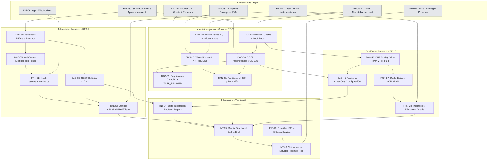

# Etapa 2: Telemetría Avanzada, Aprovisionamiento y Edición de Recursos

> **Estado:** Planificada.
> **Dependencia previa:** Cierre de la Etapa 1 ([`etapa1.md`](etapa1.md)), incluyendo sus tareas puente de infraestructura y simulador (`Bloque 7`: `BAC-30` a `BAC-33`, `FRN-21`, `INF-09` e `INF-07C`), con las pruebas de aceptación e integración de ciclo de vida en verde (`INT-01` e `INT-02`).
> **Requerimientos cubiertos:** `RF-05` (Métricas por instancia), `RF-07` (Wizard de creación con control de cuotas), `RF-10` (Edición de recursos con cálculo diferencial) y `RF-11` (Notificaciones de aprovisionamiento).

---

## 1. Criterios de Planificación y Decisiones de Arquitectura

1. **Regla de Granularidad ($\le$ 2.5 h):** Ninguna tarea supera las 2.5 horas de estimación. Cada ítem aísla una responsabilidad técnica concreta dividiendo la capa de datos, la lógica de negocio y la interfaz de usuario.
2. **Independencia del Servidor en Desarrollo:** Toda la etapa se programa y valida localmente contra el simulador `backend/cmd/proxmox-simulador` (extendido en `BAC-30`) y Redis local. La infraestructura física de Proxmox solo interviene en la validación final (`INT-06`).
3. **Exclusiones Explícitas del Alcance:**
   - `RF-12` (organizaciones / multi-tenant) permanece descartado. No se crean tablas ni campos `organization_id`.
   - Servidor SMTP real descartado del MVP: se utiliza `MockEmailService` para el registro estructurado de correos.
   - La plataforma continúa operando sobre un **único nodo Proxmox fijo** (`PROXMOX_NODE`).
   - La consola web remota (noVNC, xterm.js, SPICE) queda excluida por razones de seguridad operacional.
   - Snapshots (`RF-06`) y visor general de auditoría (`RF-08`) corresponden a la Etapa 3.
4. **Decisión de Retención y Streaming de Métricas (`RF-05`):**
   - **Streaming en Vivo:** Se utiliza un canal WebSocket (`/api/ws/instances/:vmid/metrics`) protegido por tickets efímeros en Redis (`POST /api/auth/ws-ticket`), reutilizando la arquitectura de seguridad establecida en `BAC-21C` para evitar la exposición de tokens en URLs.
   - **Histórico Corto sin Sobrecarga:** Se consumen directamente las series temporales RRDdata nativas de Proxmox (`/nodes/{node}/{tipo}/{vmid}/rrddata?timeframe=hour|day`). **Se descarta la incorporación de bases de series temporales externas (TimescaleDB / InfluxDB)** para no sobredimensionar la infraestructura del MVP; Proxmox ya calcula y consolida estos promedios de forma eficiente.
5. **Algoritmo de Validación de Cuotas y Prevención de Carreras (`RF-07`):**
   - **Headroom de Seguridad:** El backend valida que la RAM solicitada no comprometa el 15% de memoria física reservada para el sistema operativo base de Proxmox. Si la capacidad disponible no alcanza, responde `HTTP 409 Conflict` con el código estructurado `RESOURCE_QUOTA_EXCEEDED` detallando el faltante.
   - **Bloqueo Transaccional Distribuido:** Se implementa un candado en Redis (`lock:instance:provisioning`) con TTL de 30 s mediante `SETNX`. Esto evita condiciones de carrera cuando dos administradores intentan crear instancias en simultáneo sobre los mismos recursos libres restantes.
   - **Autoasignación Inmediata de Permisos:** Al completarse la tarea asíncrona de creación (`qmcreate`/`vzcreate`), el sistema asocia automáticamente la tupla `(usuario_id, vmid, FULL_ACCESS)` en `permisos_instancia`, garantizando que el creador visualice y opere de inmediato su máquina.
6. **Política de Configuración de Red en el Asistente:**
   - Se prioriza la asignación dinámica **DHCP** por defecto sobre el bridge de red virtual `vmbr1`.
   - Se ofrece la alternativa de configuración estática opcional (IP/CIDR y Gateway), validada en frontend y backend antes de enviar el payload a Proxmox.
7. **Cálculo Diferencial en Edición de Recursos (`RF-10`):**
   - Para modificaciones de memoria ($\Delta\text{RAM}$), solo se valida el incremento positivo contra la cuota libre del host. Si se reduce la asignación ($\Delta\text{RAM} < 0$), la operación se autoriza directamente.
   - Si la máquina está encendida (`running`) y Proxmox no soporta hot-plug para el recurso alterado (o el kernel huésped no lo admite), el backend persiste el cambio y devuelve `HTTP 200 OK` con `{ requiresReboot: true }`. El frontend muestra un aviso amarillo contextual indicando que el cambio surtirá efecto tras el próximo reinicio.
8. **Trazabilidad en Auditoría (`RF-08` / `BAC-18`):** Toda acción de aprovisionamiento (`CREATE_INSTANCE`) y edición (`CONFIG_INSTANCE`) se audita en la tabla inmutable `auditoria`, vinculando el usuario autenticado, el `vmid`, el `upid` de Proxmox y el resultado final.

---

## 2. Estado del Código al Inicio de la Etapa 2 (Punto de Partida)

| Componente | Estado que deja la Etapa 1 | Tarea de Etapa 2 que lo evoluciona |
|---|---|---|
| Simulador de Proxmox (`backend/cmd/proxmox-simulador`) | ✅ Soporta ciclo de vida, borrado, IP, storages, templates y RRDdata mock (`BAC-30`) | Se utiliza directamente para testing unitario e integración |
| Endpoints de Storages y Templates | ✅ `GET /api/node/storages` y `GET /api/node/templates` (`BAC-31`) | Consumidos por el Wizard de creación (`FRN-25`) |
| Cuotas asignables del Host | ✅ `GET /api/node/status` incluye `allocatable` (`BAC-33`) | Motor de validación de cuotas (`BAC-37`) y barras en UI (`FRN-24`) |
| Worker de UPIDs (`seguimiento_tareas.go`) | ✅ Soporta acciones `create` y autoasigna permisos (`BAC-32`) | Orquesta el fin de aprovisionamiento en `BAC-39` |
| Vista Detalle de Instancia (`/instances/:vmid`) | ✅ Layout base y navegación con pestañas vacías (`FRN-21`) | Aloja gráficos de métricas (`FRN-23`) y botón de edición (`FRN-28`) |
| Botón "Crear instancia" en frontend | ✅ Reubicado en cabecera de `/instances` con `PermissionGate` (`FIX-60`) | Dispara el Wizard de 4 pasos (`FRN-24`) |
| Nginx Reverse Proxy | ✅ Configurado para WebSockets con `Upgrade` y `Connection` (`INF-09`) | Canaliza el streaming en vivo sin cortes |
| Permisos de Proxmox Token | ✅ Incorpora `VM.Allocate`, `Datastore.AllocateSpace`, `VM.Config.*` (`INF-07C`) | Permite crear y reconfigurar instancias reales |

---

## 3. Mapa de Dependencias de la Etapa 2



---

## 4. Orden de Carga en ClickUp

| Ola | Se carga y se empieza | Condición para empezar |
|---|---|---|
| **1** | `BAC-34`, `BAC-37`, `FRN-24`, `INF-10` | Cierre de Etapa 1 (`Bloque 7`). No tienen bloqueantes internos en Etapa 2 |
| **2** | `BAC-35`, `BAC-36`, `BAC-38`, `FRN-22`, `FRN-25` | `BAC-34` (telemetría), `BAC-37` (cuotas) y `FRN-24` (primeros pasos wizard) |
| **3** | `BAC-39`, `BAC-40`, `FRN-23`, `FRN-26`, `FRN-27` | Ola 2. Requiere endpoints de creación, métricas y estructuras base del wizard |
| **4** | `BAC-41`, `FRN-28`, `INT-04` | Ola 3. Cierra la auditoría, la edición en frontend y la suite automática |
| **5** | `INT-05`, y después `INT-06` | Todo lo anterior implementado. `INT-06` requiere `INF-10` y Proxmox real |

**Camino crítico:** `BAC-37` $\rightarrow$ `BAC-38` $\rightarrow$ `BAC-39` $\rightarrow$ `FRN-26` $\rightarrow$ `INT-04` $\rightarrow$ `INT-05` $\rightarrow$ `INT-06`.

---

## 5. Desglose Detallado de Tareas (ClickUp)

### Bloque 1: Backend - Telemetría Avanzada y Streaming de Métricas (`RF-05`)

#### `BAC-34` - Adaptador de Proxmox RRDdata en el cliente y servicio de telemetría de instancia

- **Área:** Backend
- **Asignado:** Lisandro
- **Estimación:** 2.0 h
- **Depende de:** `BAC-30` (simulador con soporte RRD).
- **Problema:** Proxmox almacena las métricas históricas de rendimiento en formato RRD consumibles vía `/nodes/{node}/{qemu|lxc}/{vmid}/rrddata`. El cliente backend carece del adaptador para consultar este endpoint y normalizar las métricas heterogéneas entre VMs y LXCs.
- **Entregable:**
  1. Método en el cliente Proxmox `ObtenerMetricasRRD(ctx, nodo, tipo, vmid, timeframe)`.
  2. DTO normalizado `PuntoMetricaDTO`: `{ timestamp: int64, cpuPercent: float64, ramUsedBytes: int64, ramTotalBytes: int64, netInBps: int64, netOutBps: int64, diskReadBps: int64, diskWriteBps: int64 }`.
  3. Pruebas unitarias con mocks en `internal/adapters/secondary/proxmox/client_test.go`.
- **Criterio de éxito:** Consulta exitosa de métricas para VM y LXC devolviendo series temporales con valores numéricos coherentes sin fallos de conversión.

#### `BAC-35` - Canal WebSocket de métricas en tiempo real con ticket efímero

- **Área:** Backend
- **Asignada:** Tayra
- **Estimación:** 2.5 h
- **Depende de:** `BAC-34`, `BAC-21C` (patrón de tickets en Redis).
- **Problema:** Enviar peticiones REST cada pocos segundos para monitorear métricas degrada el rendimiento. Se requiere un canal bidireccional eficiente por WebSocket `/api/ws/instances/:vmid/metrics` que no exponga credenciales JWT en los query parameters.
- **Entregable:**
  1. Endpoint de emisión de ticket efímero `POST /api/auth/ws-ticket` (TTL 30 s en Redis).
  2. Handler WebSocket `/api/ws/instances/:vmid/metrics?ticket=...` que valide el ticket, verifique acceso mediante `RequireInstanceAccess` y establezca la conexión.
  3. Poller desacoplado por conexión que sondee el estado actual de la instancia cada 2 segundos y envíe el paquete JSON al cliente.
  4. Cierre ordenado y limpieza de goroutines al desconectar el cliente.
- **Criterio de éxito:** Un cliente autenticado con ticket recibe métricas periódicas por WebSocket. Un ticket inválido o expirado responde `401 Unauthorized` antes del handshake.

#### `BAC-36` - Endpoint REST de métricas históricas de instancia (`timeframe=2h|24h`)

- **Área:** Backend
- **Asignada:** Tayra
- **Estimación:** 1.5 h
- **Depende de:** `BAC-34`.
- **Problema:** Al abrir la vista de una máquina, los gráficos necesitan renderizar de inmediato la tendencia histórica sin aguardar la llegada de los primeros paquetes del WebSocket.
- **Entregable:**
  1. Endpoint `GET /api/instances/:vmid/metrics?timeframe=2h|24h` protegido con `RequireAuth` y `RequireInstanceAccess`.
  2. Parámetro `timeframe` configurable (por defecto `2h`, soportando `24h`), mapeado a los intervalos de Proxmox (`hour` y `day`).
  3. Caché corta en Redis (TTL 30 s) para evitar consultas repetitivas al hipervisor ante recargas de página.
- **Criterio de éxito:** Responde en menos de 100 ms desde caché con el arreglo histórico de métricas formateado para el consumo de gráficos.

---

### Bloque 2: Backend - Motor de Aprovisionamiento y Validación de Cuotas (`RF-07`)

#### `BAC-37` - Servicio de validación de cuotas del host y bloqueo distribuido

- **Área:** Backend
- **Asignada:** Tayra
- **Estimación:** 2.0 h
- **Depende de:** `BAC-33` (allocatable del host).
- **Problema:** Permitir la creación de máquinas sin validar los límites físicos del hipervisor puede provocar el colapso del host (`Out Of Memory` o disco lleno). Además, peticiones concurrentes simultáneas pueden sobreasignar la misma memoria libre si no existe un bloqueo transaccional.
- **Entregable:**
  1. Servicio de dominio `CuotasService.ValidarDisponibilidad(cores, ramMb, discoGb, storageId)`.
  2. Verificación de seguridad: $\text{RAM\_Solicitada} \le \text{RAM\_Libre} - \text{Headroom}(15\%)$ y $\text{Disco\_Solicitado} \le \text{Disco\_Libre}(storageId)$.
  3. Bloqueo distribuido en Redis `lock:instance:provisioning` mediante `SETNX` (TTL 30 s) para garantizar atomicidad durante la evaluación y despacho.
  4. Mapeo a error `409 Conflict` con código estructurado `RESOURCE_QUOTA_EXCEEDED` ante saturación.
- **Criterio de éxito:** Peticiones que superan los recursos seguros son rechazadas inmediatamente sin tocar Proxmox. Peticiones simultáneas compitiendo por el remanente resuelven una con éxito y otra con 409 sin condición de carrera.

#### `BAC-38` - Endpoint `POST /api/instances` para creación de VMs y Contenedores LXC

- **Área:** Backend
- **Asignado:** Lisandro
- **Estimación:** 2.5 h
- **Depende de:** `BAC-30`, `BAC-37`.
- **Problema:** No existe el endpoint de aprovisionamiento de recursos. Se requiere un endpoint unificado que oculte las diferencias nativas de Proxmox entre la creación de máquinas virtuales (`/nodes/{node}/qemu`) y contenedores (`/nodes/{node}/lxc`).
- **Entregable:**
  1. Endpoint `POST /api/instances` con rol obligatorio `ADMIN`.
  2. Payload validado:
     ```json
     {
       "tipo": "vm", // "vm" o "lxc"
       "nombre": "srv-prod-01",
       "cores": 2,
       "ramMb": 2048,
       "discoGb": 20,
       "storageId": "local-lvm",
       "templateOso": "debian-12-standard.tar.zst",
       "red": { "modo": "dhcp" } // o "static" con ip y gateway
     }
     ```
  3. Asignación automática del próximo identificador libre mediante `/cluster/nextid`.
  4. Envío de la orden a Proxmox, captura del UPID de creación (`qmcreate`/`vzcreate`), inserción en `tareas_asincronas` con estado `RUNNING` y respuesta `HTTP 202 Accepted { upid, tareaId, vmid }`.
- **Criterio de éxito:** Una solicitud válida responde `202 Accepted` en menos de 1 s, Proxmox comienza el aprovisionamiento y el UPID queda registrado para seguimiento.

#### `BAC-39` - Seguimiento de creación, autoasignación de permisos y eventos (`RF-07`, `RF-11`)

- **Área:** Backend
- **Asignado:** Lisandro
- **Estimación:** 2.0 h
- **Depende de:** `BAC-38`, `BAC-32` (worker con soporte de creación).
- **Problema:** Una máquina recién creada no pertenece a ningún operador por defecto. El creador debe obtener acceso inmediato sin requerir que otro administrador configure manualmente sus permisos en `/admin/users`.
- **Entregable:**
  1. Integración en `seguimiento_tareas.go`: al detectar fin exitoso (`exitstatus: "OK"`) de un UPID de creación, insertar atómicamente `(creador_id, vmid, FULL_ACCESS)` en `permisos_instancia`.
  2. Emisión por el canal SSE `/api/events` de `TASK_FINISHED`:
     `{ tipo: "TASK_FINISHED", recursoTipo: "VM", recursoId: "108", detalles: { tareaId, accion: "create", estado: "COMPLETED" } }`.
  3. Si la tarea de creación falla en Proxmox, liberar bloqueos y registrar el evento con `estado: "FAILED"`.
- **Criterio de éxito:** Al finalizar la creación, el inventario del usuario incluye la nueva máquina y la interfaz recibe la notificación en tiempo real.

---

### Bloque 3: Backend - Edición Dinámica de Recursos y Auditoría (`RF-10`, `RF-08`)

#### `BAC-40` - Endpoint `PUT /api/instances/:vmid/config` con cálculo diferencial ($\Delta\text{RAM}$) y detección de hot-plug

- **Área:** Backend
- **Asignada:** Tayra
- **Estimación:** 2.0 h
- **Depende de:** `BAC-37`.
- **Problema:** La modificación de recursos debe validar que los incrementos solicitados no saturen el nodo y debe advertir con precisión si el cambio exige reiniciar el sistema operativo huésped.
- **Entregable:**
  1. Endpoint `PUT /api/instances/:vmid/config` accesible para usuarios con rol `ADMIN` o con `FULL_ACCESS` sobre la instancia.
  2. Payload: `{ cores?: number, ramMb?: number }`.
  3. Cálculo diferencial: si $\Delta\text{RAM} > 0$, validar contra la cuota libre con `CuotasService`.
  4. Invocación de `PUT /nodes/{node}/{tipo}/{vmid}/config` en Proxmox.
  5. Inspección del resultado: si la instancia está `running` y no aplica en caliente, responder `HTTP 200 OK` con `{ requiresReboot: true, message: "Recursos modificados; los cambios se aplicarán tras reiniciar la instancia." }`. Si aplica en caliente, `{ requiresReboot: false }`.
- **Criterio de éxito:** Incrementos excesivos son rechazados con `409 RESOURCE_QUOTA_EXCEEDED`. Cambios válidos se persisten y notifican el estado de hot-plug.

#### `BAC-41` - Auditoría inmutable de aprovisionamiento y cambios de recursos (`RF-08`)

- **Área:** Backend
- **Asignada:** Tayra
- **Estimación:** 1.5 h
- **Depende de:** `BAC-38`, `BAC-40`.
- **Problema:** Toda alteración en la infraestructura debe quedar registrada inalterablemente en la tabla `auditoria` para trazabilidad institucional de los operadores.
- **Entregable:**
  1. Registro de `CREATE_INSTANCE`: entrada inicial con `resultado: "PENDING"` al recibir la orden, y entrada final con `resultado: "SUCCESS"` o `"FAILED"` vinculada al `upid` y `tareaId`.
  2. Registro de `CONFIG_INSTANCE`: entrada auditando los valores anteriores y los nuevos parámetros en `detalles` (JSONB).
  3. Verificación de inmutabilidad contra la base particionada.
- **Criterio de éxito:** `GET /api/admin/audit` refleja las acciones de creación y edición correlacionadas por identificador de tarea sin omisiones de datos.

---

### Bloque 4: Frontend - Gráficos de Telemetría en Detalle de Instancia (`RF-05`)

#### `FRN-22` - Hook `useInstanceMetrics` y cliente WebSocket para telemetría en tiempo real

- **Área:** Frontend
- **Asignada:** Belinda
- **Estimación:** 2.0 h
- **Depende de:** `BAC-35`, `FRN-21` (página de detalle).
- **Problema:** El cliente frontend debe gestionar la conexión WebSocket de métricas de forma resiliente, solicitando el ticket de autenticación previo y manejando caídas de red sin fugar memoria ni sockets huérfanos.
- **Entregable:**
  1. Servicio de solicitud de ticket efímero `getWsTicket()`.
  2. Hook personalizado `useInstanceMetrics(vmid)` que gestione conexión, estado (`conectando`, `conectado`, `reconectando`, `error`) y almacenamiento en búfer de los últimos $N$ puntos de telemetría.
  3. Reintento con backoff exponencial ante desconexión accidental.
  4. Cierre explícito del socket al desmontar el componente o cambiar de pestaña.
- **Criterio de éxito:** El hook entrega series de datos actualizadas cada 2 s sin fugas de memoria en pruebas de componente con Vitest.

#### `FRN-23` - Componentes de gráficos interactivos de rendimiento y selector de rango temporal

- **Área:** Frontend
- **Asignada:** Luz
- **Estimación:** 2.5 h
- **Depende de:** `FRN-22`, `BAC-36`.
- **Problema:** La pestaña "Métricas" de `InstanceDetailPage.tsx` carece de componentes visuales para interpretar el consumo de recursos de la máquina.
- **Entregable:**
  1. Incorporación de componentes de gráficos interactivos (utilizando Recharts o Chart.js):
     - Gráfico de CPU (%)
     - Gráfico de Memoria RAM (Usada vs Total)
     - Gráfico de Tráfico de Red (KB/s In/Out)
     - Gráfico de I/O de Disco (KB/s Read/Write)
  2. Selector de rango temporal: "En vivo" (WebSocket), "Últimas 2 horas" y "Últimas 24 horas" (REST `BAC-36`).
  3. Formateo legible de unidades (bytes a MB/GB, bps a KB/s).
  4. Tooltips explicativos y estados de carga (skeletons) mientras se obtienen los primeros datos.
- **Criterio de éxito:** Al abrir la pestaña "Métricas", se visualiza la serie histórica y los gráficos continúan actualizándose dinámicamente con los eventos en vivo.

---

### Bloque 5: Frontend - Asistente de Creación de Instancias (Wizard de 4 Pasos) (`RF-07`)

#### `FRN-24` - Wizard de creación: Paso 1 (Tipo de instancia) y Paso 2 (Recursos y Cuotas en Vivo)

- **Área:** Frontend
- **Asignada:** Belinda
- **Estimación:** 2.5 h
- **Depende de:** `BAC-33` (cuotas del host), `FIX-60` (botón en `/instances`).
- **Problema:** La creación debe ser simple e intuitiva, guiando al usuario para que no sobreasigne recursos por error.
- **Entregable:**
  1. Componente modal/asistente multipaso `CreateInstanceWizard.tsx`.
  2. **Paso 1 (Tipo):** Selector con tarjetas visuales entre Máquina Virtual (QEMU) y Contenedor (LXC), con descripciones claras.
  3. **Paso 2 (Recursos):** Sliders y controles numéricos para vCPU, RAM (MB/GB) y Disco (GB).
  4. Medidor de cuota reactivo: barra de capacidad del host que muestra el impacto del recurso seleccionado en tiempo real, cambiando a color de advertencia si supera el 80% del remanente y deshabilitando el avance si supera el 100%.
- **Criterio de éxito:** El usuario no puede avanzar al Paso 3 si la configuración solicitada excede la memoria o disco disponibles en el nodo.

#### `FRN-25` - Wizard de creación: Paso 3 (Almacenamiento, Template/ISO y Red) y Paso 4 (Resumen)

- **Área:** Frontend
- **Asignada:** Luz
- **Estimación:** 2.0 h
- **Depende de:** `FRN-24`, `BAC-31` (endpoints de storage y templates).
- **Problema:** El usuario necesita seleccionar de forma amigable los storages reales y las imágenes disponibles sin lidiar con comandos complejos de consola.
- **Entregable:**
  1. **Paso 3 (Storage, Imagen y Red):**
     - Desplegable de Storages disponibles (`GET /api/node/storages`).
     - Selector de Plantillas LXC o ISOs según el tipo seleccionado en el Paso 1 (`GET /api/node/templates`).
     - Configuración de red: switch "DHCP (Automático)" o "IP Fija" (con inputs validados para IP/máscara y puerta de enlace).
  2. **Paso 4 (Resumen):** Ficha consolidada con todos los parámetros técnicos elegidos y advertencia de confirmación.
- **Criterio de éxito:** El wizard valida que todos los campos requeridos estén completos antes de habilitar el botón final "Crear Instancia".

#### `FRN-26` - Envío de creación, manejo de errores de cuota (`409`) y seguimiento en la UI

- **Área:** Frontend
- **Asignado:** Cristian
- **Estimación:** 2.0 h
- **Depende de:** `FRN-25`, `BAC-38`.
- **Problema:** Durante el envío, la interfaz debe bloquearse para evitar dobles clics, manejar amigablemente los rechazos por cuota insuficiente y reflejar el progreso de la creación en la tabla de inventario.
- **Entregable:**
  1. Despacho HTTP `POST /api/instances` con estado de carga en el botón de confirmación.
  2. Manejo de error `409 RESOURCE_QUOTA_EXCEEDED`: banner en rojo dentro del modal indicando el motivo exacto sin perder los datos cargados en los pasos anteriores.
  3. Ante `202 Accepted`: cierre del modal, inserción de la nueva fila en `/instances` en estado *"Creando..."* con spinner activo.
  4. Escucha del evento `TASK_FINISHED` de creación vía `useEventsContext()` para actualizar la fila a *"Stopped"*, emitir Toast de éxito y habilitar sus controles.
- **Criterio de éxito:** Flujo completo de alta probado sin recargar la pantalla (`F5`), pasando de creación a inventario activo de forma fluida.

---

### Bloque 6: Frontend - Modal de Edición de Recursos (`RF-10`)

#### `FRN-27` - Modal de reconfiguración de vCPU y RAM con advertencia de reinicio / hot-plug

- **Área:** Frontend
- **Asignado:** Cristian
- **Estimación:** 2.0 h
- **Depende de:** `BAC-40`, `FRN-21`.
- **Problema:** Los operadores autorizados necesitan ajustar la capacidad de sus máquinas con controles seguros que indiquen claramente si la acción requiere reinicio.
- **Entregable:**
  1. Modal `EditInstanceConfigModal.tsx` accesible desde la barra de acciones o pestaña "Configuración" de `/instances/:vmid`.
  2. Controles precargados con los valores actuales de vCPU y RAM.
  3. Visualización del cálculo diferencial ($\Delta\text{RAM}$) y comparación contra el espacio disponible en el host.
  4. Mensaje informativo: *"Si la instancia está encendida y no admite hot-plug, los cambios se harán efectivos tras reiniciar el sistema operativo huésped."*
- **Criterio de éxito:** El modal bloquea valores que excedan la memoria libre del host y calcula correctamente el delta antes de confirmar.

#### `FRN-28` - Integración de edición en la página de Detalle de Instancia y refresco reactivo

- **Área:** Frontend
- **Asignado:** Cristian
- **Estimación:** 1.5 h
- **Depende de:** `FRN-27`.
- **Problema:** Tras confirmar una edición, la interfaz debe reflejar los nuevos límites sin requerir una recarga manual del navegador.
- **Entregable:**
  1. Conexión del modal con `PUT /api/instances/:vmid/config`.
  2. Toasts informativos:
     - Verde: *"Recursos actualizados exitosamente en caliente."*
     - Amarillo: *"Configuración guardada. La máquina requiere reinicio para aplicar los nuevos recursos."*
  3. Actualización inmediata de los valores de CPU/RAM en la cabecera del detalle y en la tabla de `/instances`.
- **Criterio de éxito:** La modificación de recursos se refleja instantáneamente en la interfaz y emite el feedback correspondiente al estado de hot-plug.

---

### Bloque 7: Infraestructura y Pruebas de Integración de la Etapa 2

#### `INF-10` - Verificación y disponibilidad de plantillas LXC e ISOs en el servidor Proxmox real

- **Área:** Infraestructura
- **Asignados:** Nico y Lucas
- **Estimación:** 1.5 h
- **Depende de:** `INF-07C` (permisos de token en Proxmox).
- **Problema:** Para que la validación en el servidor real (`INT-06`) funcione, los almacenamientos de Proxmox deben contener las imágenes base necesarias.
- **Entregable:**
  1. Descargar o verificar la presencia de una plantilla LXC liviana oficial (ej. `alpine-3.19-default` o `debian-12-standard`) en el storage `local:vztmpl`.
  2. Verificar una imagen ISO de prueba en `local:iso`.
  3. Comprobar que el API Token puede listar ambos contenidos mediante consulta HTTPS a `/storage/{storage}/content`.
- **Criterio de éxito:** El backend desplegado en el servidor lista las plantillas e ISOs reales a través de `GET /api/node/templates` sin errores de permisos.

#### `INT-04` - Suite automatizada de pruebas de integración de la Etapa 2

- **Área:** Backend / Testing
- **Asignados:** Tayra y Lisandro
- **Estimación:** 2.5 h
- **Depende de:** `BAC-36`, `BAC-39`, `BAC-41`.
- **Problema:** Se requiere una suite de aceptación automatizada que valide en CI/local todo el flujo de cuotas, creación, telemetría y edición contra el simulador.
- **Entregable:**
  - Suite `test/back/etapa2_acceptance_test.go`:
    1. Consumo de métricas históricas RRD y conexión WebSocket con ticket.
    2. Creación exitosa de instancia con autoasignación de permisos en `permisos_instancia`.
    3. Rechazo estricto por cuota insuficiente (`409 RESOURCE_QUOTA_EXCEEDED`) y prueba de concurrencia con candado Redis.
    4. Modificación de configuración con cálculo diferencial y verificación de auditoría.
- **Criterio de éxito:** `go test ./test/back/etapa2_acceptance_test.go` pasa 100% en verde sin dependencias externas.

#### `INT-05` - Smoke Test End-to-End local de la Etapa 2

- **Área:** Integración / Todo el equipo
- **Asignados:** Equipo completo
- **Estimación:** 2.0 h
- **Depende de:** `INT-04`, `FRN-23`, `FRN-26`, `FRN-28`.
- **Problema:** Verificación manual integral de experiencia de usuario y coherencia funcional antes de pasar al servidor físico.
- **Entregable:** Recorrido interactivo en entorno local con backend, frontend, Redis y simulador:
  1. Admin accede a `/instances`, pulsa "Crear instancia", completa el Wizard de 4 pasos para un contenedor LXC y confirma.
  2. Ve la fila en estado "Creando...", recibe notificación de tarea finalizada y la máquina aparece lista.
  3. Abre `/instances/:vmid`, verifica los gráficos de métricas actualizándose en vivo por WebSocket y prueba el selector de 2h/24h.
  4. Abre el modal de edición, amplía la memoria RAM, comprueba el cálculo diferencial y confirma.
  5. Verifica en `/admin/audit` que la creación y la edición quedaron registradas inmutablemente.
- **Criterio de éxito:** Flujo completo ejecutado sin errores en la consola del navegador ni inconsistencias en la base de datos.

#### `INT-06` - Validación en servidor de la Etapa 2 contra Proxmox real

- **Área:** Integración / Infraestructura
- **Asignados:** Nico y un integrante de backend
- **Estimación:** 2.0 h
- **Depende de:** `INT-05`, `INF-10`.
- **Problema:** Validación definitiva sobre el hipervisor real y a través del proxy inverso de producción antes de cerrar la etapa.
- **Entregable:**
  - Ejecutar los pasos del Smoke Test (`INT-05`) en el entorno de pruebas contra el Proxmox real:
    1. Crear un contenedor LXC real con la plantilla de prueba en un VMID libre ($\ge 106$).
    2. Comprobar que Nginx enruta el WebSocket de métricas sin cortes.
    3. Modificar la memoria del contenedor.
    4. Destruir el contenedor de prueba con `DELETE /api/instances/:vmid` (`BAC-24B`/`BAC-24C`) para dejar el entorno limpio.
- **Criterio de éxito:** El aprovisionamiento, telemetría y edición funcionan idénticamente en el servidor físico, registrando auditoría y respetando los VMIDs protegidos.

---

## 6. Resumen de Distribución y Carga de Trabajo

| Ola | Tarea | Área | Responsable(s) | Estimación | Empieza con | Cierra con (bloqueantes) |
|---|---|---|---|---|---|---|
| 1 | `BAC-34` | Backend | Lisandro | 2.0 h | — | — (`BAC-30` de Etapa 1) |
| 1 | `BAC-37` | Backend | Tayra | 2.0 h | — | — (`BAC-33` de Etapa 1) |
| 1 | `FRN-24` | Frontend | Belinda | 2.5 h | — | — (`BAC-33` de Etapa 1) |
| 1 | `INF-10` | Infraestructura | Nico / Lucas | 1.5 h | — | — (`INF-07C` de Etapa 1) |
| 2 | `BAC-35` | Backend | Tayra | 2.5 h | `BAC-34` | `BAC-34` |
| 2 | `BAC-36` | Backend | Tayra | 1.5 h | `BAC-34` | `BAC-34` |
| 2 | `BAC-38` | Backend | Lisandro | 2.5 h | `BAC-37` | `BAC-37` |
| 2 | `FRN-22` | Frontend | Belinda | 2.0 h | `BAC-35` | `BAC-35`, `INF-09` |
| 2 | `FRN-25` | Frontend | Luz | 2.0 h | `FRN-24` | `FRN-24`, `BAC-31` |
| 3 | `BAC-39` | Backend | Lisandro | 2.0 h | `BAC-38` | `BAC-38`, `BAC-32` |
| 3 | `BAC-40` | Backend | Tayra | 2.0 h | `BAC-37` | `BAC-37` |
| 3 | `FRN-23` | Frontend | Luz | 2.5 h | `FRN-22`, `BAC-36` | `FRN-22`, `BAC-36` |
| 3 | `FRN-26` | Frontend | Cristian | 2.0 h | `FRN-25` | `FRN-25`, `BAC-38` |
| 3 | `FRN-27` | Frontend | Cristian | 2.0 h | `BAC-40` | `BAC-40` |
| 4 | `BAC-41` | Backend | Tayra | 1.5 h | `BAC-38`, `BAC-40` | `BAC-38`, `BAC-40` |
| 4 | `FRN-28` | Frontend | Cristian | 1.5 h | `FRN-27` | `FRN-27` |
| 4 | `INT-04` | Testing | Tayra, Lisandro | 2.5 h | — | `BAC-36`, `BAC-39`, `BAC-41` |
| 5 | `INT-05` | Integración | Equipo completo | 2.0 h | — | `INT-04`, `FRN-23`, `FRN-26`, `FRN-28` |
| 5 | `INT-06` | Integración / Infra | Nico + backend | 2.0 h | — | `INT-05`, `INF-10` |
| | **Total** | | | **38.0 h** | | **19 tareas, promedio 2.0 h** |

---

### Carga Horaria por Integrante en la Etapa 2

| Integrante | Rol | Horas Asignadas | Tareas |
|---|---|---:|---|
| **Lisandro** | Backend | 9.0 h + `INT-04` | `BAC-34`, `BAC-38`, `BAC-39` |
| **Tayra** | Backend | 9.5 h + `INT-04` | `BAC-37`, `BAC-35`, `BAC-36`, `BAC-40`, `BAC-41` |
| **Belinda** | Frontend | 4.5 h | `FRN-24`, `FRN-22` |
| **Luz** | Frontend | 4.5 h | `FRN-25`, `FRN-23` |
| **Cristian** | Frontend | 5.5 h | `FRN-26`, `FRN-27`, `FRN-28` |
| **Nico** | Infraestructura | 2.5 h + `INT-06` | `INF-10` (compartida), `INT-06` |
| **Lucas** | Infraestructura | 0.75 h | `INF-10` (compartida) |
| **Equipo Completo** | Integración | 2.0 h | `INT-05` (Smoke test end-to-end) |

