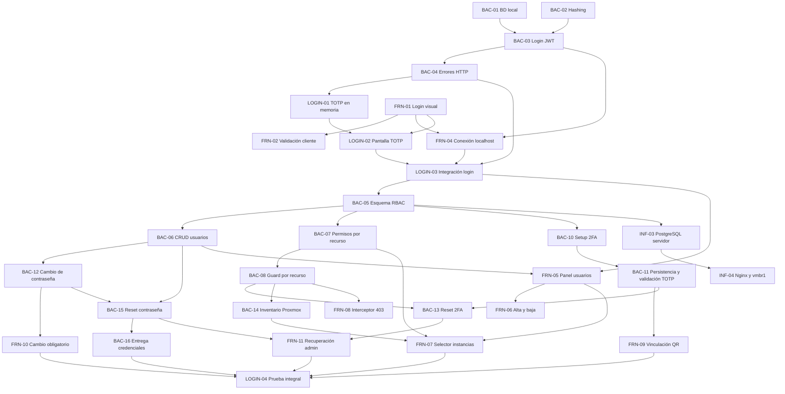

# Plan de próximas tareas

## Criterio de planificación

Este plan parte del estado registrado en `actual.md`: ninguna tarea de `BAC-01` a `BAC-04` ni de `FRN-01` a `FRN-04` está confirmada como terminada. Por eso, primero se debe cerrar el prototipo básico de login con usuario de prueba, JWT y flujo 2FA/TOTP en memoria.

Las fechas y horarios siguientes son una propuesta de ejecución desde el jueves 10/09/2026. Las horas indicadas son horas de trabajo estimadas y las franjas permiten visualizar dependencias y tareas paralelas. Una tarea solo pasa a `terminado.md` cuando se valida su criterio de éxito.

### Decisiones de alcance

- El 2FA se configura por usuario y cada cuenta conserva su propio secreto TOTP cifrado. No forma parte del rol.
- `ADMIN` y `OPERATOR` determinan qué acciones puede realizar una cuenta. `user_instances` solo determina sobre qué instancias puede actuar un operador.
- Los permisos granulares por acción, por ejemplo permitir `start` y prohibir `delete`, no están modelados por `user_instances` ni son parte del RF-09 actual. Si se requieren, deben planificarse como una ampliación separada del modelo de autorización.
- Antes de completar el cambio de contraseña y la verificación o vinculación 2FA, el backend solo debe emitir una sesión o token restringido para continuar el proceso de autenticación, nunca un JWT con acceso completo a la aplicación.

## Fase 0. Cierre del prototipo de login

## Fase 2. Cierre de autenticación y asignación de máquinas

---

### `BAC-12` - Cambio obligatorio de contraseña

- **Área:** Backend
- **Asignado:** Lisandro
- **Estimación:** 2 h
- **Ventana propuesta:** 16/09/2026, 09:00-11:00
- **Depende de:** `BAC-02`, `BAC-05` y `BAC-06`.
- **Entregable:** `POST /api/auth/change-password`, accesible con una sesión restringida, que compruebe la contraseña temporal, valide la nueva clave, actualice su hash e indique `must_change_password: false`. Mientras el indicador sea verdadero, el resto de endpoints protegidos debe permanecer bloqueado.
- **Criterio de éxito:** la contraseña temporal deja de ser válida después del cambio, la nueva contraseña nunca se guarda en texto plano y el usuario no obtiene acceso completo antes de finalizar el proceso.

### `BAC-15` - Restablecimiento administrativo de contraseña

- **Área:** Backend
- **Asignado:** Lisandro
- **Estimación:** 2 h
- **Ventana propuesta:** 17/09/2026, 14:00-16:00
- **Depende de:** `BAC-06` y `BAC-12`.
- **Entregable:** `POST /api/admin/users/{id}/reset-password`, restringido a administradores, que genere una contraseña temporal segura, actualice su hash, establezca `must_change_password: true` y revoque las sesiones activas del usuario.
- **Criterio de éxito:** un operador recibe `403 Forbidden`; la clave anterior deja de funcionar y el usuario debe cambiar la nueva contraseña temporal en el siguiente acceso.

### `BAC-16` - Entrega segura de credenciales temporales

- **Área:** Backend / Infraestructura
- **Asignados:** Lisandro y Nico
- **Estimación:** 3 h
- **Ventana propuesta:** 18/09/2026, 09:00-12:00
- **Depende de:** `BAC-06`, `BAC-15` y de la configuración SMTP.
- **Entregable:** integración SMTP o proveedor equivalente para enviar la contraseña temporal al crear o restablecer una cuenta, con secretos fuera del repositorio y sin registrar la contraseña en logs.
- **Criterio de éxito:** el usuario recibe una única credencial temporal y el administrador obtiene un resultado controlado si el envío falla, sin exponer la clave en respuestas posteriores ni registros.

### `FRN-10` - Cambio obligatorio de contraseña temporal

- **Área:** Frontend
- **Asignada:** Belinda
- **Estimación:** 2 h
- **Ventana propuesta:** 16/09/2026, 11:00-13:00
- **Depende de:** `BAC-12` y `FRN-04`.
- **Entregable:** vista de nueva contraseña y confirmación que detecte `must_change_password`, bloquee la navegación general y llame a `POST /api/auth/change-password`.
- **Criterio de éxito:** una cuenta con contraseña temporal solo puede cerrar sesión o cambiarla; después del cambio continúa al enrolamiento o validación 2FA que corresponda.

---

### `BAC-13` - Restablecimiento administrativo de 2FA

- **Área:** Backend
- **Asignado:** Tayra
- **Estimación:** 2 h
- **Ventana propuesta:** 17/09/2026, 09:00-11:00
- **Depende de:** `BAC-06`, `BAC-08` y `BAC-11`.
- **Entregable:** `POST /api/admin/users/{id}/reset-2fa`, restringido a administradores, que invalide el secreto TOTP, establezca `is_2fa_enabled: false` y revoque las sesiones activas del usuario afectado.
- **Criterio de éxito:** un operador recibe `403 Forbidden`; tras el restablecimiento, los códigos del secreto anterior dejan de funcionar y el usuario debe repetir `BAC-10`, `BAC-11` y `FRN-09` en su siguiente acceso.

### `FRN-11` - Acciones administrativas de recuperación

- **Área:** Frontend
- **Asignada:** Luz
- **Estimación:** 2 h
- **Ventana propuesta:** 18/09/2026, 12:00-14:00
- **Depende de:** `FRN-05`, `BAC-13` y `BAC-15`.
- **Entregable:** acciones separadas para restablecer contraseña y 2FA desde el panel de usuarios, ambas con confirmación explícita, estado de carga y notificación del resultado.
- **Criterio de éxito:** un administrador puede iniciar cada recuperación sin confundir sus efectos; la tabla refleja que el 2FA quedó desvinculado y nunca muestra secretos ni hashes.

### `LOGIN-04` - Prueba integral de autenticación y autorización

- **Área:** Frontend / Backend
- **Asignados:** Cristian, Tayra y Lisandro
- **Estimación:** 3 h
- **Ventana propuesta:** 18/09/2026, 14:00-17:00
- **Depende de:** `FRN-07`, `FRN-09`, `FRN-10`, `FRN-11`, `BAC-14` y `BAC-16`.
- **Entregable:** pruebas documentadas o automatizadas de creación de usuario, entrega y cambio de clave temporal, enrolamiento y login con TOTP, acceso según rol, filtro por instancias y recuperación administrativa de contraseña y 2FA.
- **Criterio de éxito:** todos los recorridos válidos terminan con el acceso esperado y los intentos de omitir pasos, usar credenciales anteriores, acceder con otro rol o consultar una instancia no asignada son rechazados con códigos HTTP controlados.

## Fase 3. Despliegue de persistencia y red

## Relación y orden de ejecución

### Tareas que pueden ejecutarse en paralelo

- `BAC-01`, `BAC-02`, `FRN-01` y `FRN-03` no dependen entre sí.
- `FRN-05` puede comenzar con el contrato definido de `BAC-06`, aunque necesita el endpoint para validación final.
- `FRN-06` puede avanzar con datos simulados mientras termina `BAC-06`.
- `BAC-10`/`BAC-11`, `BAC-12` y `BAC-14` pueden desarrollarse en paralelo una vez disponibles sus dependencias.
- `FRN-09` y `FRN-10` pueden maquetarse con contratos simulados, pero requieren `BAC-11` y `BAC-12` para validar los bloqueos de navegación.
- `BAC-13` y `BAC-15` pueden desarrollarse en paralelo; `FRN-11` integra ambas recuperaciones una vez definidos sus contratos.
- `INF-03` debe esperar el esquema de `BAC-05`, pero puede preparar el LXC, la red y los secretos antes de desplegarlo.

### Secuencia crítica

`BAC-01` + `BAC-02` -> `BAC-03` -> `BAC-04` -> `LOGIN-01` + `LOGIN-02` -> `FRN-04` -> `LOGIN-03` -> `BAC-05` -> `BAC-06`/`BAC-07` -> `BAC-08` -> `BAC-10`/`BAC-11` + `BAC-12` + `BAC-14` -> `BAC-13`/`BAC-15` + `FRN-07`/`FRN-09`/`FRN-10` -> `BAC-16`/`FRN-11` -> `LOGIN-04`.

## Resumen para ClickUp

| ID | Área | Asignado | Horas | Fecha propuesta | Dependencias |
|---|---|---|---:|---|---|
| BAC-01 | Backend/Infra | Tayra / Lucas | 2 | 10/09/2026 | - |
| BAC-02 | Backend | Lisandro | 2 | 10/09/2026 | - |
| BAC-03 | Backend | Tayra | 3 | 11/09/2026 | BAC-01, BAC-02 |
| BAC-04 | Backend | Lisandro | 1,5 | 11/09/2026 | BAC-03 |
| LOGIN-01 | Backend | Tayra / Lisandro | 2 | 11/09/2026 | BAC-03, BAC-04 |
| FRN-01 | Frontend | Belinda | 3 | 10/09/2026 | - |
| FRN-02 | Frontend | Belinda | 2 | 10/09/2026 | FRN-01 |
| FRN-03 | Frontend | Cristian / Luz | 3 | 10/09/2026 | - |
| FRN-04 | Frontend | Cristian | 3 | 11/09/2026 | BAC-03, BAC-04, FRN-01 |
| LOGIN-02 | Frontend | Belinda / Luz | 2 | 11/09/2026 | LOGIN-01, FRN-01 |
| LOGIN-03 | Integración | Cristian / Tayra / Lisandro | 2 | 11/09/2026 | FRN-04, LOGIN-02 |
| BAC-05 | Backend | Tayra / Lisandro | 3 | 14/09/2026 | BAC-01, LOGIN-03 |
| BAC-06 | Backend | Lisandro | 4 | 14/09/2026 | BAC-05 |
| BAC-07 | Backend | Tayra | 3 | 15/09/2026 | BAC-05, BAC-06 |
| BAC-08 | Backend | Lisandro | 3 | 15/09/2026 | BAC-07 |
| FRN-05 | Frontend | Belinda | 4 | 14/09/2026 | LOGIN-03, BAC-06 |
| FRN-06 | Frontend | Luz | 3 | 14/09/2026 | FRN-05, BAC-06 |
| FRN-07 | Frontend | Cristian | 4 | 15/09/2026 | FRN-05, BAC-07, BAC-14 |
| FRN-08 | Frontend | Cristian | 2 | 15/09/2026 | BAC-08, FRN-04 |
| BAC-10 | Backend | Tayra | 2 | 16/09/2026 | BAC-05, LOGIN-03 |
| BAC-11 | Backend | Lisandro | 3 | 16/09/2026 | BAC-10, BAC-05 |
| FRN-09 | Frontend | Belinda / Luz | 3 | 16/09/2026 | BAC-10, BAC-11, LOGIN-02 |
| BAC-12 | Backend | Lisandro | 2 | 16/09/2026 | BAC-02, BAC-05, BAC-06 |
| FRN-10 | Frontend | Belinda | 2 | 16/09/2026 | BAC-12, FRN-04 |
| BAC-13 | Backend | Tayra | 2 | 17/09/2026 | BAC-06, BAC-08, BAC-11 |
| BAC-14 | Backend | Tayra | 3 | 17/09/2026 | BAC-08, credenciales Proxmox |
| BAC-15 | Backend | Lisandro | 2 | 17/09/2026 | BAC-06, BAC-12 |
| BAC-16 | Backend/Infra | Lisandro / Nico | 3 | 18/09/2026 | BAC-06, BAC-15, SMTP |
| FRN-11 | Frontend | Luz | 2 | 18/09/2026 | FRN-05, BAC-13, BAC-15 |
| LOGIN-04 | Integración | Cristian / Tayra / Lisandro | 3 | 18/09/2026 | FRN-07, FRN-09, FRN-10, FRN-11, BAC-14, BAC-16 |
| INF-03 | Infraestructura | Lucas / Nico | 3 | 16/09/2026 | BAC-05 |
| INF-04 | Infraestructura | Nico | 3 | 16/09/2026 | INF-03 |

**Resultado esperado:** al completar `LOGIN-04` e `INF-04`, el equipo tendrá cerrado el circuito técnico de RF-01 y RF-09: contraseña temporal entregada y reemplazada, 2FA individual persistido, JWT posterior a la verificación, usuarios, roles, recuperación administrativa, permisos binarios por instancia, inventario real y bloqueo por recurso. La protección de las operaciones de Proxmox debe validarse antes de habilitar acciones destructivas.

**Fuera de alcance:** no se incluyen permisos granulares por acción porque el requerimiento actual solo define roles y asignación de instancias. Incorporarlos requiere una ampliación explícita del modelo de autorización y nuevos criterios para cada operación.

### 🧱 Bloque 3: Persistencia Definitiva de 2FA y Ciclo de Vida de Credenciales

Este bloque formaliza la seguridad completa (Fase 2) y cierra el hito integral `LOGIN-04`.

#### 1. Tareas de desarrollo paralelo

* **Backend:**
* `BAC-10` y `BAC-11` — Enrolamiento 2FA, QR (`GET /api/auth/2fa/setup`) y persistencia del secreto cifrado con AES-256 (`POST /api/auth/2fa/enable`).

* `BAC-12` — Cambio obligatorio de contraseña temporal (`POST /api/auth/change-password`).

* `BAC-13` y `BAC-15` — Restablecimiento administrativo de 2FA y contraseña (`POST /api/admin/users/{id}/reset-...`).

* `BAC-16` — Entrega segura de credenciales temporales vía SMTP.

* **Frontend:**
* `FRN-09` — Modal obligatorio de vinculación 2FA con escaneo de QR y confirmación.

* `FRN-10` — Pantalla obligatoria de cambio de contraseña cuando `must_change_password: true`.

* `FRN-11` — Acciones de restablecimiento de contraseña y 2FA desde el panel de administración.

#### 🎯 Prueba de Integración final (`LOGIN-04`):

> **Hito:** *Circuito Completo de Seguridad y Autenticación*
> 1. El Admin crea un usuario -> El usuario recibe su clave temporal por correo (`BAC-16`).
> 
> 
> 2. El usuario inicia sesión -> El Front detecta `must_change_password` y lo bloquea hasta que cambie su clave temporal (`FRN-10` / `BAC-12`).
> 
> 
> 3. Pasa al enrolamiento de 2FA: escanea el QR en Google Authenticator (`FRN-09` / `BAC-10`) y confirma su código (`BAC-11`).
> 
> 
> 4. Ingresa al sistema con su JWT definitivo según su rol y permisos de instancias.
> 
> 
> 5. El Admin puede revocarle el 2FA o la clave (`FRN-11` / `BAC-13` / `BAC-15`) forzándolo a reiniciar el ciclo en su próximo acceso.
> 
> 
> 
> 

---

### 📋 Resumen del orden de ejecución para el equipo:

1. **Cerrar Bloque 0:** Resolver el fix de dígitos OTP en `TwoFactor.tsx` (`LOGIN-02` / `LOGIN-03` al 100%).

2. **Asignar Bloque 1:** CRUD de Usuarios y Roles (`BAC-05`, `BAC-06`, `BAC-06B`, `BAC-09` + `FRN-05`, `FRN-06`, `FRN-06B`) -> **Prueba de Integración 1**.

3. **Asignar Bloque 2:** Permisos por Recurso e Inventario (`BAC-07`, `BAC-08`, `BAC-14` + `FRN-07`, `FRN-08`) -> **Prueba de Integración 2**.

4. **Asignar Bloque 3:** 2FA Real, Recuperación y Cambio de Clave (`BAC-10` a `BAC-16` + `FRN-09` a `FRN-11`) -> **Prueba de Integración `LOGIN-04**`.