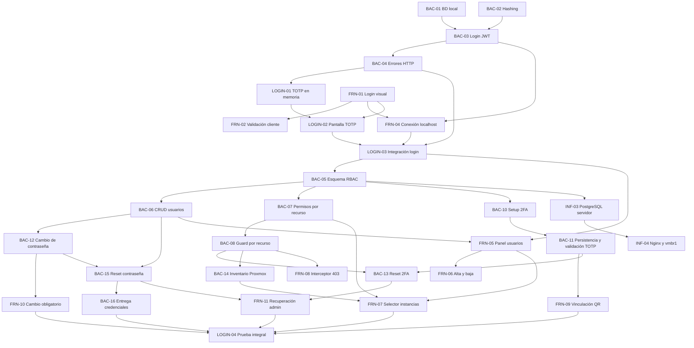

# Plan de próximas tareas

## Criterio de planificación

Este plan parte del estado registrado en `actual.md`: ninguna tarea de `BAC-01` a `BAC-04` ni de `FRN-01` a `FRN-04` está confirmada como terminada. Por eso, primero se debe cerrar el prototipo básico de login con usuario de prueba, JWT y flujo 2FA/TOTP en memoria.

Las fechas y horarios siguientes son una propuesta de ejecución desde el jueves 10/09/2026. Las horas indicadas son horas de trabajo estimadas y las franjas permiten visualizar dependencias y tareas paralelas. Una tarea solo pasa a `terminado.md` cuando se valida su criterio de éxito.

### Decisiones de alcance

- El 2FA se configura por usuario y cada cuenta conserva su propio secreto TOTP cifrado. No forma parte del rol.
- `ADMIN` y `OPERATOR` determinan qué acciones puede realizar una cuenta. `user_instances` solo determina sobre qué instancias puede actuar un operador.
- Los permisos granulares por acción, por ejemplo permitir `start` y prohibir `delete`, no están modelados por `user_instances` ni son parte del RF-09 actual. Si se requieren, deben planificarse como una ampliación separada del modelo de autorización.
- Antes de completar el cambio de contraseña y la verificación o vinculación 2FA, el backend solo debe emitir una sesión o token restringido para continuar el proceso de autenticación, nunca un JWT con acceso completo a la aplicación.
- **RF-12 (organizaciones) queda descartado del MVP.** El sistema se planifica y se implementa como monoorganización; ninguna tarea de la fase base ni de las etapas posteriores debe reservar campos de `organization_id`.
- **RF-13 (recuperación de contraseña por el propio usuario) se suma a la fase base**, para no dejar el flujo de recuperación cubierto solo con el reset administrativo (`BAC-15`).
- **La auditoría (RF-08) es una base transversal, no una tarea aislada de la Etapa 3.** Desde `BAC-18` la tabla `audit_logs` debe diseñarse como append-only (sin `UPDATE`/`DELETE` habilitados para la aplicación) y con columnas genéricas (`resource_type`, `resource_id`, `upid` nullable) para que la Etapa 1 (energía de instancias), la Etapa 2 (aprovisionamiento) y la Etapa 3 (snapshots) reutilicen la misma tabla sin migrar el esquema ni reconstruir historial. Toda tarea que agregue una acción auditable en cualquier etapa debe registrar contra esta tabla, no crear una paralela.
- **El contrato del canal de eventos/notificaciones (base de RF-11) se define en la fase base**, aunque el motor de alertas completo se construya recién en la Etapa 3, para que el poller de UPID de la Etapa 1 y las alertas de saturación de la Etapa 3 compartan el mismo esquema de evento desde el principio (ver `BAC-21`).
- **Servidor SMTP real descartado:** La integración con un proveedor SMTP real queda formalmente descartada del alcance. La entrega de correos y credenciales temporales queda resuelta de forma definitiva y completa mediante `MockEmailService` por consola a través del puerto `EmailService` (`BAC-16`), cumpliendo con mínimos privilegios (Zero-Trust), logs sanitizados y control estructurado de fallos sin dependencias de infraestructura externa.

## Fase 0. Cierre del prototipo de login

### `FIX-08` - Auditoría del contrato de códigos de error

- **Área:** Frontend / Backend
- **Asignados:** Cristian y Lisandro
- **Estimación:** 1,5 h
- **Ventana propuesta:** A definir.
- **Depende de:** ninguna.
- **Problema:** el backend y el frontend deben compartir una lista única de valores `errorCode`; el informe de pruebas registró una posible desalineación entre los códigos emitidos y los mensajes manejados por el cliente.
- **Entregable:** inventario de todos los `errorCode` emitidos por el backend, su estado HTTP y su manejo explícito en frontend. Corregir las diferencias verificadas y documentar los códigos que deliberadamente usan mensaje genérico.
- **Criterio de éxito:** cada código del contrato tiene una respuesta y un mensaje de frontend verificables, sin depender de nombres históricos como `body.code`.

### `FIX-12` - Falta guard de rol administrativo en rutas de gestión de usuarios (`FRN-05`)

- **Área:** Frontend
- **Asignada:** Belinda / Cristian
- **Estimación:** 0,5 h
- **Ventana propuesta:** A definir (alta prioridad).
- **Depende de:** `FIX-08`.
- **Problema:** las rutas administrativas `/users`, `/users/new` y `/users/:userId` deben verificar el rol del usuario autenticado, no solamente la existencia de un JWT. Sin este guard, un usuario `OPERATOR` puede acceder al panel de administración, incumpliendo `RF-09` y el criterio de éxito de `FRN-05`.
- **Entregable:** enlazar `loadAdminSession` a las rutas administrativas o agruparlas bajo un layout con dicho guard.
- **Criterio de éxito:** un usuario `OPERATOR` que navega a `/users` es redirigido a `/dashboard`; un usuario `ADMIN` puede acceder normalmente al panel.

### `FIX-13` - Desalineación de endpoints y PR pendiente en recuperación de contraseñas (`BAC-19` / `BAC-20`)

- **Área:** Backend
- **Asignados:** Lisandro y Tayra
- **Estimación:** 1,5 h
- **Ventana propuesta:** A definir.
- **Depende de:** la rama o implementación que contenga el flujo de recuperación.
- **Problema:** el informe histórico registró endpoints de recuperación ausentes o con rutas diferentes a las definidas en el contrato, lo que provocaba respuestas `404` y requería integrar la implementación correcta en `main`.
- **Entregable:** confirmar en `main` las rutas oficiales de recuperación, alinear handlers, documentación Swagger y pruebas, y eliminar alias o rutas obsoletas que generen ambigüedad.
- **Criterio de éxito:** las rutas documentadas para solicitar y confirmar la recuperación responden según contrato en `main`, y las pruebas de `BAC-19` y `BAC-20` pasan sin depender de una rama remota no integrada.

### `BAC-17` - Cierre de sesión y revocación atómica de sesiones (Backend)

- **Área:** Backend
- **Asignado:** Lisandro
- **Estimación:** 2 h
- **Ventana propuesta:** A definir.
- **Depende de:** `BAC-03` y `BAC-04`.
- **Estado de implementación actual en submódulo:** En `backend/cmd/api/main.go`, el endpoint `POST /api/auth/logout` está montado sin middleware de autenticación, por lo que el JTI del token de acceso (`ContextKeyJTI`) nunca se inyecta en el contexto y llega vacío a `authService.CerrarSesion`. En consecuencia, solo se desactiva el registro del `refreshToken` en `sesiones_activas`, mientras que el `accessToken` sigue figurando como activo en base de datos hasta que expire.
- **Entregable:**
  1. Permitir que `POST /api/auth/logout` reciba el encabezado `Authorization: Bearer <accessToken>` (o extraerlo del contexto) para obtener el JTI del token de acceso y revocar atómicamente ambas sesiones (`jtiRefresh` y `jtiAccess`) en la tabla `sesiones_activas`.
  2. Asegurar que tras el logout, cualquier llamada subsiguiente con el `accessToken` reciba inmediatamente `401 Unauthorized` (`TOKEN_REVOKED`) en el middleware `RequireAuth`.
  3. Registrar formalmente la acción en la tabla de auditoría con la acción `LOGOUT`.
- **Criterio de éxito:** tras ejecutar `POST /api/auth/logout`, tanto el refresh token como el access token quedan con `activa: false` en la base de datos; cualquier petición con el access token revocado es rechazada con código 401; la auditoría registra el evento de cierre de sesión.

### `FRN-13` - Flujo integral de logout y limpieza de sesión en cliente (Frontend)

- **Área:** Frontend
- **Asignados:** Cristian y Belinda
- **Estimación:** 2 h
- **Ventana propuesta:** A definir.
- **Depende de:** `BAC-17`.
- **Estado de implementación actual en submódulo:** En `frontend/centinela`, el servicio `logoutSession()` (`src/components/features/auth/services/authService.ts`) y el hook `useLogout()` (`src/components/features/auth/hooks/useAuth.ts`) ejecutan `POST /api/auth/logout` enviando únicamente `{ refreshToken }` y limpian el almacenamiento local. El botón "Cerrar sesión" se encuentra en el popover del usuario en `Header.tsx`. Sin embargo, falta garantizar el envío del token de acceso en la cabecera, gestionar el caso en que el refresh token no exista o haya expirado, y reaccionar ante eventos globales de revocación.
- **Entregable:**
  1. Asegurar que `logoutSession()` incluya la cabecera `Authorization: Bearer <accessToken>` junto al body `{ refreshToken }` para permitir al backend la revocación de ambos tokens.
  2. Garantizar que `useLogout()` limpie exhaustivamente `sessionStorage` (`centinela_access`, `centinela_refresh`, `centinela_user`, `centinela_pending_login`) sin importar si la llamada a la API tiene éxito o falla por red/expiración.
  3. Implementar un listener global para el evento `centinela:api-unauthorized` (o respuestas 401 `TOKEN_REVOKED`) que invoque la limpieza de sesión y redirección inmediata a `/login` para expulsar al usuario si su sesión fue revocada remotamente o cerrada en otra pestaña.
- **Criterio de éxito:** el usuario presiona "Cerrar sesión" en el menú de usuario, el backend revoca ambos tokens en la base de datos, el cliente elimina todas las credenciales de `sessionStorage` y redirige a `/login` con `replace: true`, impidiendo volver atrás mediante el historial del navegador; si el backend revoca la sesión, el frontend detecta el 401 y expulsa al usuario al login.

### `QA-11` - Re-verificación completa tras el fix crítico

- **Área:** Backend / Frontend
- **Asignados:** Cristian, Tayra y Lisandro
- **Estimación:** 1 h
- **Ventana propuesta:** A definir, después de cerrar los fixes del hito de recursos.
- **Depende de:** `BAC-14`, `FIX-14` y `FIX-16`.
- **Problema:** las pruebas actuales todavía fallan en el circuito de permisos por instancia: contrato de endpoints, autorización por recurso, inventario Proxmox e integración del selector frontend.
- **Entregable:** correr `test/back` completo contra el commit con los fixes aplicados y actualizar el estado real de cada tarea afectada en `terminado.md` (o devolverla a este documento si el criterio de éxito no se cumple).
- **Criterio de éxito:** las suites backend y frontend pasan sin fallos relacionados con el hito de recursos y cada tarea marcada como terminada tiene su criterio de éxito confirmado por pruebas.

### `SEC-01` - Refresh token en cookie HttpOnly en backend

- **Área:** Backend
- **Asignado:** Lisandro
- **Estimación:** 3 h
- **Ventana propuesta:** A definir.
- **Depende de:** `BAC-17`.
- **Estado actual:** la revocación de sesiones y la renovación de tokens están implementadas, pero el backend todavía recibe el refresh token en JSON y devuelve el token en el body. No existe emisión ni lectura de cookie HttpOnly.
- **Entregable:**
	1. Emitir el `refreshToken` mediante `Set-Cookie` al completar `POST /api/auth/2fa/verify`.
	2. Leerlo desde la cookie en `POST /api/auth/refresh` y `POST /api/auth/logout`.
	3. Dejar de devolver el refresh token en las respuestas JSON públicas.
	4. Configurar `HttpOnly`, `Secure`, `SameSite` y `Path` de forma segura y configurable para desarrollo y producción.
	5. Eliminar la cookie al cerrar sesión o cuando la sesión sea inválida.
- **Criterio de éxito:** el backend renueva y revoca sesiones usando exclusivamente la cookie HttpOnly; el refresh token no aparece en cuerpos JSON ni en logs; una cookie inválida o vencida produce un error controlado.

### `SEC-02` - Cliente frontend compatible con refresh token HttpOnly

- **Área:** Frontend
- **Asignado:** Cristian
- **Estimación:** 2 h
- **Ventana propuesta:** A definir, posterior a `SEC-01`.
- **Depende de:** `SEC-01` y `BAC-17`.
- **Estado actual:** `credentials: 'include'` ya está configurado en el cliente HTTP, pero el frontend todavía guarda el `refreshToken` en `sessionStorage`, lo lee para renovar la sesión y lo envía en el body de refresh/logout.
- **Entregable:**
	1. Eliminar el almacenamiento, lectura y tipado de `refreshToken` en el frontend.
	2. Mantener `credentials: 'include'` en login/2FA, refresh y logout.
	3. Adaptar la validación de respuestas para aceptar respuestas que ya no incluyan `refreshToken`.
	4. Adaptar el interceptor para renovar la sesión sin construir un body con el token.
	5. Mantener el `accessToken` en `sessionStorage` mientras esta tarea se limite al refresh token.
- **Criterio de éxito:** JavaScript no puede leer el refresh token desde storage, memoria de aplicación ni respuestas HTTP; la renovación y el logout funcionan mediante cookies y la sesión local conserva únicamente el access token.

## Fase 1. Cierre del control de acceso por recurso

### `FIX-14` - Integración frontend del selector de instancias (`FRN-07`)

- **Área:** Frontend
- **Asignado:** Cristian
- **Estimación:** 4 h
- **Ventana propuesta:** A definir.
- **Depende de:** `BAC-07` y `BAC-14`.
- **Problema y evidencia en pruebas (`test/front/admin-users.test.tsx`):**
  1. *Falla de consulta:* `FRN-07 - selector de asignación de instancias > consulta GET /api/instances con Authorization Bearer para listar instancias` falló con `AssertionError: expected undefined to be defined` en la comprobación de llamadas a `fetchMock`. `UserDetail.tsx` nunca realiza la consulta HTTP a `/instances` para obtener el listado dinámico de máquinas virtuales y contenedores LXC.
  2. *Falla de guardado:* `FRN-07 - selector de asignación de instancias > permite seleccionar VMIDs y enviarlos al endpoint de permisos` falló con `AssertionError: expected undefined to be defined` tras hacer click en el botón de guardado. `handleSaveChanges()` solo despacha la actualización de datos generales a `PUT /api/admin/users/:id`, omitiendo el despacho de los VMIDs seleccionados hacia el endpoint de permisos.
  3. *Diagnóstico en código:* en [frontend/centinela/src/pages/UserDetail.tsx](frontend/centinela/src/pages/UserDetail.tsx), el subcomponente `AccessList()` renderiza elementos estáticos fijos (`['Ubuntu Server (101)', 'Desarrollo (104)', ...]`) sin estado reactivo, sin consumir `apiClient.get('/instances')` y sin vincular los checkboxes a una mutación real.
- **Entregable:**
  1. Implementar en `UserDetail.tsx` (o hook dedicado) la carga asíncrona de instancias consumiendo `GET /api/instances` con token de autorización Bearer.
  2. Mapear los VMIDs actualmente asignados al usuario (obtenidos desde `GET /api/admin/users/:id/permissions` o `instanciasPermitidas` del DTO) en el estado de selección de la pestaña "Roles y permisos".
  3. Al presionar "Guardar cambios", despachar la petición `PUT /api/admin/users/:id/permissions` con el payload `{ vmids: number[] }` de forma atómica junto a la edición del perfil de usuario, mostrando estados de carga, notificación visual (toast) y control de errores.
- **Criterio de éxito:** la suite `test/front/admin-users.test.tsx` pasa al 100% (2 pruebas de `FRN-07` en verde), verificando la llamada con Bearer a `GET /api/instances` y el despacho de `PUT /api/admin/users/:id/permissions` con el array de VMIDs seleccionados.

### `FIX-16` - Montar middleware de autorización por recurso en rutas de instancias (`BAC-08`)

- **Área:** Backend
- **Asignado:** Lisandro
- **Estimación:** 1,5 h
- **Ventana propuesta:** A definir (junto a `BAC-14`).
- **Depende de:** `BAC-08` y `BAC-14`.
- **Problema y evidencia en pruebas (`test/back/resource_access_acceptance_test.go`):** la prueba `BAC-08_rechaza_instancia_no_asignada_con_403_sin_llamar_a_Proxmox` falló con código HTTP `404 Not Found` en lugar de `403 Forbidden` al consultar `GET /instances/9999` con token de un usuario con rol `OPERATOR`.
- **Diagnóstico y causa raíz:** el middleware `RequireInstanceAccess` (`internal/adapters/primary/http/middleware/instance_guard.go`), el puerto `InstanceRepository` (`internal/core/ports/instance_port.go`) y el repositorio PostgreSQL `postgres.NewInstanceRepository(db)` (`internal/adapters/secondary/postgres/instance_repository.go`) se encuentran completamente programados e instanciados en `main.go`. No obstante, el grupo de rutas `/instances` permanece comentado en `backend/cmd/api/main.go` a la espera de que se incorporen los handlers de Proxmox VE (`BAC-14`). Al no estar montadas las rutas en Gin, la solicitud no alcanza el guard y responde `404`.
- **Entregable:**
  1. Habilitar y montar el grupo de rutas `/instances` en `cmd/api/main.go` bajo `middleware.RequireAuth()`.
  2. Aplicar el middleware `RequireInstanceAccess(instanceRepo, "vmid")` en las operaciones por recurso (`GET /instances/:vmid`, `POST /instances/:vmid/start`, etc.).
  3. Asegurar que las solicitudes de operadores sobre VMIDs no autorizados sean interceptadas tempranamente con código `403 Forbidden` y `{ "errorCode": "INSTANCE_ACCESS_DENIED" }`, abortando la cadena antes de invocar cualquier llamada hacia Proxmox VE.
- **Criterio de éxito:** un operador que intente acceder a un VMID no asignado recibe `403 Forbidden` con `INSTANCE_ACCESS_DENIED`; la aserción de `BAC-08_rechaza_instancia_no_asignada_con_403_sin_llamar_a_Proxmox` en `resource_access_acceptance_test.go` pasa al 100%.

## Fase 2. Cierre de autenticación y asignación de máquinas

*(Nota de alcance: `BAC-16` se encuentra finalizada y validada en `terminado.md` con `MockEmailService`; la integración con un servidor SMTP real quedó formalmente descartada).*

---

*(Nota: `BAC-19`, `BAC-20` y `BAC-21` fueron completadas, integradas y verificadas 100% en `terminado.md`).*

### `INF-05` - CORS y TLS en el borde

- **Área:** Infraestructura
- **Asignado:** Nico
- **Estimación:** 1,5 h
- **Ventana propuesta:** A definir (junto con `INF-04`).
- **Depende de:** `INF-04`.
- **Entregable:** whitelist de orígenes permitidos en CORS y certificados TLS configurados en Nginx para todo el tráfico hacia el frontend y la API.
- **Criterio de éxito:** una petición desde un origen no autorizado es rechazada por CORS y el tráfico hacia el sistema se sirve únicamente sobre HTTPS.

### `LOGIN-04` - Prueba integral de autenticación y autorización

- **Área:** Frontend / Backend
- **Asignados:** Cristian, Tayra y Lisandro
- **Estimación:** 3 h
- **Ventana propuesta:** 18/09/2026, 14:00-17:00
- **Depende de:** `FRN-07`, `FRN-09`, `FRN-10`, `FRN-11`, `FRN-12`, `BAC-14`, `BAC-16`, `BAC-17`, `BAC-18`, `BAC-20` y `BAC-21`.
- **Entregable:** pruebas documentadas o automatizadas de creación de usuario, entrega y cambio de clave temporal, enrolamiento y login con TOTP, acceso según rol, filtro por instancias, recuperación administrativa de contraseña y 2FA, recuperación de contraseña por el propio usuario, logout/revocación de sesión y verificación de que las acciones administrativas quedan auditadas.
- **Criterio de éxito:** todos los recorridos válidos terminan con el acceso esperado y los intentos de omitir pasos, usar credenciales anteriores, acceder con otro rol, consultar una instancia no asignada o reutilizar un token revocado son rechazados con códigos HTTP controlados.

## Fase 3. Despliegue de persistencia y red

## Relación y orden de ejecución

### Tareas que pueden ejecutarse en paralelo

- `BAC-01`, `BAC-02`, `FRN-01` y `FRN-03` no dependen entre sí.
- `FRN-05` puede comenzar con el contrato definido de `BAC-06`, aunque necesita el endpoint para validación final.
- `FRN-06` puede avanzar con datos simulados mientras termina `BAC-06`.
- `BAC-10`/`BAC-11`, `BAC-12` y `BAC-14` pueden desarrollarse en paralelo una vez disponibles sus dependencias.
- `FRN-09` y `FRN-10` pueden maquetarse con contratos simulados, pero requieren `BAC-11` y `BAC-12` para validar los bloqueos de navegación.
- `BAC-13` y `BAC-15` pueden desarrollarse en paralelo; `FRN-11` integra ambas recuperaciones una vez definidos sus contratos.
- `INF-03` debe esperar el esquema de `BAC-05`, pero puede preparar el LXC, la red y los secretos antes de desplegarlo.

### Secuencia crítica

`BAC-01` + `BAC-02` -> `BAC-03` -> `BAC-04` -> `LOGIN-01` + `LOGIN-02` -> `FRN-04` -> `LOGIN-03` -> `BAC-05` -> `BAC-06`/`BAC-07` -> `BAC-08` -> `BAC-10`/`BAC-11` + `BAC-12` + `BAC-14` -> `BAC-13`/`BAC-15` + `FRN-07`/`FRN-09`/`FRN-10` -> `BAC-16`/`FRN-11` -> `LOGIN-04`.

## Resumen para ClickUp

| ID | Área | Asignado | Horas | Fecha propuesta | Dependencias |
|---|---|---|---:|---|---|
| BAC-01 | Backend/Infra | Tayra / Lucas | 2 | 10/09/2026 | - |
| BAC-02 | Backend | Lisandro | 2 | 10/09/2026 | - |
| BAC-03 | Backend | Tayra | 3 | 11/09/2026 | BAC-01, BAC-02 |
| BAC-04 | Backend | Lisandro | 1,5 | 11/09/2026 | BAC-03 |
| LOGIN-01 | Backend | Tayra / Lisandro | 2 | 11/09/2026 | BAC-03, BAC-04 |
| FRN-01 | Frontend | Belinda | 3 | 10/09/2026 | - |
| FRN-02 | Frontend | Belinda | 2 | 10/09/2026 | FRN-01 |
| FRN-03 | Frontend | Cristian / Luz | 3 | 10/09/2026 | - |
| FRN-04 | Frontend | Cristian | 3 | 11/09/2026 | BAC-03, BAC-04, FRN-01 |
| LOGIN-02 | Frontend | Belinda / Luz | 2 | 11/09/2026 | LOGIN-01, FRN-01 |
| LOGIN-03 | Integración | Cristian / Tayra / Lisandro | 2 | 11/09/2026 | FRN-04, LOGIN-02 |
| BAC-05 | Backend | Tayra / Lisandro | 3 | 14/09/2026 | BAC-01, LOGIN-03 |
| BAC-06 | Backend | Lisandro | 4 | 14/09/2026 | BAC-05 |
| BAC-07 | Backend | Tayra | 3 | 15/09/2026 | BAC-05, BAC-06 |
| BAC-08 | Backend | Lisandro | 3 | 15/09/2026 | BAC-07 |
| FRN-05 | Frontend | Belinda | 4 | 14/09/2026 | LOGIN-03, BAC-06 |
| FRN-06 | Frontend | Luz | 3 | 14/09/2026 | FRN-05, BAC-06 |
| FRN-07 | Frontend | Cristian | 4 | 15/09/2026 | FRN-05, BAC-07, BAC-14 |
| FRN-08 | Frontend | Cristian | 2 | 15/09/2026 | BAC-08, FRN-04 |
| BAC-10 | Backend | Tayra | 2 | 16/09/2026 | BAC-05, LOGIN-03 |
| BAC-11 | Backend | Lisandro | 3 | 16/09/2026 | BAC-10, BAC-05 |
| FRN-09 | Frontend | Belinda / Luz | 3 | 16/09/2026 | BAC-10, BAC-11, LOGIN-02 |
| BAC-12 | Backend | Lisandro | 2 | 16/09/2026 | BAC-02, BAC-05, BAC-06 |
| FRN-10 | Frontend | Belinda | 2 | 16/09/2026 | BAC-12, FRN-04 |
| BAC-13 | Backend | Tayra | 2 | 17/09/2026 | BAC-06, BAC-08, BAC-11 |
| BAC-14 | Backend | Tayra | 3 | 17/09/2026 | BAC-08, credenciales Proxmox |
| BAC-15 | Backend | Lisandro | 2 | 17/09/2026 | BAC-06, BAC-12 |
| BAC-16 | Backend/Infra | Lisandro / Nico | 3 | 18/09/2026 | BAC-06, BAC-15, SMTP |
| FRN-11 | Frontend | Luz | 2 | 18/09/2026 | FRN-05, BAC-13, BAC-15 |
| LOGIN-04 | Integración | Cristian / Tayra / Lisandro | 3 | 18/09/2026 | FRN-07, FRN-09, FRN-10, FRN-11, BAC-14, BAC-16 |
| INF-03 | Infraestructura | Lucas / Nico | 3 | 16/09/2026 | BAC-05 |
| INF-04 | Infraestructura | Nico | 3 | 16/09/2026 | INF-03 |
| BAC-17 | Backend | Lisandro | 2 | A definir | BAC-03, BAC-05 |
| FRN-13 | Frontend | Cristian / Belinda | 2 | A definir | BAC-17 |
| BAC-18 | Backend | Tayra | 4 | A definir | BAC-05 |
| BAC-19 | Backend | Lisandro | 2 | A definir | BAC-05, BAC-16 |
| BAC-20 | Backend | Tayra | 2 | A definir | BAC-19, BAC-17 |
| BAC-21 | Backend | Tayra / Lisandro | 2 | A definir | BAC-05 |
| FRN-12 | Frontend | Belinda | 3 | A definir | BAC-19, BAC-20 |
| INF-05 | Infraestructura | Nico | 1,5 | A definir | INF-04 |

**Resultado esperado:** al completar `LOGIN-04` e `INF-04`, el equipo tendrá cerrado el circuito técnico de RF-01 y RF-09: contraseña temporal entregada y reemplazada, 2FA individual persistido, JWT posterior a la verificación, usuarios, roles, recuperación administrativa, permisos binarios por instancia, inventario real y bloqueo por recurso. Con `BAC-17` a `BAC-21`, `FRN-12` e `INF-05` también queda cerrado RF-13 (recuperación de contraseña por el propio usuario), la revocación de sesiones, la base append-only de auditoría (parte de RF-08) y el contrato de eventos que la Etapa 1 y la Etapa 3 van a reutilizar (base de RF-11), sin dejar backfill ni rediseño pendiente. La protección de las operaciones de Proxmox debe validarse antes de habilitar acciones destructivas.

**Fuera de alcance:** no se incluyen permisos granulares por acción porque el requerimiento actual solo define roles y asignación de instancias. Incorporarlos requiere una ampliación explícita del modelo de autorización y nuevos criterios para cada operación. **RF-12 (organizaciones/multi-tenant) queda descartado del MVP** y no debe planificarse en ninguna etapa posterior salvo decisión explícita en contrario.

### 🧱 Bloque 3: Persistencia Definitiva de 2FA y Ciclo de Vida de Credenciales

Este bloque formaliza la seguridad completa (Fase 2) y cierra el hito integral `LOGIN-04`.

#### 1. Tareas de desarrollo paralelo

* **Backend:**
* `BAC-10` y `BAC-11` — Enrolamiento 2FA, QR (`GET /api/auth/2fa/qr`) y persistencia del secreto cifrado con AES-256 (`POST /api/auth/2fa/verify`).

* `BAC-12` — Cambio obligatorio de contraseña temporal (`POST /api/auth/change-password`).

* `BAC-13` y `BAC-15` — Restablecimiento administrativo de 2FA y contraseña (`POST /api/admin/users/{id}/reset-...`).

* `BAC-16` — Entrega segura de credenciales temporales vía SMTP.

* **Frontend:**
* `FRN-09` — Modal obligatorio de vinculación 2FA con escaneo de QR y confirmación.

* `FRN-10` — Pantalla obligatoria de cambio de contraseña cuando `must_change_password: true`.

* `FRN-11` — Acciones de restablecimiento de contraseña y 2FA desde el panel de administración.

#### 🎯 Prueba de Integración final (`LOGIN-04`):

> **Hito:** *Circuito Completo de Seguridad y Autenticación*
> 1. El Admin crea un usuario -> El usuario recibe su clave temporal por correo (`BAC-16`).
> 
> 
> 2. El usuario inicia sesión -> El Front detecta `must_change_password` y lo bloquea hasta que cambie su clave temporal (`FRN-10` / `BAC-12`).
> 
> 
> 3. Pasa al enrolamiento de 2FA: escanea el QR en Google Authenticator (`FRN-09` / `BAC-10`) y confirma su código (`BAC-11`).
> 
> 
> 4. Ingresa al sistema con su JWT definitivo según su rol y permisos de instancias.
> 
> 
> 5. El Admin puede revocarle el 2FA o la clave (`FRN-11` / `BAC-13` / `BAC-15`) forzándolo a reiniciar el ciclo en su próximo acceso.
> 
> 
> 
> 

---

### 📋 Resumen del orden de ejecución para el equipo:

1. **Cerrar Bloque 0:** Resolver el fix de dígitos OTP en `TwoFactor.tsx` (`LOGIN-02` / `LOGIN-03` al 100%).

2. **Asignar Bloque 1:** CRUD de Usuarios y Roles (`BAC-05`, `BAC-06`, `BAC-06B`, `BAC-09` + `FRN-05`, `FRN-06`, `FRN-06B`) -> **Prueba de Integración 1**.

3. **Asignar Bloque 2:** Permisos por Recurso e Inventario (`BAC-07`, `BAC-08`, `BAC-14` + `FRN-07`, `FRN-08`) -> **Prueba de Integración 2**.

4. **Asignar Bloque 3:** 2FA Real, Recuperación y Cambio de Clave (`BAC-10` a `BAC-16` + `FRN-09` a `FRN-11`) -> **Prueba de Integración `LOGIN-04**`.