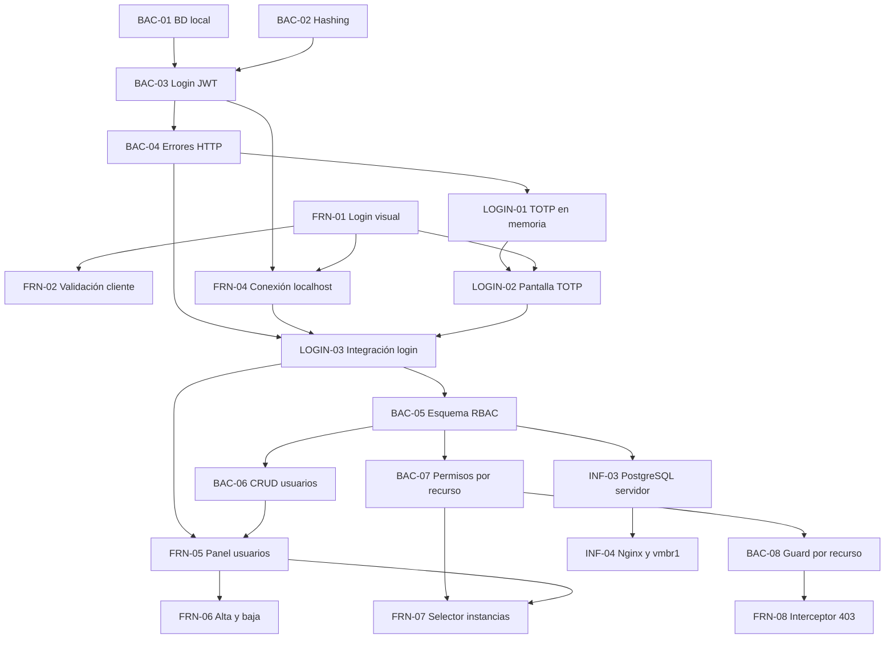

 # Plan de próximas tareas

## Criterio de planificación

Este plan parte del estado registrado en `actual.md`: ninguna tarea de `BAC-01` a `BAC-04` ni de `FRN-01` a `FRN-04` está confirmada como terminada. Por eso, primero se debe cerrar el prototipo básico de login con usuario de prueba, JWT y flujo 2FA/TOTP en memoria.

Las fechas y horarios siguientes son una propuesta de ejecución desde el jueves 10/09/2026. Las horas indicadas son horas de trabajo estimadas y las franjas permiten visualizar dependencias y tareas paralelas. Una tarea solo pasa a `terminado.md` cuando se valida su criterio de éxito.

## Fase 0. Cierre del prototipo de login

### `BAC-01` - Script Docker Compose de base de datos local

- **Área:** Backend / Infraestructura
- **Asignados:** Tayra y Lucas
- **Estimación:** 2 h
- **Ventana propuesta:** 10/09/2026, 14:00-16:00
- **Depende de:** ninguna.
- **Entregable:** PostgreSQL local mediante Docker Compose, tablas mínimas de usuarios y roles `ADMIN`/`OPERATOR`, y usuario de prueba.
- **Criterio de éxito:** el equipo puede levantar la base con `docker compose up` y conectarse usando las credenciales documentadas.

### `BAC-02` - Modelo y hashing de contraseñas

- **Área:** Backend
- **Asignado:** Lisandro
- **Estimación:** 2 h
- **Ventana propuesta:** 10/09/2026, 14:00-16:00
- **Depende de:** ninguna; puede ejecutarse en paralelo con `BAC-01`.
- **Entregable:** modelo de usuario y verificación de contraseñas con bcrypt o Argon2.
- **Criterio de éxito:** la contraseña nunca se persiste en texto plano y una credencial válida se distingue de una inválida mediante pruebas automatizadas o manuales documentadas.

### `BAC-03` - Endpoint `POST /api/auth/login`

- **Área:** Backend
- **Asignado:** Tayra
- **Estimación:** 3 h
- **Ventana propuesta:** 11/09/2026, 09:00-12:00
- **Depende de:** `BAC-01` y `BAC-02`.
- **Entregable:** endpoint que recibe usuario o correo y contraseña, valida contra PostgreSQL y devuelve un JWT firmado con `id` y `role`.
- **Criterio de éxito:** el usuario de prueba puede iniciar sesión y el JWT se valida correctamente con la clave configurada.

### `BAC-04` - Manejo de errores HTTP

- **Área:** Backend
- **Asignado:** Lisandro
- **Estimación:** 1,5 h
- **Ventana propuesta:** 11/09/2026, 12:00-13:30
- **Depende de:** `BAC-03`.
- **Entregable:** respuestas JSON unificadas con `400` para payload incompleto y `401` para credenciales inválidas.
- **Criterio de éxito:** los casos válidos e inválidos devuelven código HTTP y estructura JSON documentados.

### `LOGIN-01` - Flujo 2FA/TOTP en memoria

- **Área:** Backend
- **Asignado:** Tayra y Lisandro
- **Estimación:** 2 h
- **Ventana propuesta:** 11/09/2026, 13:30-15:30
- **Depende de:** `BAC-03` y `BAC-04`.
- **Entregable:** generación de secreto TOTP temporal, validación de código de seis dígitos y estado de verificación en memoria. No reemplaza todavía la persistencia segura definitiva del RF-01.
- **Criterio de éxito:** el login solicita el TOTP después de validar la contraseña y rechaza códigos inválidos o vencidos.

### `FRN-01` - Maquetado del formulario de login

- **Área:** Frontend
- **Asignado:** Belinda
- **Estimación:** 3 h
- **Ventana propuesta:** 10/09/2026, 14:00-17:00
- **Depende de:** ninguna.
- **Entregable:** campos de usuario o correo, contraseña, botón de envío y estado visual de carga.
- **Criterio de éxito:** la vista se renderiza y permite recorrer los estados inicial, cargando, éxito y error.

### `FRN-02` - Validación en cliente del login

- **Área:** Frontend
- **Asignado:** Belinda
- **Estimación:** 2 h
- **Ventana propuesta:** 10/09/2026, 17:00-19:00
- **Depende de:** `FRN-01`.
- **Entregable:** validación de formato y mensajes de error antes de enviar la petición.
- **Criterio de éxito:** no se envían formularios incompletos y cada error se muestra junto al campo correspondiente.

### `FRN-03` - Navbar y rutas base

- **Área:** Frontend
- **Asignados:** Cristian y Luz
- **Estimación:** 3 h
- **Ventana propuesta:** 10/09/2026, 14:00-17:00
- **Depende de:** ninguna.
- **Entregable:** navegación y vistas iniciales de Dashboard e Instancias, aunque sean estáticas.
- **Criterio de éxito:** el usuario puede navegar entre las pantallas base sin romper la aplicación.

### `FRN-04` - Conexión del login con localhost

- **Área:** Frontend
- **Asignado:** Cristian
- **Estimación:** 3 h
- **Ventana propuesta:** 11/09/2026, 15:30-18:30
- **Depende de:** `BAC-03`, `BAC-04` y `FRN-01`.
- **Entregable:** petición HTTP al backend local y almacenamiento del JWT en memoria.
- **Criterio de éxito:** el usuario de prueba puede iniciar sesión desde el frontend y el cliente conserva el JWT durante la sesión.

### `LOGIN-02` - Pantalla y validación del código TOTP

- **Área:** Frontend
- **Asignados:** Belinda y Luz
- **Estimación:** 2 h
- **Ventana propuesta:** 11/09/2026, 15:30-17:30
- **Depende de:** `LOGIN-01` y `FRN-01`.
- **Entregable:** pantalla de ingreso del código TOTP de seis dígitos y mensajes de error.
- **Criterio de éxito:** el frontend permite ingresar el código, muestra el estado de verificación y habilita la navegación solo cuando la validación es correcta.

### `LOGIN-03` - Integración y prueba del prototipo

- **Área:** Frontend / Backend
- **Asignados:** Cristian, Tayra y Lisandro
- **Estimación:** 2 h
- **Ventana propuesta:** 11/09/2026, 18:30-20:30
- **Depende de:** `BAC-04`, `FRN-04` y `LOGIN-02`.
- **Entregable:** recorrido completo usuario de prueba -> contraseña -> TOTP en memoria -> pantalla base.
- **Criterio de éxito:** el flujo válido termina en Dashboard, el flujo inválido muestra un error y no permite acceder a las vistas protegidas.

## Fase 1. Usuarios, roles y permisos

### `BAC-05` - Migración y esquema relacional de usuarios y RBAC

- **Área:** Backend
- **Asignados:** Tayra y Lisandro
- **Estimación:** 3 h
- **Ventana propuesta:** 14/09/2026, 09:00-12:00
- **Depende de:** `BAC-01` y `LOGIN-03`.
- **Entregable:** migración SQL u ORM con `users` y `user_instances`. `users` debe incluir `id` UUID, `username`, `email`, `password_hash`, `role`, `totp_secret` protegido, `is_2fa_enabled` y `must_change_password`. `user_instances` debe tener `user_id`, `instance_id` y clave primaria compuesta.
- **Criterio de éxito:** la migración se ejecuta desde cero, crea las relaciones y carga un administrador inicial.

### `BAC-06` - CRUD de usuarios para administradores

- **Área:** Backend
- **Asignado:** Lisandro
- **Estimación:** 4 h
- **Ventana propuesta:** 14/09/2026, 13:00-17:00
- **Depende de:** `BAC-05`.
- **Entregable:** `GET /api/admin/users`, `POST /api/admin/users` y `DELETE /api/admin/users/{id}`. La creación debe generar una contraseña temporal y establecer `must_change_password: true`.
- **Criterio de éxito:** un administrador puede listar, crear y desactivar usuarios; un operador recibe `403 Forbidden`.

### `BAC-07` - Asignación de permisos por recurso

- **Área:** Backend
- **Asignado:** Tayra
- **Estimación:** 3 h
- **Ventana propuesta:** 15/09/2026, 09:00-12:00
- **Depende de:** `BAC-05` y `BAC-06`.
- **Entregable:** `PUT /api/admin/users/{id}/permissions` y `GET /api/admin/users/{id}/permissions`, con actualización atómica de `user_instances`.
- **Criterio de éxito:** la relación usuario-instancia se persiste, reemplaza el conjunto anterior de forma atómica y solo puede gestionarla un administrador autorizado.

### `BAC-08` - Middleware de autorización por recurso

- **Área:** Backend
- **Asignado:** Lisandro
- **Estimación:** 3 h
- **Ventana propuesta:** 15/09/2026, 13:00-16:00
- **Depende de:** `BAC-07`.
- **Entregable:** guard que valide `(user_id, instance_id)` en `user_instances` antes de consultar o enviar órdenes a Proxmox VE.
- **Criterio de éxito:** un operador sin permiso recibe `403` y la API no realiza ninguna llamada a Proxmox VE.

### `FRN-05` - Panel de gestión de usuarios

- **Área:** Frontend
- **Asignado:** Belinda
- **Estimación:** 4 h
- **Ventana propuesta:** 14/09/2026, 09:00-13:00
- **Depende de:** `LOGIN-03` y contrato inicial de `BAC-06`.
- **Entregable:** vista `/admin/users` con nombre, correo, rol, estado de 2FA y acciones. Solo debe ser visible para administradores.
- **Criterio de éxito:** el administrador ve el listado real y un operador no puede acceder a la vista.

### `FRN-06` - Modal de creación y desactivación de usuarios

- **Área:** Frontend
- **Asignado:** Luz
- **Estimación:** 3 h
- **Ventana propuesta:** 14/09/2026, 14:00-17:00
- **Depende de:** `FRN-05` y `BAC-06`.
- **Entregable:** modal con usuario, correo y rol; visualización controlada de la contraseña temporal; confirmación para desactivar usuarios y toasts de resultado.
- **Criterio de éxito:** el administrador puede completar altas y bajas desde la interfaz y los errores se muestran de forma comprensible.

### `FRN-07` - Selector de asignación de instancias

- **Área:** Frontend
- **Asignado:** Cristian
- **Estimación:** 4 h
- **Ventana propuesta:** 15/09/2026, 09:00-13:00
- **Depende de:** `FRN-05` y `BAC-07`.
- **Entregable:** selector con instancias disponibles y asignadas, y botón que envíe el array de IDs a `PUT /api/admin/users/{id}/permissions`.
- **Criterio de éxito:** el administrador puede guardar una matriz de permisos y verla nuevamente al abrir el usuario.

### `FRN-08` - Interceptor HTTP y manejo de `403 Forbidden`

- **Área:** Frontend
- **Asignado:** Cristian
- **Estimación:** 2 h
- **Ventana propuesta:** 15/09/2026, 14:00-16:00
- **Depende de:** `BAC-08` y `FRN-04`.
- **Entregable:** interceptor Axios o Fetch para enviar `Authorization: Bearer <JWT>` y mostrar un mensaje amigable ante un `403` sin cerrar la sesión.
- **Criterio de éxito:** las peticiones incluyen el JWT y un operador sin permiso recibe una respuesta visual clara.

## Fase 2. Despliegue de persistencia y red

### `INF-03` - PostgreSQL persistente en el servidor

- **Área:** Infraestructura
- **Asignados:** Lucas y Nico
- **Estimación:** 3 h
- **Ventana propuesta:** 16/09/2026, 09:00-12:00
- **Depende de:** `BAC-05`.
- **Entregable:** PostgreSQL desplegado en el LXC o Docker de prueba, con volumen persistente y credenciales seguras.
- **Criterio de éxito:** la base es accesible por la red interna o VPN y los datos sobreviven al reinicio del contenedor.

### `INF-04` - Red interna y reverse proxy con Nginx

- **Área:** Infraestructura
- **Asignado:** Nico
- **Estimación:** 3 h
- **Ventana propuesta:** 16/09/2026, 13:00-16:00
- **Depende de:** `INF-03` y del backend desplegable.
- **Entregable:** Nginx enruta `/api/*` al backend y `/` al frontend; la subred virtual `vmbr1` comunica backend, base de datos y API de Proxmox VE.
- **Criterio de éxito:** el dominio o IP local resuelve, el frontend alcanza el backend y el backend alcanza PostgreSQL y Proxmox VE sin exponer la base públicamente.

## Relación y orden de ejecución

### Tareas que pueden ejecutarse en paralelo

- `BAC-01`, `BAC-02`, `FRN-01` y `FRN-03` no dependen entre sí.
- `FRN-05` puede comenzar con el contrato definido de `BAC-06`, aunque necesita el endpoint para validación final.
- `FRN-06` puede avanzar con datos simulados mientras termina `BAC-06`.
- `INF-03` debe esperar el esquema de `BAC-05`, pero puede preparar el LXC, la red y los secretos antes de desplegarlo.

### Secuencia crítica

`BAC-01` + `BAC-02` -> `BAC-03` -> `BAC-04` -> `LOGIN-01` + `LOGIN-02` -> `FRN-04` -> `LOGIN-03` -> `BAC-05` -> `BAC-06`/`BAC-07` -> `BAC-08` -> `FRN-07`/`FRN-08`.

## Resumen para ClickUp

| ID | Área | Asignado | Horas | Fecha propuesta | Dependencias |
|---|---|---|---:|---|---|
| BAC-01 | Backend/Infra | Tayra / Lucas | 2 | 10/09/2026 | - |
| BAC-02 | Backend | Lisandro | 2 | 10/09/2026 | - |
| BAC-03 | Backend | Tayra | 3 | 11/09/2026 | BAC-01, BAC-02 |
| BAC-04 | Backend | Lisandro | 1,5 | 11/09/2026 | BAC-03 |
| LOGIN-01 | Backend | Tayra / Lisandro | 2 | 11/09/2026 | BAC-03, BAC-04 |
| FRN-01 | Frontend | Belinda | 3 | 10/09/2026 | - |
| FRN-02 | Frontend | Belinda | 2 | 10/09/2026 | FRN-01 |
| FRN-03 | Frontend | Cristian / Luz | 3 | 10/09/2026 | - |
| FRN-04 | Frontend | Cristian | 3 | 11/09/2026 | BAC-03, BAC-04, FRN-01 |
| LOGIN-02 | Frontend | Belinda / Luz | 2 | 11/09/2026 | LOGIN-01, FRN-01 |
| LOGIN-03 | Integración | Cristian / Tayra / Lisandro | 2 | 11/09/2026 | FRN-04, LOGIN-02 |
| BAC-05 | Backend | Tayra / Lisandro | 3 | 14/09/2026 | BAC-01, LOGIN-03 |
| BAC-06 | Backend | Lisandro | 4 | 14/09/2026 | BAC-05 |
| BAC-07 | Backend | Tayra | 3 | 15/09/2026 | BAC-05, BAC-06 |
| BAC-08 | Backend | Lisandro | 3 | 15/09/2026 | BAC-07 |
| FRN-05 | Frontend | Belinda | 4 | 14/09/2026 | LOGIN-03, BAC-06 |
| FRN-06 | Frontend | Luz | 3 | 14/09/2026 | FRN-05, BAC-06 |
| FRN-07 | Frontend | Cristian | 4 | 15/09/2026 | FRN-05, BAC-07 |
| FRN-08 | Frontend | Cristian | 2 | 15/09/2026 | BAC-08, FRN-04 |
| INF-03 | Infraestructura | Lucas / Nico | 3 | 16/09/2026 | BAC-05 |
| INF-04 | Infraestructura | Nico | 3 | 16/09/2026 | INF-03 |

**Resultado esperado:** al completar `FRN-08` e `INF-04`, el equipo tendrá consolidado el RF-09, con usuarios persistidos, roles, permisos por instancia, bloqueo por recurso y despliegue de la base en el servidor de prueba. La protección de las operaciones de Proxmox debe validarse antes de habilitar acciones destructivas.
