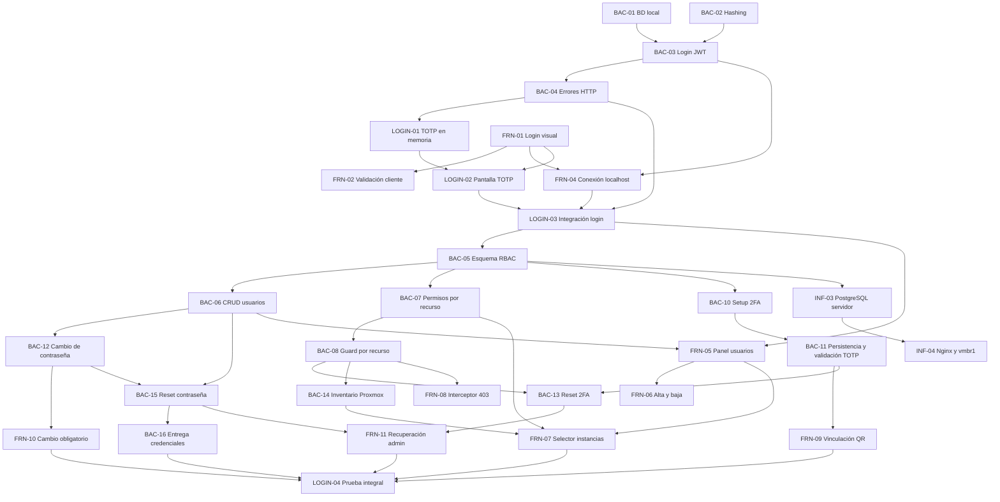

# Plan de próximas tareas

## Criterio de planificación

Este plan parte del estado registrado en `actual.md`: ninguna tarea de `BAC-01` a `BAC-04` ni de `FRN-01` a `FRN-04` está confirmada como terminada. Por eso, primero se debe cerrar el prototipo básico de login con usuario de prueba, JWT y flujo 2FA/TOTP en memoria.

Las fechas y horarios siguientes son una propuesta de ejecución desde el jueves 10/09/2026. Las horas indicadas son horas de trabajo estimadas y las franjas permiten visualizar dependencias y tareas paralelas. Una tarea solo pasa a `terminado.md` cuando se valida su criterio de éxito.

### Decisiones de alcance (Actualizadas al 25/09/2026)

- El 2FA se configura por usuario y cada cuenta conserva su propio secreto TOTP cifrado. No forma parte del rol.
- `ADMIN` y `OPERATOR` determinan qué acciones globales puede realizar una cuenta. `permisos_instancia` determina sobre qué instancias puede actuar un operador y con qué **nivel de acceso (`SEC-04`)**: `FULL_ACCESS` (permite operar ciclo de vida: encender, apagar, reiniciar) o `READ_ONLY` (solo visualización de inventario y telemetría, bloqueando órdenes mutantes con HTTP 403). La eliminación destructiva (`DELETE`) queda restringida exclusivamente al rol `ADMIN`.
- Antes de completar el cambio de contraseña y la verificación o vinculación 2FA, el backend solo debe emitir una sesión o token restringido para continuar el proceso de autenticación, nunca un JWT con acceso completo a la aplicación.
- **RF-12 (organizaciones) queda descartado del MVP.** El sistema se planifica y se implementa como monoorganización; ninguna tarea nueva debe requerir gestión multi-tenant.
- **RF-13 (recuperación de contraseña por el propio usuario) forma parte de la fase base**, complementando el reset administrativo (`BAC-15`).
- **Servidor SMTP real ACTIVADO (`INF-08` / `BAC-16B`):** Se revierte el descarte previo de SMTP. Aprovechando el puerto hexagonal `EmailService` (`BAC-16`), se implementa el adaptador real `SmtpEmailService` para el envío efectivo de correos en desarrollo/producción (credenciales temporales de alta/reset y códigos OTP de recuperación), manteniendo `MockEmailService` únicamente para ejecución de pruebas automatizadas en CI.
- **Implementación de Redis y Optimización de Base de Datos (`INF-06` / `DB-01`):**
  - Se adelanta el despliegue de **Redis** al cierre de la fase base para gestionar el control de sesiones/JTIs con expiración automática por `TTL`, tickets efímeros de autenticación para WebSockets/SSE, bus Pub/Sub entre réplicas y caché de telemetría de Proxmox.
  - En PostgreSQL, se optimiza `sesiones_activas` mediante **índices parciales** (`WHERE activa = true`) y un **worker de purga periódica** que elimina registros inactivos o vencidos para evitar la degradación en cada request autenticado.
  - En la tabla `auditoria` (*append-only*, `FIX-23`), se incorpora **particionamiento trimestral por rango de fechas** (`PARTITION BY RANGE (fecha_hora)`) e indexación compuesta para sostener el crecimiento de registros operativos de las Etapas 1, 2 y 3 sin degradar las consultas ni exportaciones CSV.
- **La auditoría (`RF-08`) y las tareas asíncronas (`RNF-04`) utilizan los modelos reales implementados en la base (`auditoria` y `tareas_asincronas`):** Toda acción de las siguientes etapas debe persistirse sobre estas tablas reales sin crear tablas paralelas (`audit_logs` o `user_instances`).
- **Criterio de cierre de la Fase Base (actualizado el 30/09/2026):** la fase base se cierra cuando están aprobadas, con sus pruebas en verde, estas tareas:
  - `LOGIN-04` ✅ (completada el 01/10/2026, en `terminado.md`).
  - Todas las tareas de `actual.md`: `SEC-03`, `INF-08`, `BAC-16B`, `BAC-17B`, `BAC-18B` (DB-01), `FIX-27` a `FIX-30`, `BAC-21B` (BRG-01) y `BAC-21C` (BRG-02-BAC).
  - Las tareas de la fase base que siguen en este archivo: `FRN-17C` (BRG-02-FRN) y `FIX-31`.

  Las tareas puente `BRG-03`, `BRG-04` y `BRG-05` dependen de tareas de la Etapa 1 (`INF-07`, `BAC-25A`, `FRN-16`, `BAC-22` y `BAC-23A`). Por eso se movieron a `etapa1.md` y **no** bloquean el inicio de la Etapa 1.

> `LOGIN-04` se completó el 01/10/2026 y pasó a [`terminado.md`](terminado.md).

## Fase 3. Despliegue de persistencia y red

## Relación y orden de ejecución

### Tareas que pueden ejecutarse en paralelo

- `BAC-01`, `BAC-02`, `FRN-01` y `FRN-03` no dependen entre sí.
- `FRN-05` puede comenzar con el contrato definido de `BAC-06`, aunque necesita el endpoint para validación final.
- `FRN-06` puede avanzar con datos simulados mientras termina `BAC-06`.
- `BAC-10`/`BAC-11`, `BAC-12` y `BAC-14` pueden desarrollarse en paralelo una vez disponibles sus dependencias.
- `FRN-09` y `FRN-10` pueden maquetarse con contratos simulados, pero requieren `BAC-11` y `BAC-12` para validar los bloqueos de navegación.
- `BAC-13` y `BAC-15` pueden desarrollarse en paralelo; `FRN-11` integra ambas recuperaciones una vez definidos sus contratos.
- `INF-03` debe esperar el esquema de `BAC-05`, pero puede preparar el LXC, la red y los secretos antes de desplegarlo.

### Secuencia crítica

`BAC-01` + `BAC-02` -> `BAC-03` -> `BAC-04` -> `LOGIN-01` + `LOGIN-02` -> `FRN-04` -> `LOGIN-03` -> `BAC-05` -> `BAC-06`/`BAC-07` -> `BAC-08` -> `BAC-10`/`BAC-11` + `BAC-12` + `BAC-14` -> `BAC-13`/`BAC-15` + `FRN-07`/`FRN-09`/`FRN-10` -> `BAC-16`/`FRN-11` -> `LOGIN-04`.

## Resumen para ClickUp

| ID | Área | Asignado | Horas | Fecha propuesta | Dependencias |
|---|---|---|---:|---|---|
| BAC-01 | Backend/Infra | Tayra / Lucas | 2 | 10/09/2026 | - |
| BAC-02 | Backend | Lisandro | 2 | 10/09/2026 | - |
| BAC-03 | Backend | Tayra | 3 | 11/09/2026 | BAC-01, BAC-02 |
| BAC-04 | Backend | Lisandro | 1,5 | 11/09/2026 | BAC-03 |
| LOGIN-01 | Backend | Tayra / Lisandro | 2 | 11/09/2026 | BAC-03, BAC-04 |
| FRN-01 | Frontend | Belinda | 3 | 10/09/2026 | - |
| FRN-02 | Frontend | Belinda | 2 | 10/09/2026 | FRN-01 |
| FRN-03 | Frontend | Cristian / Luz | 3 | 10/09/2026 | - |
| FRN-04 | Frontend | Cristian | 3 | 11/09/2026 | BAC-03, BAC-04, FRN-01 |
| LOGIN-02 | Frontend | Belinda / Luz | 2 | 11/09/2026 | LOGIN-01, FRN-01 |
| LOGIN-03 | Integración | Cristian / Tayra / Lisandro | 2 | 11/09/2026 | FRN-04, LOGIN-02 |
| BAC-05 | Backend | Tayra / Lisandro | 3 | 14/09/2026 | BAC-01, LOGIN-03 |
| BAC-06 | Backend | Lisandro | 4 | 14/09/2026 | BAC-05 |
| BAC-07 | Backend | Tayra | 3 | 15/09/2026 | BAC-05, BAC-06 |
| BAC-08 | Backend | Lisandro | 3 | 15/09/2026 | BAC-07 |
| FRN-05 | Frontend | Belinda | 4 | 14/09/2026 | LOGIN-03, BAC-06 |
| FRN-06 | Frontend | Luz | 3 | 14/09/2026 | FRN-05, BAC-06 |
| FRN-07 | Frontend | Cristian | 4 | 15/09/2026 | FRN-05, BAC-07, BAC-14 |
| FRN-08 | Frontend | Cristian | 2 | 15/09/2026 | BAC-08, FRN-04 |
| BAC-10 | Backend | Tayra | 2 | 16/09/2026 | BAC-05, LOGIN-03 |
| BAC-11 | Backend | Lisandro | 3 | 16/09/2026 | BAC-10, BAC-05 |
| FRN-09 | Frontend | Belinda / Luz | 3 | 16/09/2026 | BAC-10, BAC-11, LOGIN-02 |
| BAC-12 | Backend | Lisandro | 2 | 16/09/2026 | BAC-02, BAC-05, BAC-06 |
| FRN-10 | Frontend | Belinda | 2 | 16/09/2026 | BAC-12, FRN-04 |
| BAC-13 | Backend | Tayra | 2 | 17/09/2026 | BAC-06, BAC-08, BAC-11 |
| BAC-14 | Backend | Tayra | 3 | 17/09/2026 | BAC-08, credenciales Proxmox |
| BAC-15 | Backend | Lisandro | 2 | 17/09/2026 | BAC-06, BAC-12 |
| BAC-16 | Backend/Infra | Lisandro / Nico | 3 | 18/09/2026 | BAC-06, BAC-15, SMTP |
| FRN-11 | Frontend | Luz | 2 | 18/09/2026 | FRN-05, BAC-13, BAC-15 |
| LOGIN-04 | Integración | Cristian / Tayra / Lisandro | 3 | 18/09/2026 | FRN-07, FRN-09, FRN-10, FRN-11, BAC-14, BAC-16 |
| INF-03 | Infraestructura | Lucas / Nico | 3 | 16/09/2026 | BAC-05 |
| INF-04 | Infraestructura | Nico | 3 | 16/09/2026 | INF-03 |
| BAC-17 | Backend | Lisandro | 2 | A definir | BAC-03, BAC-05 |
| FRN-13 | Frontend | Cristian / Belinda | 2 | A definir | BAC-17 |
| BAC-18 | Backend | Tayra | 4 | A definir | BAC-05 |
| BAC-19 | Backend | Lisandro | 2 | A definir | BAC-05, BAC-16 |
| BAC-20 | Backend | Tayra | 2 | A definir | BAC-19, BAC-17 |
| BAC-21 | Backend | Tayra / Lisandro | 2 | A definir | BAC-05 |
| FRN-12 | Frontend | Belinda | 3 | A definir | BAC-19, BAC-20 |
| INF-05 | Infraestructura | Nico | 1,5 | A definir | INF-04 |

**Resultado esperado:** al completar `LOGIN-04` e `INF-04`, el equipo tendrá cerrado el circuito técnico de RF-01 y RF-09: contraseña temporal entregada y reemplazada, 2FA individual persistido, JWT posterior a la verificación, usuarios, roles, recuperación administrativa, permisos binarios por instancia, inventario real y bloqueo por recurso. Con `BAC-17` a `BAC-21`, `FRN-12` e `INF-05` también queda cerrado RF-13 (recuperación de contraseña por el propio usuario), la revocación de sesiones, la base append-only de auditoría (parte de RF-08) y el contrato de eventos que la Etapa 1 y la Etapa 3 van a reutilizar (base de RF-11), sin dejar backfill ni rediseño pendiente. La protección de las operaciones de Proxmox debe validarse antes de habilitar acciones destructivas.

**Fuera de alcance:** no se incluyen permisos granulares por acción porque el requerimiento actual solo define roles y asignación de instancias. Incorporarlos requiere una ampliación explícita del modelo de autorización y nuevos criterios para cada operación. **RF-12 (organizaciones/multi-tenant) queda descartado del MVP** y no debe planificarse en ninguna etapa posterior salvo decisión explícita en contrario.

### 🧱 Bloque 3: Persistencia Definitiva de 2FA y Ciclo de Vida de Credenciales

Este bloque formaliza la seguridad completa (Fase 2) y cierra el hito integral `LOGIN-04`.

#### 1. Tareas de desarrollo paralelo

* **Backend:**
* `BAC-10` y `BAC-11` — Enrolamiento 2FA, QR (`GET /api/auth/2fa/qr`) y persistencia del secreto cifrado con AES-256 (`POST /api/auth/2fa/verify`).

* `BAC-12` — Cambio obligatorio de contraseña temporal (`POST /api/auth/change-password`).

* `BAC-13` y `BAC-15` — Restablecimiento administrativo de 2FA y contraseña (`POST /api/admin/users/{id}/reset-...`).

* `BAC-16` — Entrega segura de credenciales temporales vía SMTP.

* **Frontend:**
* `FRN-09` — Modal obligatorio de vinculación 2FA con escaneo de QR y confirmación.

* `FRN-10` — Pantalla obligatoria de cambio de contraseña cuando `must_change_password: true`.

* `FRN-11` — Acciones de restablecimiento de contraseña y 2FA desde el panel de administración.

#### 🎯 Prueba de Integración final (`LOGIN-04`):

> **Hito:** *Circuito Completo de Seguridad y Autenticación*
> 1. El Admin crea un usuario -> El usuario recibe su clave temporal por correo (`BAC-16`).
> 
> 
> 2. El usuario inicia sesión -> El Front detecta `must_change_password` y lo bloquea hasta que cambie su clave temporal (`FRN-10` / `BAC-12`).
> 
> 
> 3. Pasa al enrolamiento de 2FA: escanea el QR en Google Authenticator (`FRN-09` / `BAC-10`) y confirma su código (`BAC-11`).
> 
> 
> 4. Ingresa al sistema con su JWT definitivo según su rol y permisos de instancias.
> 
> 
> 5. El Admin puede revocarle el 2FA o la clave (`FRN-11` / `BAC-13` / `BAC-15`) forzándolo a reiniciar el ciclo en su próximo acceso.
> 
> 
> 
> 

---

### 📋 Resumen del orden de ejecución para el equipo:

1. **Cerrar Bloque 0:** Resolver el fix de dígitos OTP en `TwoFactor.tsx` (`LOGIN-02` / `LOGIN-03` al 100%).

2. **Asignar Bloque 1:** CRUD de Usuarios y Roles (`BAC-05`, `BAC-06`, `BAC-06B`, `BAC-09` + `FRN-05`, `FRN-06`, `FRN-06B`) -> **Prueba de Integración 1**.

3. **Asignar Bloque 2:** Permisos por Recurso e Inventario (`BAC-07`, `BAC-08`, `BAC-14` + `FRN-07`, `FRN-08`) -> **Prueba de Integración 2**.

4. **Asignar Bloque 3:** 2FA Real, Recuperación y Cambio de Clave (`BAC-10` a `BAC-16` + `FRN-09` a `FRN-11`) -> **Prueba de Integración `LOGIN-04**`.

---

## 🛠️ Defectos Técnicos y Fixes: Distinción entre Cambio y Restablecimiento de Contraseñas

### Contexto de los Flujos de Credenciales

Para evitar la ambigüedad que provocó desalineaciones entre Frontend y Backend, se formaliza la distinción entre los tres flujos de contraseñas:

1. **Cambio Obligatorio de Contraseña (`FRN-10` / `BAC-12`):** Usuario en proceso de login con contraseña temporal (`cambio_contrasena: true`). Requiere sesión activa restringida, exige ingresar `contrasenaActual` y `contrasenaNueva`, e interactúa con `PUT /api/account/password`.
2. **Restablecimiento / Recuperación por Olvido (`FRN-12` / `BAC-19` / `BAC-20` / RF-13):** Usuario anónimo que olvidó su clave. Paso 1: `POST /api/auth/password/forgot` (envía OTP de 6 dígitos al correo). Paso 2 y 3: `POST /api/auth/password/reset` con `{ email, codigo, nuevaContrasena }` (sin contraseña actual). Al finalizar redirige a `/login`.
3. **Restablecimiento Administrativo (`FRN-11` / `BAC-13` / `BAC-15`):** Administrador autenticado con rol `ADMIN` que opera sobre otro usuario desde `/users`. Invoca `POST /api/admin/users/:id/password/reset` (genera nueva clave temporal y envía por correo) y `POST /api/admin/users/:id/2fa/reset` (desvincula TOTP).

---

---

## 🛠️ Fixes detectados en la verificación del 23/09/2026

Surgen de la corrida de `test/back` y `test/front` contra `origin/main` (backend `15032da`, frontend `3192cf4`). El detalle está en [test/informe.md](../test/informe.md). Cada FIX corrige una tarea ya movida a `terminado.md` que tiene un problema; su prueba de aceptación ya existe y hoy falla.

FIX DEL 21 AL 25 (en actual.md)

---

## 🚀 Bloque 4: Infraestructura Real (SMTP y Redis), Corrección de `sesiones_activas` y Optimización de BD

*(Todas las tareas están separadas estrictamente por equipo —**Infraestructura**, **Backend** o **Frontend**— para su asignación directa en ClickUp).*

---

## 🔐 Bloque 5: Cierre de Huecos de la Fase Base

*(Origen: análisis de cierre de la fase base del 26/09/2026. Sus tareas se incorporaron como `FRN-18` (terminada), `BAC-21B`, `BAC-21C` (`actual.md`), `FRN-17C` (este archivo), el criterio de cierre de "Decisiones de alcance" y los ajustes de la Etapa 1 en `etapa1.md`).*

---

## 🌉 Bloque 6: Tareas Puente (Bridge) entre la Fase Base y la Etapa 1 (`etapa1.md`)

*(Tareas puente que pertenecen a la fase base. Las que dependen de tareas de la Etapa 1 — `BRG-03`, `BRG-04` y `BRG-05` — se movieron a `etapa1.md`).*

---

## 🧰 Redis y SMTP: parte local (repo del backend) y parte del servidor (30/09/2026)

`INF-06` e `INF-08` se dividieron en dos tareas cada una:

| Tarea | Quién | Dónde | Destraba |
|---|---|---|---|
| `INF-06A` Redis local | Backend | Repo del backend (`docker-compose.yml`, `.env.example`) | `BAC-17A`, `BAC-17B`, `BAC-21C` |
| `INF-06B` Redis en el servidor | Infraestructura | Servidor (`vmbr1`) | Despliegue en el servidor |
| `INF-08B` Credenciales SMTP | Backend | Repo del backend (`.env.example`, `.env`) | `BAC-16B` |
| `INF-08A` SMTP en el servidor | Infraestructura | Servidor | Envío real en el servidor |

**El backend avanza en local con `INF-06A` e `INF-08B`, sin esperar al servidor.**

---

> `FIX-34` (credenciales reales en `backend/.env.example`) **se eliminó el 01/10/2026**. Las credenciales reales están en el `.env` local de cada desarrollador, en el servidor (`INF-08A`) y en `test/back/smtp-brevo.env`, y autentican contra el relay. `.env.example` queda con valores de ejemplo, como corresponde. Ver `INF-08B` en [`terminado.md`](terminado.md).

---

## 🛠️ Fixes detectados en la verificación del 01/10/2026

---

## 🛠️ Fixes detectados en la verificación del 02/10/2026

> `FIX-41` y `FIX-42` quedaron resueltos en el frontend `6fd2c7c` (PR #72 y #73) y pasaron a [`terminado.md`](terminado.md).

---

## 🛠️ Fixes detectados en la verificación del 03/10/2026

---

## 🛠️ Fixes detectados en la verificación del 05/10/2026

---

## Revisión estática del 06/10/2026: reutilizar correo sin perder identidad histórica

> [!WARNING]
> **Estado: propuesta y tareas pendientes, NO implementadas ni verificadas con pruebas ejecutadas.** Se revisaron documentos y código; no se ejecutaron suites ni se verificó el esquema desplegado. Las referencias al esquema son evidencia de su definición en código, no del estado de una base real.

### Alcance y referencias

- Superproyecto analizado: `b91a410d332d19ad145d3062e65f11772b6dd023`; el HEAD inicial de este PR, `70b905a89d04631f0ffb88cb21fa368b462e5fe6` (“Initial plan”), tiene ese commit como padre y no cambia sus documentos ni gitlinks.
- Backend `tayraag/centinela-back`, ruta `/home/runner/work/centinela/centinela/backend`, fijado en `e1f2df436c33ea42fc414e78e3f0d8047a14ae97`.
- Frontend `luzpacello/centinela-front`, ruta `/home/runner/work/centinela/centinela/frontend`, fijado en `d47999da48fd31fff419e5c8e03ce9ec96b6a14c`.
- Documentos contrastados: `/home/runner/work/centinela/centinela/documentacion/terminado.md` (`BAC-06`, `BAC-06B`, `FIX-24`, `BAC-18` y `FIX-23`), `/home/runner/work/centinela/centinela/documentacion/actual.md` (hito Gestión Administrativa y `FIX-50` a `FIX-53`) y `/home/runner/work/centinela/centinela/documentacion/terminado-1.md`. El defecto pertenece a la fase base: no requiere modificar tareas de la Etapa 1 ni mover tareas terminadas.
- Se buscaron IDs en todos los documentos antes de agregar estos fixes; `FIX-54` a `FIX-57` estaban libres. Este PR solo documenta: no modifica implementación ni gitlinks y no asigna responsables.

### Hallazgo y evidencia de código

1. **El correo sigue reservado tras la baja.** `/home/runner/work/centinela/centinela/backend/internal/core/domain/models.go:29-34` declara `NombreUsuario` y `EmailUsuario` con `uniqueIndex` global y `not null`; `Usuario` solo tiene `Activo`, sin marca de eliminación. `/home/runner/work/centinela/centinela/backend/internal/core/services/user_service.go:198-223` implementa `EliminarUsuario` actualizando únicamente `activo=false` (205-206): conserva correo y username; la revocación de sesiones PostgreSQL/Redis/SSE falla como advertencia (211-213). La auditoría usa `actorID` y `detalles.usuarioEliminado` (216-220), no al eliminado como actor.
2. **Suspensión y eliminación son indistinguibles.** `/home/runner/work/centinela/centinela/backend/internal/core/services/user_service.go:162-170` permite cambiar `activo` por `PUT`, incluida la reactivación. Las comprobaciones de alta (70-81), edición y perfil usan `ExisteEmailEnOrg`; `/home/runner/work/centinela/centinela/backend/internal/adapters/secondary/postgres/user_repository.go:104-130` no excluye eliminados/inactivos del correo ni del username. Listado, resumen y búsqueda administrativa por ID incluyen todas las filas; la actividad histórica se consulta por UUID.
3. **Liberar solo el índice no alcanza.** `/home/runner/work/centinela/centinela/backend/internal/adapters/secondary/postgres/auth_repository.go:28-40` busca `email_usuario=?` con `First`, sin estado. Con varias filas históricas podría seleccionar la cuenta vieja y bloquear login/recuperación. `/home/runner/work/centinela/centinela/backend/internal/core/services/auth_service.go:57-72` comprueba `Activo` después del lookup; `SolicitarRecuperacionContrasena:572-582` descarta inactivos, pero `ConfirmarRecuperacionContrasena:606-650` no verifica `Activo`. `VerificarTotp:197-335` tampoco lo comprueba tras buscar por UUID; `usuarioDePre2FA:535-544` solo recupera el UUID. Refresh sí comprueba `Activo` (381-383). La baja no limpia `codigo_recuperacion`/expiración ni el estado preauth: hacen falta guardas y pruebas de credenciales, tokens y OTP anteriores, sin afirmar explotación runtime.
4. **La identidad histórica debe conservarse.** `/home/runner/work/centinela/centinela/backend/internal/core/domain/models.go:53` define `OnDelete:RESTRICT`; el comentario de `Auditoria.UsuarioID:96` aún dice `SET NULL` y está desactualizado. `/home/runner/work/centinela/centinela/backend/internal/adapters/secondary/postgres/db.go:45-54` incluye `Usuario` en `AutoMigrate`, y 229-239 define la FK de auditoría particionada a `usuarios(id) ON DELETE RESTRICT`. `/home/runner/work/centinela/centinela/backend/internal/adapters/secondary/postgres/audit_repository.go:69-77,147-155` hace `LEFT JOIN usuarios u ON u.id=a.usuario_id`, filtra organización y no filtra `Activo`: conservar fila, UUID, organización y nombre originales es necesario para consultas y exports.
5. **El frontend no origina la restricción.** `/home/runner/work/centinela/centinela/frontend/centinela/src/components/features/users/services/userDeactivationService.ts:4-7` envía correctamente `DELETE` y espera `204`. `/home/runner/work/centinela/centinela/frontend/centinela/src/pages/detailsUserPage.tsx:95-98` muestra “Usuario eliminado” con descripción “cuenta desactivada”; al completar vuelve a `/users`. El formulario permite editar perfil y `activo`. `/home/runner/work/centinela/centinela/frontend/centinela/src/components/features/createuser/services/createUserService.ts:4-15` espera `201` y propaga errores distintos de `EMAIL_DELIVERY_FAILED`. El bloqueo nace en la validación y unicidad del backend.
6. **La cobertura existente no contempla recreación.** `/home/runner/work/centinela/centinela/test/back/backend_acceptance_test.go:418-434` prueba suspensión y reactivación con `PUT`, luego `DELETE` conservando `activo=false`; termina ahí, sin alta con el mismo correo, autenticación de la cuenta nueva ni preservación de auditoría al recrear. Solo se leyó el test. Además, `/home/runner/work/centinela/centinela/backend/internal/core/services/user_service.go:95-99,103,115` envía el correo antes del INSERT y genera un UUID nuevo: revisar ese orden al evaluar altas concurrentes.

### Decisión propuesta a partir del requisito del usuario

Conservar al usuario anterior para auditoría y permitir una cuenta **nueva** con su correo tras una eliminación lógica definitiva, no tras una suspensión reversible:

- Suspensión: `activo=false` y `eliminado_en IS NULL`; reserva el correo y puede reactivarse.
- Eliminación: `eliminado_en timestamptz` con fecha y `activo=false`; no puede reactivarse ni modificarse por los flujos operativos. Conserva correo histórico, UUID, organización, nombre y relaciones.
- Unicidad **global**, según el alcance monoorganización actual, del correo normalizado solo en filas **no eliminadas**: `UNIQUE (lower(btrim(email_usuario))) WHERE eliminado_en IS NULL`. No ampliar soporte multitenant.
- **No** usar `WHERE activo=true`: liberaría correos de suspendidos y generaría conflictos al reactivarlos. **No** usar `UNIQUE(email_usuario, activo)`: limita las generaciones históricas y no resuelve el requisito.
- Mantener el username único según la política actual: la nueva cuenta usa otro username. Su reutilización es una decisión separada, fuera de alcance.
- No borrar físicamente usuarios, reenlazar registros al UUID nuevo, ni hacer `UPDATE`/`DELETE` de auditoría. Mantener el contrato append-only de `BAC-18`/`FIX-23`, las búsquedas históricas por UUID y los JOIN de auditoría/actividad sin scope de borrado de usuarios. La nueva cuenta no hereda credenciales, 2FA, permisos ni sesiones.

> [!IMPORTANT]
> **Datos existentes:** hoy `activo=false` no permite saber si ocurrió un `DELETE` o una suspensión por `PUT`. No marcar automáticamente todos los inactivos como eliminados. Planificar clasificación controlada con evidencia de `AccionEliminarUsuario` y `detalles.usuarioEliminado`, considerando reactivaciones posteriores y la disponibilidad de `auditoria_legacy` (`FIX-51`), o revisión manual. Mantener suspendidos por defecto hasta identificación segura. `FIX-51` es un problema independiente: no incorporar su migración de auditoría a estos fixes.

### `FIX-54` - Separar eliminación lógica y suspensión; migrar unicidad del correo (Backend)

- **Área:** Backend
- **Estado:** Pendiente; no implementado ni probado.
- **Estimación:** 2 h
- **Depende de:** `BAC-05`, `BAC-06` y la clasificación controlada de datos históricos descrita arriba; coordinar disponibilidad de evidencia con `FIX-51`, sin mezclar su solución.
- **Problema:** la baja conserva correctamente la identidad, pero la unicidad incondicional reserva su correo; `activo` no distingue eliminación de suspensión.
- **Entregables:**
  1. Agregar `eliminado_en timestamptz` nullable y definir la invariante de eliminado siempre inactivo, conservando identidad y relaciones. Aplicar el plan seguro de clasificación histórica; no inferir eliminación solo desde `activo=false`.
  2. Quitar `uniqueIndex` incondicional de `EmailUsuario` del modelo e inspeccionar el nombre real del índice/constraint existente antes de reemplazarlo explícitamente por `UNIQUE (lower(btrim(email_usuario))) WHERE eliminado_en IS NULL`. Evitar que `AutoMigrate` recree la unicidad anterior; mantener la del username.
  3. Prevalidar duplicados normalizados entre no eliminados sin fusionar identidades ni modificar auditoría; definir resolución controlada y transacción/orden seguro de migración. Documentar base nueva, base existente, reinicio e idempotencia.
  4. Corregir el comentario `SET NULL` para reflejar `RESTRICT`, sin cambiar FK ni aplicar scopes de borrado a JOIN de auditoría o actividad histórica.
- **Criterios de aceptación pendientes:** múltiples eliminados pueden conservar el mismo correo; solo una fila no eliminada puede reservarlo, incluso con mayúsculas/espacios; suspendidos lo reservan. Migración repetible y reinicio no recrean el índice anterior ni pierden filas/relaciones/auditoría.

### `FIX-55` - Alinear baja, validación y autenticación con identidad histórica (Backend)

- **Área:** Backend
- **Estado:** Pendiente; no implementado ni probado.
- **Estimación:** 2,5 h
- **Depende de:** `FIX-54`, `BAC-06`, `BAC-06B`, `BAC-13`, `BAC-15` y los mecanismos existentes de autenticación/revocación.
- **Problema:** cambiar solo la unicidad dejaría lookup ambiguo, reactivación de eliminados y flujos con estado temporal anterior a la baja.
- **Entregables:**
  1. `DELETE` fija la marca y desactiva conservando identidad; `PUT activo=false` solo suspende y `PUT activo=true` no restaura eliminados. Bloquear edición, cambios de permisos y resets administrativos sobre eliminados; conservar consultas históricas explícitas por UUID.
  2. `ExisteEmailEnOrg` y validaciones de crear/editar/perfil excluyen eliminados, incluyen suspendidos y comparten normalización con DB. El lookup de autenticación por email excluye eliminados, mantiene el rechazo de suspendidos y no usa `First` ambiguo entre generaciones.
  3. Incorporar guardas de eliminado por UUID en login, 2FA, refresh y recuperación y revisar los caminos que emiten/usan acceso. Invalidar OTP de recuperación y expiración, preauth, tickets, sesiones PostgreSQL/Redis y streams con los mecanismos existentes. Definir consistencia/rollback o estrategia fail-closed: un error de revocación no debe producir éxito engañoso ni dejar acceso habilitado.
  4. Crear con UUID y clave nuevos, cambio obligatorio y 2FA nuevo, sin permisos/sesiones heredados; mantener relaciones históricas en el UUID anterior. Conservar la unicidad DB como última barrera ante carreras y mapear su violación de correo a `409` estructurado, con código acordado en contrato, sin SQL crudo y sin convertir cualquier fallo DB en conflicto.
  5. Revisar el envío SMTP previo al INSERT al probar altas concurrentes y documentar su riesgo; no prometer una transacción distribuida email/DB ni incorporar un refactor SMTP ajeno como requisito obligatorio.
- **Criterios de aceptación pendientes:** nueva cuenta accesible sin seleccionar la histórica; eliminado no puede reactivarse, editarse ni acceder mediante credenciales, tokens, preauth u OTP previos. Suspensión sigue siendo reversible y reserva correo. Conflictos y fallos de revocación tienen respuestas controladas y coherentes con el estado persistido.

### `FIX-56` - Distinguir suspensión y eliminación en contrato e interfaz (Frontend)

- **Área:** Frontend
- **Estado:** Pendiente; no implementado ni probado.
- **Estimación:** 1,5 h
- **Depende de:** DTO/contrato de `FIX-54`/`FIX-55`, `FRN-05`, `FRN-06`, `FRN-06B` y `FIX-24`.
- **Problema:** la interfaz llama eliminación a una desactivación y no dispone de estado separado; no es la causa del bloqueo de unicidad backend.
- **Entregables:**
  1. Diferenciar “Inactivo” de “Eliminado” según DTO; deshabilitar reactivar, editar y resetear eliminados. Ocultarlos del listado operativo por defecto manteniendo acceso histórico explícito y auditoría.
  2. Modal de eliminación: explicar conservación de historial y liberación del correo; suspensión: explicar reversibilidad y reserva del correo. Alinear acciones, mensajes y navegación con el contrato.
  3. Mostrar el conflicto de correo de cuentas no eliminadas con el código acordado por backend; mantener alta `201`, baja `204` y restricción `403` salvo cambio contractual explícito documentado.
- **Criterios de aceptación pendientes:** mensajes y acciones distinguen ambos estados; un eliminado no ofrece acciones operativas; historial accesible y errores de correo claros, sin atribuir la restricción DB al frontend.

### `FIX-57` - Regresión de recreación, autenticación, migración y auditoría (Integración)

- **Área:** Integración
- **Estado:** Pendiente; casos propuestos, ninguno ejecutado en esta revisión.
- **Estimación:** 2 h
- **Depende de:** `FIX-54`, `FIX-55` y `FIX-56`; considerar `FIX-51` al preparar fixtures históricos, sin resolverlo aquí.
- **Problema:** la cobertura leída termina en la baja y no comprueba aislamiento entre generaciones de una cuenta.
- **Entregables / casos pendientes en la infraestructura de pruebas existente:**
  1. Crear A → acciones/auditoría → `DELETE A` → `POST B` con mismo correo y distinto username → `201` y UUID distinto → login/recuperación/2FA de B. A sigue persistido con correo histórico y marca; sus registros y exports mantienen UUID A, organización y nombre originales. Tareas/relaciones se preservan, sin transferirse a B ni heredar permisos, sesiones o credenciales.
  2. Suspender por `PUT`: reserva correo y permite reactivar. Eliminar: rechaza reactivación, edición, permisos, resets y autenticación con credenciales, access/refresh tokens, tickets/preauth y OTP anteriores; incluir fallos de revocación y ausencia de éxito engañoso.
  3. Varias generaciones eliminadas con el mismo correo; duplicados no eliminados y variantes de mayúsculas/espacios reciben `409`. Altas concurrentes permiten solo una cuenta no eliminada y devuelven error controlado para las demás; registrar el efecto del SMTP previo al INSERT.
  4. Migración en base nueva y existente, repetición y reinicio; duplicados normalizados y clasificación histórica con suspensiones y reactivaciones posteriores. No convertir todos los inactivos ni recrear el índice incondicional.
  5. Pruebas frontend de mensajes, listado operativo/histórico y acciones de cada estado; no regresión de `201`/`204`/`403`.
- **Criterios de aceptación pendientes:** ejecutar y registrar estos casos al implementar, con revisiones y entorno reales. Esta revisión documental no declara suites en verde ni tareas verificadas.
