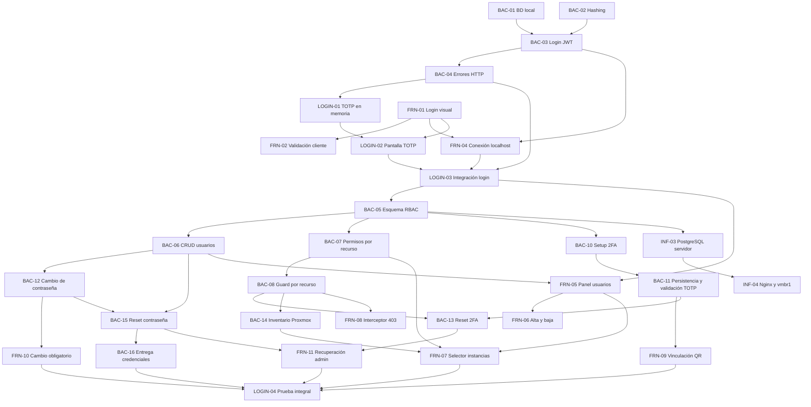

# Plan de próximas tareas

## Criterio de planificación

Este plan parte del estado registrado en `actual.md`: ninguna tarea de `BAC-01` a `BAC-04` ni de `FRN-01` a `FRN-04` está confirmada como terminada. Por eso, primero se debe cerrar el prototipo básico de login con usuario de prueba, JWT y flujo 2FA/TOTP en memoria.

Las fechas y horarios siguientes son una propuesta de ejecución desde el jueves 10/09/2026. Las horas indicadas son horas de trabajo estimadas y las franjas permiten visualizar dependencias y tareas paralelas. Una tarea solo pasa a `terminado.md` cuando se valida su criterio de éxito.

### Decisiones de alcance

- El 2FA se configura por usuario y cada cuenta conserva su propio secreto TOTP cifrado. No forma parte del rol.
- `ADMIN` y `OPERATOR` determinan qué acciones puede realizar una cuenta. `user_instances` solo determina sobre qué instancias puede actuar un operador.
- Los permisos granulares por acción, por ejemplo permitir `start` y prohibir `delete`, no están modelados por `user_instances` ni son parte del RF-09 actual. Si se requieren, deben planificarse como una ampliación separada del modelo de autorización.
- Antes de completar el cambio de contraseña y la verificación o vinculación 2FA, el backend solo debe emitir una sesión o token restringido para continuar el proceso de autenticación, nunca un JWT con acceso completo a la aplicación.
- **RF-12 (organizaciones) queda descartado del MVP.** El sistema se planifica y se implementa como monoorganización; ninguna tarea de la fase base ni de las etapas posteriores debe reservar campos de `organization_id`.
- **RF-13 (recuperación de contraseña por el propio usuario) se suma a la fase base**, para no dejar el flujo de recuperación cubierto solo con el reset administrativo (`BAC-15`).
- **La auditoría (RF-08) es una base transversal, no una tarea aislada de la Etapa 3.** Desde `BAC-18` la tabla `audit_logs` debe diseñarse como append-only (sin `UPDATE`/`DELETE` habilitados para la aplicación) y con columnas genéricas (`resource_type`, `resource_id`, `upid` nullable) para que la Etapa 1 (energía de instancias), la Etapa 2 (aprovisionamiento) y la Etapa 3 (snapshots) reutilicen la misma tabla sin migrar el esquema ni reconstruir historial. Toda tarea que agregue una acción auditable en cualquier etapa debe registrar contra esta tabla, no crear una paralela.
- **El contrato del canal de eventos/notificaciones (base de RF-11) se define en la fase base**, aunque el motor de alertas completo se construya recién en la Etapa 3, para que el poller de UPID de la Etapa 1 y las alertas de saturación de la Etapa 3 compartan el mismo esquema de evento desde el principio (ver `BAC-21`).
- **Servidor SMTP real descartado:** La integración con un proveedor SMTP real queda formalmente descartada del alcance. La entrega de correos y credenciales temporales queda resuelta de forma definitiva y completa mediante `MockEmailService` por consola a través del puerto `EmailService` (`BAC-16`), cumpliendo con mínimos privilegios (Zero-Trust), logs sanitizados y control estructurado de fallos sin dependencias de infraestructura externa.

## Fase 0. Cierre del prototipo de login


## Fase 2. Cierre de autenticación y asignación de máquinas

*(Nota de alcance: `BAC-16` se encuentra finalizada y validada en `terminado.md` con `MockEmailService`; la integración con un servidor SMTP real quedó formalmente descartada).*

---

*(Nota: `BAC-19`, `BAC-20` y `BAC-21` fueron completadas, integradas y verificadas 100% en `terminado.md`).*


### `INF-05` - CORS y TLS en el borde

- **Área:** Infraestructura
- **Asignado:** Nico
- **Estimación:** 1,5 h
- **Ventana propuesta:** A definir (junto con `INF-04`).
- **Depende de:** `INF-04`.
- **Entregable:** whitelist de orígenes permitidos en CORS y certificados TLS configurados en Nginx para todo el tráfico hacia el frontend y la API.
- **Criterio de éxito:** una petición desde un origen no autorizado es rechazada por CORS y el tráfico hacia el sistema se sirve únicamente sobre HTTPS.

### `LOGIN-04` - Prueba integral de autenticación y autorización

- **Área:** Frontend / Backend
- **Asignados:** Cristian, Tayra y Lisandro
- **Estimación:** 3 h
- **Ventana propuesta:** 18/09/2026, 14:00-17:00
- **Depende de:** `FRN-07`, `FRN-09`, `FRN-10`, `FRN-11`, `FRN-12`, `BAC-14`, `BAC-16`, `BAC-17`, `BAC-18`, `BAC-20` y `BAC-21`.
- **Entregable:** pruebas documentadas o automatizadas de creación de usuario, entrega y cambio de clave temporal, enrolamiento y login con TOTP, acceso según rol, filtro por instancias, recuperación administrativa de contraseña y 2FA, recuperación de contraseña por el propio usuario, logout/revocación de sesión y verificación de que las acciones administrativas quedan auditadas.
- **Criterio de éxito:** todos los recorridos válidos terminan con el acceso esperado y los intentos de omitir pasos, usar credenciales anteriores, acceder con otro rol, consultar una instancia no asignada o reutilizar un token revocado son rechazados con códigos HTTP controlados.


### `QA-11` - Re-verificación completa tras el fix crítico

- **Área:** Backend / Frontend
- **Asignados:** Cristian, Tayra y Lisandro
- **Estimación:** 1 h
- **Ventana propuesta:** A definir, después de cerrar los fixes del hito de recursos.
- **Depende de:** `BAC-14`, `FIX-14` y `FIX-16`.
- **Problema:** las pruebas actuales todavía fallan en el circuito de permisos por instancia: contrato de endpoints, autorización por recurso, inventario Proxmox e integración del selector frontend.
- **Entregable:** correr `test/back` completo contra el commit con los fixes aplicados y actualizar el estado real de cada tarea afectada en `terminado.md` (o devolverla a este documento si el criterio de éxito no se cumple).
- **Criterio de éxito:** las suites backend y frontend pasan sin fallos relacionados con el hito de recursos y cada tarea marcada como terminada tiene su criterio de éxito confirmado por pruebas.

## Fase 3. Despliegue de persistencia y red


## Relación y orden de ejecución



### Tareas que pueden ejecutarse en paralelo

- `BAC-01`, `BAC-02`, `FRN-01` y `FRN-03` no dependen entre sí.
- `FRN-05` puede comenzar con el contrato definido de `BAC-06`, aunque necesita el endpoint para validación final.
- `FRN-06` puede avanzar con datos simulados mientras termina `BAC-06`.
- `BAC-10`/`BAC-11`, `BAC-12` y `BAC-14` pueden desarrollarse en paralelo una vez disponibles sus dependencias.
- `FRN-09` y `FRN-10` pueden maquetarse con contratos simulados, pero requieren `BAC-11` y `BAC-12` para validar los bloqueos de navegación.
- `BAC-13` y `BAC-15` pueden desarrollarse en paralelo; `FRN-11` integra ambas recuperaciones una vez definidos sus contratos.
- `INF-03` debe esperar el esquema de `BAC-05`, pero puede preparar el LXC, la red y los secretos antes de desplegarlo.

### Secuencia crítica

`BAC-01` + `BAC-02` -> `BAC-03` -> `BAC-04` -> `LOGIN-01` + `LOGIN-02` -> `FRN-04` -> `LOGIN-03` -> `BAC-05` -> `BAC-06`/`BAC-07` -> `BAC-08` -> `BAC-10`/`BAC-11` + `BAC-12` + `BAC-14` -> `BAC-13`/`BAC-15` + `FRN-07`/`FRN-09`/`FRN-10` -> `BAC-16`/`FRN-11` -> `LOGIN-04`.

## Resumen para ClickUp

| ID | Área | Asignado | Horas | Fecha propuesta | Dependencias |
|---|---|---|---:|---|---|
| BAC-01 | Backend/Infra | Tayra / Lucas | 2 | 10/09/2026 | - |
| BAC-02 | Backend | Lisandro | 2 | 10/09/2026 | - |
| BAC-03 | Backend | Tayra | 3 | 11/09/2026 | BAC-01, BAC-02 |
| BAC-04 | Backend | Lisandro | 1,5 | 11/09/2026 | BAC-03 |
| LOGIN-01 | Backend | Tayra / Lisandro | 2 | 11/09/2026 | BAC-03, BAC-04 |
| FRN-01 | Frontend | Belinda | 3 | 10/09/2026 | - |
| FRN-02 | Frontend | Belinda | 2 | 10/09/2026 | FRN-01 |
| FRN-03 | Frontend | Cristian / Luz | 3 | 10/09/2026 | - |
| FRN-04 | Frontend | Cristian | 3 | 11/09/2026 | BAC-03, BAC-04, FRN-01 |
| LOGIN-02 | Frontend | Belinda / Luz | 2 | 11/09/2026 | LOGIN-01, FRN-01 |
| LOGIN-03 | Integración | Cristian / Tayra / Lisandro | 2 | 11/09/2026 | FRN-04, LOGIN-02 |
| BAC-05 | Backend | Tayra / Lisandro | 3 | 14/09/2026 | BAC-01, LOGIN-03 |
| BAC-06 | Backend | Lisandro | 4 | 14/09/2026 | BAC-05 |
| BAC-07 | Backend | Tayra | 3 | 15/09/2026 | BAC-05, BAC-06 |
| BAC-08 | Backend | Lisandro | 3 | 15/09/2026 | BAC-07 |
| FRN-05 | Frontend | Belinda | 4 | 14/09/2026 | LOGIN-03, BAC-06 |
| FRN-06 | Frontend | Luz | 3 | 14/09/2026 | FRN-05, BAC-06 |
| FRN-07 | Frontend | Cristian | 4 | 15/09/2026 | FRN-05, BAC-07, BAC-14 |
| FRN-08 | Frontend | Cristian | 2 | 15/09/2026 | BAC-08, FRN-04 |
| BAC-10 | Backend | Tayra | 2 | 16/09/2026 | BAC-05, LOGIN-03 |
| BAC-11 | Backend | Lisandro | 3 | 16/09/2026 | BAC-10, BAC-05 |
| FRN-09 | Frontend | Belinda / Luz | 3 | 16/09/2026 | BAC-10, BAC-11, LOGIN-02 |
| BAC-12 | Backend | Lisandro | 2 | 16/09/2026 | BAC-02, BAC-05, BAC-06 |
| FRN-10 | Frontend | Belinda | 2 | 16/09/2026 | BAC-12, FRN-04 |
| BAC-13 | Backend | Tayra | 2 | 17/09/2026 | BAC-06, BAC-08, BAC-11 |
| BAC-14 | Backend | Tayra | 3 | 17/09/2026 | BAC-08, credenciales Proxmox |
| BAC-15 | Backend | Lisandro | 2 | 17/09/2026 | BAC-06, BAC-12 |
| BAC-16 | Backend/Infra | Lisandro / Nico | 3 | 18/09/2026 | BAC-06, BAC-15, SMTP |
| FRN-11 | Frontend | Luz | 2 | 18/09/2026 | FRN-05, BAC-13, BAC-15 |
| LOGIN-04 | Integración | Cristian / Tayra / Lisandro | 3 | 18/09/2026 | FRN-07, FRN-09, FRN-10, FRN-11, BAC-14, BAC-16 |
| INF-03 | Infraestructura | Lucas / Nico | 3 | 16/09/2026 | BAC-05 |
| INF-04 | Infraestructura | Nico | 3 | 16/09/2026 | INF-03 |
| BAC-17 | Backend | Lisandro | 2 | A definir | BAC-03, BAC-05 |
| FRN-13 | Frontend | Cristian / Belinda | 2 | A definir | BAC-17 |
| BAC-18 | Backend | Tayra | 4 | A definir | BAC-05 |
| BAC-19 | Backend | Lisandro | 2 | A definir | BAC-05, BAC-16 |
| BAC-20 | Backend | Tayra | 2 | A definir | BAC-19, BAC-17 |
| BAC-21 | Backend | Tayra / Lisandro | 2 | A definir | BAC-05 |
| FRN-12 | Frontend | Belinda | 3 | A definir | BAC-19, BAC-20 |
| INF-05 | Infraestructura | Nico | 1,5 | A definir | INF-04 |

**Resultado esperado:** al completar `LOGIN-04` e `INF-04`, el equipo tendrá cerrado el circuito técnico de RF-01 y RF-09: contraseña temporal entregada y reemplazada, 2FA individual persistido, JWT posterior a la verificación, usuarios, roles, recuperación administrativa, permisos binarios por instancia, inventario real y bloqueo por recurso. Con `BAC-17` a `BAC-21`, `FRN-12` e `INF-05` también queda cerrado RF-13 (recuperación de contraseña por el propio usuario), la revocación de sesiones, la base append-only de auditoría (parte de RF-08) y el contrato de eventos que la Etapa 1 y la Etapa 3 van a reutilizar (base de RF-11), sin dejar backfill ni rediseño pendiente. La protección de las operaciones de Proxmox debe validarse antes de habilitar acciones destructivas.

**Fuera de alcance:** no se incluyen permisos granulares por acción porque el requerimiento actual solo define roles y asignación de instancias. Incorporarlos requiere una ampliación explícita del modelo de autorización y nuevos criterios para cada operación. **RF-12 (organizaciones/multi-tenant) queda descartado del MVP** y no debe planificarse en ninguna etapa posterior salvo decisión explícita en contrario.

### 🧱 Bloque 3: Persistencia Definitiva de 2FA y Ciclo de Vida de Credenciales

Este bloque formaliza la seguridad completa (Fase 2) y cierra el hito integral `LOGIN-04`.

#### 1. Tareas de desarrollo paralelo

* **Backend:**
* `BAC-10` y `BAC-11` — Enrolamiento 2FA, QR (`GET /api/auth/2fa/qr`) y persistencia del secreto cifrado con AES-256 (`POST /api/auth/2fa/verify`).


* `BAC-12` — Cambio obligatorio de contraseña temporal (`POST /api/auth/change-password`).


* `BAC-13` y `BAC-15` — Restablecimiento administrativo de 2FA y contraseña (`POST /api/admin/users/{id}/reset-...`).


* `BAC-16` — Entrega segura de credenciales temporales vía SMTP.


* **Frontend:**
* `FRN-09` — Modal obligatorio de vinculación 2FA con escaneo de QR y confirmación.


* `FRN-10` — Pantalla obligatoria de cambio de contraseña cuando `must_change_password: true`.


* `FRN-11` — Acciones de restablecimiento de contraseña y 2FA desde el panel de administración.


#### 🎯 Prueba de Integración final (`LOGIN-04`):

> **Hito:** *Circuito Completo de Seguridad y Autenticación*
> 1. El Admin crea un usuario -> El usuario recibe su clave temporal por correo (`BAC-16`).
> 
> 
> 2. El usuario inicia sesión -> El Front detecta `must_change_password` y lo bloquea hasta que cambie su clave temporal (`FRN-10` / `BAC-12`).
> 
> 
> 3. Pasa al enrolamiento de 2FA: escanea el QR en Google Authenticator (`FRN-09` / `BAC-10`) y confirma su código (`BAC-11`).
> 
> 
> 4. Ingresa al sistema con su JWT definitivo según su rol y permisos de instancias.
> 
> 
> 5. El Admin puede revocarle el 2FA o la clave (`FRN-11` / `BAC-13` / `BAC-15`) forzándolo a reiniciar el ciclo en su próximo acceso.
> 
> 
> 
> 

---

### 📋 Resumen del orden de ejecución para el equipo:

1. **Cerrar Bloque 0:** Resolver el fix de dígitos OTP en `TwoFactor.tsx` (`LOGIN-02` / `LOGIN-03` al 100%).


2. **Asignar Bloque 1:** CRUD de Usuarios y Roles (`BAC-05`, `BAC-06`, `BAC-06B`, `BAC-09` + `FRN-05`, `FRN-06`, `FRN-06B`) -> **Prueba de Integración 1**.


3. **Asignar Bloque 2:** Permisos por Recurso e Inventario (`BAC-07`, `BAC-08`, `BAC-14` + `FRN-07`, `FRN-08`) -> **Prueba de Integración 2**.


4. **Asignar Bloque 3:** 2FA Real, Recuperación y Cambio de Clave (`BAC-10` a `BAC-16` + `FRN-09` a `FRN-11`) -> **Prueba de Integración `LOGIN-04**`.

---

## 🛠️ Defectos Técnicos y Fixes: Distinción entre Cambio y Restablecimiento de Contraseñas

### Contexto de los Flujos de Credenciales

Para evitar la ambigüedad que provocó desalineaciones entre Frontend y Backend, se formaliza la distinción entre los tres flujos de contraseñas:

1. **Cambio Obligatorio de Contraseña (`FRN-10` / `BAC-12`):** Usuario en proceso de login con contraseña temporal (`cambio_contrasena: true`). Requiere sesión activa restringida, exige ingresar `contrasenaActual` y `contrasenaNueva`, e interactúa con `PUT /api/account/password`.
2. **Restablecimiento / Recuperación por Olvido (`FRN-12` / `BAC-19` / `BAC-20` / RF-13):** Usuario anónimo que olvidó su clave. Paso 1: `POST /api/auth/password/forgot` (envía OTP de 6 dígitos al correo). Paso 2 y 3: `POST /api/auth/password/reset` con `{ email, codigo, nuevaContrasena }` (sin contraseña actual). Al finalizar redirige a `/login`.
3. **Restablecimiento Administrativo (`FRN-11` / `BAC-13` / `BAC-15`):** Administrador autenticado con rol `ADMIN` que opera sobre otro usuario desde `/users`. Invoca `POST /api/admin/users/:id/password/reset` (genera nueva clave temporal y envía por correo) y `POST /api/admin/users/:id/2fa/reset` (desvincula TOTP).

---

### `FIX-17` - Alinear y formalizar endpoints y contratos de contraseñas (Backend)

- **Área:** Backend
- **Asignado:** Lisandro / Tayra
- **Estimación:** 2 h
- **Ventana propuesta:** A definir (Fase Base / Bloque 3).
- **Depende de:** `BAC-12`, `BAC-15`, `BAC-19`, `BAC-20`.
- **Problema y evidencia:**
  1. *Rutas ambiguas y divergencia con la documentación:* `actual.md` y versiones previas de planificación referenciaban `POST /api/auth/change-password` para el cambio obligatorio, mientras el backend implementó `PUT /api/account/password`.
  2. *Inconsistencia en reset administrativo:* En `terminado.md` (`BAC-15`) se documentó `POST /api/admin/users/{id}/reset-password`, pero en `cmd/api/main.go` se montó `POST /api/admin/users/:id/password/reset`.
  3. *Confusión entre reset público y reset administrativo:* Ambos comparten el sufijo `/password/reset` pero con semánticas, autorizaciones y payloads totalmente diferentes.
- **Entregable:**
  1. Formalizar como canónico `PUT /api/account/password` para el cambio autenticado de contraseña (payload: `{ contrasenaActual, contrasenaNueva }`), manteniendo bajo `RequireAuth` el bloqueo 403 `PASSWORD_CHANGE_REQUIRED` a otras rutas.
  2. Mantener `POST /api/auth/password/forgot` (payload: `{ email }`) y `POST /api/auth/password/reset` (payload: `{ email, codigo, nuevaContrasena }`) para la recuperación pública (RF-13), garantizando que tras el reset exitoso la cuenta quede con `cambio_contrasena = false` y todas las sesiones previas revocadas en `sesiones_activas`.
  3. Confirmar como canónico `POST /api/admin/users/:id/password/reset` (sin body, requiere rol `ADMIN`), el cual genera una contraseña temporal, activa `cambio_contrasena = true`, revoca sesiones y despacha la clave por `EmailService` (`MockEmailService`).
  4. Actualizar Swagger/OpenAPI y eliminar alias no utilizados o rutas contradictorias.
  5. Asegurar consistencia de códigos de error estructurados: `PASSWORD_CHANGE_REQUIRED` (403), `PASSWORD_CHANGE_FAILED` (400), `RESET_FAILED` (400) y `INVALID_REQUEST` (400).
- **Criterio de éxito:** Swagger expone los contratos precisos y unificados; `PUT /api/account/password` valida la contraseña actual y libera la cuenta; `POST /api/auth/password/reset` valida el OTP de 6 dígitos sin requerir contraseña actual; las llamadas a cada endpoint responden con los códigos de estado y payloads esperados.

### `FIX-18` - Conexión de `RecoverPassword.tsx` a la API y alineación de tests (`FRN-12` / RF-13) (Frontend)

- **Área:** Frontend
- **Asignada:** Belinda
- **Estimación:** 3 h
- **Ventana propuesta:** A definir (Fase Base / Bloque 3).
- **Depende de:** `BAC-19`, `BAC-20` y `FIX-17`.
- **Problema y evidencia en código y pruebas (`test/front/recover-password.test.tsx`):**
  1. *Formulario desconectado de la red:* `frontend/centinela/src/pages/RecoverPassword.tsx` es actualmente un cascarón visual que solo maneja estado local mediante `handleNext()`, sin invocar `apiClient` ni interactuar con el backend en ninguno de sus tres pasos.
  2. *Desalineación de rutas en tests:* `test/front/recover-password.test.tsx` espera que el componente llame a URLs ficticias (`/recover/request`, `/auth/recovery`, `/recover/confirm`, `/recovery/confirm`), las cuales nunca existieron en el backend.
  3. *Flujo de finalización ausente:* Al finalizar el tercer paso, el formulario no consume `POST /api/auth/password/reset` ni redirige al usuario al login.
- **Entregable:**
  1. Conectar el Paso 1 (Solicitud) a `POST /api/auth/password/forgot` enviando `{ email }`, mostrando spinner/estado de carga y avanzando al Paso 2 al recibir HTTP 200.
  2. En el Paso 2 (Código), vincular `InputOTP` al estado del código de 6 dígitos y validar que no esté vacío antes de avanzar al Paso 3.
  3. Conectar el Paso 3 (Nueva contraseña) a `POST /api/auth/password/reset` enviando `{ email, codigo, nuevaContrasena }` (sin solicitar contraseña actual).
  4. Procesar la respuesta HTTP 200 mostrando un toast de éxito («Contraseña restablecida con éxito») y redirigiendo a `/login` con `{ replace: true }`.
  5. Procesar los errores del backend (`RESET_FAILED`, código expirado o superación de 3 intentos) y mostrarlos junto al campo correspondiente en la interfaz.
  6. Actualizar la suite `test/front/recover-password.test.tsx` para mockear y validar los llamados reales a `/auth/password/forgot` y `/auth/password/reset`.
- **Criterio de éxito:** El usuario puede recuperar su cuenta de punta a punta consumiendo la API; la suite `test/front/recover-password.test.tsx` pasa al 100% verificando los endpoints canónicos del backend.

### `FIX-19` - Acciones de Restablecimiento Administrativo de Contraseña y 2FA en `Users.tsx` (`FRN-11`) (Frontend)

- **Área:** Frontend
- **Asignada:** Luz / Cristian
- **Estimación:** 2,5 h
- **Ventana propuesta:** A definir (Fase Base / Bloque 3).
- **Depende de:** `BAC-13`, `BAC-15`, `FRN-05` y `test/front/admin-recovery.test.tsx`.
- **Problema y evidencia en código:**
  1. *Botón sin acción:* En `frontend/centinela/src/pages/Users.tsx` (línea 354), el botón «Restablecer contraseña» carece de manejador `onClick`.
  2. *Acción de 2FA faltante:* En el menú de acciones no existe la opción para «Restablecer 2FA» / «Desvincular 2FA», requerida por `FRN-11` y verificada en `test/front/admin-recovery.test.tsx`.
  3. *Falta de reactividad y feedback:* No se ofrece modal de confirmación ni notificación al administrador sobre el envío de la clave temporal, y la tabla no actualiza el estado de 2FA tras un reset.
- **Entregable:**
  1. Conectar el botón «Restablecer contraseña» a una función con modal de confirmación explícito que invoque `POST /api/admin/users/:id/password/reset` con token Bearer, cerrando el dropdown y emitiendo un toast que informe el envío por correo.
  2. Agregar en el dropdown de acciones la opción «Restablecer 2FA» (con icono de seguridad y advertencia de acción crítica) con modal de confirmación, consumiendo `POST /api/admin/users/:id/2fa/reset`.
  3. Al completar con éxito el restablecimiento de 2FA, mutar reactivamente el estado local (`totpVinculado: false`) para que el badge de la tabla pase inmediatamente de «Activado» a «Desactivado» sin necesidad de recargar la página.
  4. Garantizar que bajo ninguna circunstancia se muestren secretos ni hashes en la interfaz (política Zero-Trust).
- **Criterio de éxito:** Un administrador puede resetear la contraseña y el 2FA de cualquier operador desde el panel; la tabla actualiza el estado de 2FA reactivamente; la suite `test/front/admin-recovery.test.tsx` pasa al 100%.

### `FIX-20` - Sincronización de políticas de complejidad y distinción UX entre Cambio y Restablecimiento (`FRN-10` / `FRN-12`) (Frontend / UX)

- **Área:** Frontend
- **Asignada:** Belinda
- **Estimación:** 1,5 h
- **Ventana propuesta:** A definir (Fase Base / Bloque 3).
- **Depende de:** `FRN-10`, `FRN-12` y `BAC-02`.
- **Problema:**
  1. *Disparidad en reglas de validación:* `ChangePassword.tsx` (`validateChangePasswordFields`, líneas 22-34) valida únicamente que la longitud esté entre 8 y 12 caracteres. Omite las reglas que exige el backend en `crypto.ValidarComplejidadContrasena` (`backend/internal/infrastructure/crypto/password.go:89`): al menos una mayúscula, un número y un carácter especial `!@#$%^&*-_=+`. Si el usuario ingresa una clave que no cumple estas reglas, el cliente la envía y el backend responde 400 `PASSWORD_CHANGE_FAILED`.
     - **Evidencia (23/09/2026):** en `test/front/password-change.test.tsx`, los casos *"no llama a la API si la contraseña nueva no cumple la complejidad del backend (sin mayúscula / sin dígito / sin carácter especial)"* fallan, porque el cliente envía `PUT /api/account/password` con `nueva1234!`, `NuevaClave!` y `Nueva12345`.
  2. *Ambigüedad visual:* Falta claridad en los textos de ayuda de los formularios para distinguir que en el **Cambio** se requiere la clave temporal previa, mientras que en el **Restablecimiento** solo se define una nueva contraseña.
- **Entregable:**
  1. Implementar un validador unificado de contraseñas (`validatePasswordComplexity`) en el archivo existente `frontend/centinela/src/utils/validators.js`, que replique exactamente los criterios del backend:
     - Longitud: 8 a 12 caracteres.
     - Al menos una letra mayúscula.
     - Al menos un dígito numérico.
     - Al menos un símbolo permitido (`[!@#$%^&*-_=+]`).
  2. Integrar el validador unificado en `ChangePassword.tsx` y `RecoverPassword.tsx` (paso 3), mostrando el error junto al campo y textos de ayuda explicativos debajo. `CrearUsuarios.tsx` no lo necesita: desde `BAC-16` la clave temporal la genera el backend y se envía por correo, y los campos de contraseña de esa vista se eliminan en `FIX-24`.
- **Criterio de éxito:** Las validaciones de cliente previenen el envío de contraseñas no conformes; el usuario recibe retroalimentación inmediata; se eliminan los errores 400 por rechazo de complejidad en el backend. Los 3 casos de complejidad de `test/front/password-change.test.tsx` pasan.
- **Nota:** la corrección de la referencia de `FRN-10` a `PUT /api/account/password` en la documentación ya se hizo el 23/09/2026, en `terminado.md`, y no forma parte de este FIX.
---

## 🛠️ Fixes detectados en la verificación del 23/09/2026

Surgen de la corrida de `test/back` y `test/front` contra `origin/main` (backend `15032da`, frontend `3192cf4`). El detalle está en [test/informe.md](../test/informe.md). Cada FIX corrige una tarea ya movida a `terminado.md` que tiene un problema; su prueba de aceptación ya existe y hoy falla.

### `FIX-21` - Opción de cerrar sesión en el cambio obligatorio de contraseña (`FRN-10`) (Frontend)

- **Área:** Frontend
- **Asignada:** Belinda
- **Estimación:** 0,5 h
- **Ventana propuesta:** A definir.
- **Depende de:** `FRN-10` y `FRN-13`.
- **Problema y evidencia:** el criterio de `FRN-10` dice que "una cuenta con contraseña temporal solo puede cerrar sesión o cambiarla". `frontend/centinela/src/pages/ChangePassword.tsx` solo ofrece el formulario de cambio; no hay forma de salir sin cambiar la clave. La prueba `test/front/password-change.test.tsx`, caso *"la pantalla de cambio ofrece cerrar sesión como única alternativa"*, falla con `Unable to find role="button" and name /cerrar sesión/i`.
- **Entregable:**
  1. Agregar en `ChangePassword.tsx` un botón secundario "Cerrar sesión" que use el hook existente `useLogout()` (`components/features/auth/hooks/useAuth.ts`). Ese hook ya llama a `POST /api/auth/logout`, limpia la sesión y navega a `/login` con `replace`.
  2. Deshabilitar el botón mientras se envía el formulario o el logout (`isSubmitting` / `isLoggingOut`).
- **Criterio de éxito:** desde `/change-password` el usuario puede cerrar sesión: se llama a `/auth/logout`, se borra `centinela_access` y se navega a `/login`. `password-change.test.tsx` pasa 7/7.

### `FIX-22` - Guard administrativo en la ruta `/auditoria` (`FRN-14` / `BAC-18`) (Frontend)

- **Área:** Frontend
- **Asignada:** Belinda / Luz
- **Estimación:** 0,5 h
- **Ventana propuesta:** A definir (alta prioridad: es un control de acceso).
- **Depende de:** `FRN-14` y `FIX-12`.
- **Problema y evidencia:** en `frontend/centinela/src/routes/applicationRoutes.tsx` la ruta `{ path: '/auditoria', Component: AuditoriaPage }` está dentro del grupo `loadProtectedSession` y **no** dentro del grupo `loadAdminSession`. Un usuario `OPERATOR` puede abrir la vista de auditoría; el backend le responde 403 a los datos, pero la pantalla administrativa se muestra igual. La prueba `test/front/audit.test.tsx`, caso *"si un operador intenta entrar a /auditoria, el guard administrativo lo redirige a /dashboard"*, falla con `expected '/auditoria' to be '/dashboard'`.
- **Entregable:** mover `{ path: '/auditoria', Component: AuditoriaPage }` al arreglo `children` del grupo con `loader: loadAdminSession`, junto a `/users`, `/users/new` y `/users/:userId`.
- **Criterio de éxito:** un `OPERATOR` que navega a `/auditoria` es redirigido a `/dashboard`, y un `ADMIN` accede normalmente. `audit.test.tsx` pasa 7/7.
- **Nota:** el acceso visible a Auditoría en el menú lateral, solo para administradores, forma parte de `SEC-03`, que sigue en `actual.md`.

### `FIX-23` - Hacer append-only la tabla `auditoria` a nivel de base de datos (`BAC-18`) (Backend)

- **Área:** Backend
- **Asignado:** Tayra
- **Estimación:** 1,5 h
- **Ventana propuesta:** A definir.
- **Depende de:** `BAC-18`.
- **Problema y evidencia:** el criterio de `BAC-18` exige que "un intento de `UPDATE` o `DELETE` sobre la auditoría con las credenciales de la aplicación falle a nivel de base de datos, no solo por convención de código". Hoy no existe ningún trigger, `REVOKE` ni regla: "append-only" solo aparece en comentarios (`internal/core/ports/audit_port.go:106`, `internal/core/domain/models.go:86`). La prueba `test/back/password_recovery_acceptance_test.go`, caso *"BAC-18 auditoria … append-only en la base"*, falla con:
  ```
  la base permitió UPDATE sobre auditoria con el usuario de la aplicación; la tabla no es append-only
  la base permitió DELETE sobre auditoria con el usuario de la aplicación; la tabla no es append-only
  ```
- **Entregable:**
  1. Crear, después del `AutoMigrate` en `postgres.InitDB()` o en `scripts/init.sql`, una función y un trigger idempotentes:
     ```sql
     CREATE OR REPLACE FUNCTION auditoria_append_only() RETURNS trigger AS $$
     BEGIN
       RAISE EXCEPTION 'la tabla auditoria es append-only (% no permitido)', TG_OP;
     END; $$ LANGUAGE plpgsql;

     DROP TRIGGER IF EXISTS trg_auditoria_append_only ON auditoria;
     CREATE TRIGGER trg_auditoria_append_only
       BEFORE UPDATE OR DELETE ON auditoria
       FOR EACH ROW EXECUTE FUNCTION auditoria_append_only();
     ```
     Agregar también `BEFORE TRUNCATE ... FOR EACH STATEMENT`.
  2. El trigger funciona aunque la aplicación se conecte con el usuario dueño de la tabla, que es el caso del entorno de pruebas y del compose actual. Como defensa adicional en producción, conectar la aplicación con un rol sin privilegios `UPDATE`/`DELETE` sobre `auditoria` (`REVOKE UPDATE, DELETE, TRUNCATE ON auditoria FROM <rol_app>`).
  3. Revisar que ninguna ruta del backend haga `UPDATE`/`DELETE` sobre `auditoria`. Por ejemplo, el `ON DELETE SET NULL` de `usuario_id` al eliminar un usuario: si hace falta, resolverlo con eliminación lógica de usuarios, que es lo que ya hace `DELETE /admin/users/:id`.
- **Criterio de éxito:** `UPDATE`, `DELETE` y `TRUNCATE` sobre `auditoria` fallan en PostgreSQL con las credenciales de la aplicación; el registro y la consulta de auditoría siguen funcionando. El caso `BAC-18` de `password_recovery_acceptance_test.go` pasa.

### `FIX-24` - Confirmación del alta sin contraseña temporal y baja de usuario (`FRN-06` / `BAC-16`) (Frontend)

- **Área:** Frontend
- **Asignada:** Luz
- **Estimación:** 2 h
- **Ventana propuesta:** A definir.
- **Depende de:** `FRN-06`, `BAC-06` y `BAC-16`.
- **Problema y evidencia:**
  1. *Alta sin respuesta visible:* desde `BAC-16`, `POST /api/admin/users` responde `201 { id, rol, activo }` **sin `contrasenaTemp`**, porque la clave se envía por correo. `frontend/centinela/src/pages/CrearUsuarios.tsx:56` hace `setTempPassword(created.contrasenaTemp ?? null)`, y solo muestra algo si llega ese campo. Resultado: tras un alta exitosa el administrador no ve ninguna confirmación. Además, la vista conserva campos de "Contraseña temporal" y "Confirmar contraseña temporal" que ya no tienen función. Prueba: `test/front/admin-users.test.tsx`, caso *"tras el alta informa el resultado y que la clave temporal se envió por correo (BAC-16)…"*.
  2. *Baja sin acción:* el botón "Eliminar usuario" de `frontend/centinela/src/pages/detailsUserPage.tsx:110` no tiene `onClick` y nunca envía `DELETE /api/admin/users/:id`. Prueba: `admin-users.test.tsx`, caso *"el botón 'Eliminar usuario' solicita DELETE /api/admin/users/:id"*.
- **Entregable:**
  1. En `CrearUsuarios.tsx`, al recibir 201:
     - mostrar un toast o mensaje con `role="status"`, por ejemplo *"Usuario creado. La contraseña temporal se envió a <correo>."*;
     - limpiar el formulario o volver a `/users`;
     - eliminar la caja "Contraseña temporal generada" y los campos de contraseña del formulario.
  2. Manejar `502 EMAIL_DELIVERY_FAILED` con un mensaje claro: *"No se pudo enviar el correo; el usuario no fue creado"*.
  3. En `detailsUserPage.tsx`, conectar "Eliminar usuario" a un diálogo de confirmación explícita que envíe `DELETE /api/admin/users/:id` y espere 204. Después, mostrar un toast y volver a `/users`, o reflejar `activo: false`, que es una baja lógica.
- **Criterio de éxito:** el administrador ve la confirmación de cada alta sin que se muestre ninguna contraseña, y puede dar de baja a un usuario desde el detalle. Los dos casos de FRN-06 de `admin-users.test.tsx` pasan.

### `FIX-25` - Persistir la edición del perfil de usuario (`FRN-06B` / `FIX-14`) (Frontend)

- **Área:** Frontend
- **Asignada:** Luz / Cristian
- **Estimación:** 2 h
- **Ventana propuesta:** A definir.
- **Depende de:** `FRN-06B`, `BAC-06B` y `FIX-14`.
- **Problema y evidencia:** en `frontend/centinela/src/pages/detailsUserPage.tsx`, el formulario de "Información general" (`informationOfUser.tsx` + `useEditableUser.ts`) modifica solo el estado local. "Guardar cambios" (`detailsUserPage.tsx:114`) llama únicamente a `instanceAccess.saveAssignments()` y está deshabilitado si no cambió ningún permiso de instancia. En todo el frontend **no existe ninguna llamada a `PUT /api/admin/users/:id`**: editar nombre, correo, rol o estado no se guarda nunca. Esto incumple `FRN-06B` y el entregable 3 de `FIX-14` ("guardar de forma atómica junto a la edición del perfil"). Prueba: `test/front/admin-users.test.tsx`, caso *"editar el nombre y guardar envía PUT /api/admin/users/:id con los datos modificados"*, que falla con `guardar no envió PUT /admin/users/u2`.
- **Entregable:**
  1. Agregar a `components/features/users/services/userDetailsService.ts` una función `updateUserDetails(userId, values)`. Debe enviar `PUT /api/admin/users/:id` solo con los campos modificados de `{ nombreCompleto, emailUsuario, rol, activo }` y validar la respuesta con el `isUserDetailsResponse` existente.
  2. Habilitar "Guardar cambios" cuando haya cambios en el perfil **o** en los permisos. Al guardar, enviar primero el `PUT` del perfil y luego el de permisos, con un solo estado de carga, un toast de resultado y la vista refrescada con la respuesta.
  3. Mostrar los errores del backend: `USER_CONFLICT` (409) para correo duplicado y 400 para datos inválidos.
- **Criterio de éxito:** un administrador cambia el nombre, el correo, el rol o el estado de un usuario, guarda, y el cambio se refleja en el detalle y en la tabla sin recargar. El caso FRN-06B de `admin-users.test.tsx` pasa, y los 3 casos de FIX-14 siguen en verde.
