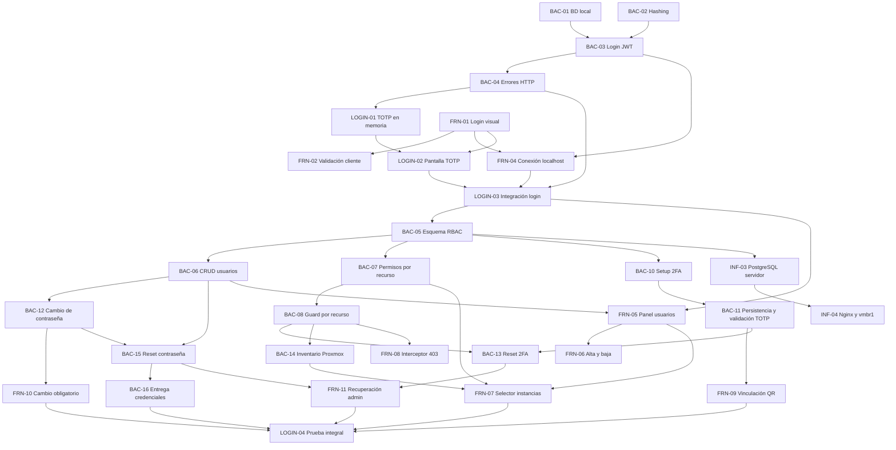

# Plan de próximas tareas

## Criterio de planificación

Este plan parte del estado registrado en `actual.md`: ninguna tarea de `BAC-01` a `BAC-04` ni de `FRN-01` a `FRN-04` está confirmada como terminada. Por eso, primero se debe cerrar el prototipo básico de login con usuario de prueba, JWT y flujo 2FA/TOTP en memoria.

Las fechas y horarios siguientes son una propuesta de ejecución desde el jueves 10/09/2026. Las horas indicadas son horas de trabajo estimadas y las franjas permiten visualizar dependencias y tareas paralelas. Una tarea solo pasa a `terminado.md` cuando se valida su criterio de éxito.

### Decisiones de alcance

- El 2FA se configura por usuario y cada cuenta conserva su propio secreto TOTP cifrado. No forma parte del rol.
- `ADMIN` y `OPERATOR` determinan qué acciones puede realizar una cuenta. `user_instances` solo determina sobre qué instancias puede actuar un operador.
- Los permisos granulares por acción, por ejemplo permitir `start` y prohibir `delete`, no están modelados por `user_instances` ni son parte del RF-09 actual. Si se requieren, deben planificarse como una ampliación separada del modelo de autorización.
- Antes de completar el cambio de contraseña y la verificación o vinculación 2FA, el backend solo debe emitir una sesión o token restringido para continuar el proceso de autenticación, nunca un JWT con acceso completo a la aplicación.

## Fase 0. Cierre del prototipo de login

## Fase 1. Usuarios, roles y permisos

### `BAC-05` - Migración y esquema relacional de usuarios y RBAC

- **Área:** Backend
- **Asignados:** Tayra y Lisandro
- **Estimación:** 3 h
- **Ventana propuesta:** 14/09/2026, 09:00-12:00
- **Depende de:** `BAC-01` y `LOGIN-03`.
- **Entregable:** migración SQL u ORM con `users` y `user_instances`. `users` debe incluir `id` UUID, `username`, `email`, `password_hash`, `role`, `totp_secret` protegido, `is_2fa_enabled` y `must_change_password`. `user_instances` debe tener `user_id`, `instance_id` y clave primaria compuesta.
- **Criterio de éxito:** la migración se ejecuta desde cero, crea las relaciones y carga un administrador inicial.

### `BAC-06` - CRUD de usuarios para administradores

- **Área:** Backend
- **Asignado:** Lisandro
- **Estimación:** 4 h
- **Ventana propuesta:** 14/09/2026, 13:00-17:00
- **Depende de:** `BAC-05`.
- **Entregable:** `GET /api/admin/users`, `POST /api/admin/users` y `DELETE /api/admin/users/{id}`. La creación debe generar una contraseña temporal y establecer `must_change_password: true`.
- **Criterio de éxito:** un administrador puede listar, crear y desactivar usuarios; un operador recibe `403 Forbidden`.

### BAC-06B — Edición de Usuario y Cambio de Rol (PUT /api/admin/users/{id}):
- Asignado: Lisandro | Estimación: 2h
- Depende de: BAC-06
- Entregable: Endpoint PUT /api/admin/users/{id} para actualizar nombre, correo, estado (isActive) y rol (role: ADMIN u OPERATOR).  
- Criterio de éxito: Un administrador puede cambiarle el rol a un usuario o desactivarlo; los cambios se reflejan de inmediato en la base de datos.  

### `BAC-07` - Asignación de permisos por recurso

- **Área:** Backend
- **Asignado:** Tayra
- **Estimación:** 3 h
- **Ventana propuesta:** 15/09/2026, 09:00-12:00
- **Depende de:** `BAC-05` y `BAC-06`.
- **Entregable:** `PUT /api/admin/users/{id}/permissions` y `GET /api/admin/users/{id}/permissions`, con actualización atómica de `user_instances`.
- **Criterio de éxito:** la relación usuario-instancia se persiste, reemplaza el conjunto anterior de forma atómica y solo puede gestionarla un administrador autorizado.

### `BAC-08` - Middleware de autorización por recurso

- **Área:** Backend
- **Asignado:** Lisandro
- **Estimación:** 3 h
- **Ventana propuesta:** 15/09/2026, 13:00-16:00
- **Depende de:** `BAC-07`.
- **Entregable:** guard que valide `(user_id, instance_id)` en `user_instances` antes de consultar o enviar órdenes a Proxmox VE.
- **Criterio de éxito:** un operador sin permiso recibe `403` y la API no realiza ninguna llamada a Proxmox VE.

### BAC-09 — Endpoint de Roles del Sistema (GET /api/roles):
- Asignado: Tayra | Estimación: 1h
- Depende de: BAC-05Entregable: Endpoint público o protegido que retorne el listado de roles con su identificador y descripción básica.  
- Criterio de éxito: Devuelve un JSON con los roles disponibles (ADMIN, OPERATOR) con código HTTP 200.

### `FRN-05` - Panel de gestión de usuarios

- **Área:** Frontend
- **Asignado:** Belinda
- **Estimación:** 4 h
- **Ventana propuesta:** 14/09/2026, 09:00-13:00
- **Depende de:** `LOGIN-03` y contrato inicial de `BAC-06`.
- **Entregable:** vista `/admin/users` con nombre, correo, rol, estado de 2FA y acciones. Solo debe ser visible para administradores.
- **Criterio de éxito:** el administrador ve el listado real y un operador no puede acceder a la vista.

### `FRN-06` - Modal de creación y desactivación de usuarios

- **Área:** Frontend
- **Asignado:** Luz
- **Estimación:** 3 h
- **Ventana propuesta:** 14/09/2026, 14:00-17:00
- **Depende de:** `FRN-05` y `BAC-06`.
- **Entregable:** modal con usuario, correo y rol; visualización controlada de la contraseña temporal; confirmación para desactivar usuarios y toasts de resultado.
- **Criterio de éxito:** el administrador puede completar altas y bajas desde la interfaz y los errores se muestran de forma comprensible.

### FRN-06B — Modal de Edición de Usuario y Cambio de Rol:
- Asignado: Luz | Estimación: 2h
- Depende de: FRN-05, FRN-06 y BAC-06B
- Entregable: Formulario precargado con los datos del usuario seleccionado para modificar su información básica y cambiar su rol mediante un desplegable.  
- Criterio de éxito: Al confirmar la edición, se llama a PUT /api/admin/users/{id}, se actualiza la tabla y se muestra una alerta visual (toast) de éxito.  

### `FRN-07` - Selector de asignación de instancias

- **Área:** Frontend
- **Asignado:** Cristian
- **Estimación:** 4 h
- **Ventana propuesta:** 15/09/2026, 09:00-13:00
- **Depende de:** `FRN-05`, `BAC-07` y `BAC-14`.
- **Entregable:** selector con instancias reales obtenidas de `GET /api/instances`, instancias asignadas y botón que envíe el array de IDs a `PUT /api/admin/users/{id}/permissions`.
- **Criterio de éxito:** el administrador puede guardar una matriz de permisos y verla nuevamente al abrir el usuario.

### `FRN-08` - Interceptor HTTP y manejo de `403 Forbidden`

- **Área:** Frontend
- **Asignado:** Cristian
- **Estimación:** 2 h
- **Ventana propuesta:** 15/09/2026, 14:00-16:00
- **Depende de:** `BAC-08` y `FRN-04`.
- **Entregable:** interceptor Axios o Fetch para enviar `Authorization: Bearer <JWT>` y mostrar un mensaje amigable ante un `403` sin cerrar la sesión.
- **Criterio de éxito:** las peticiones incluyen el JWT y un operador sin permiso recibe una respuesta visual clara.

## Fase 2. Cierre de autenticación y asignación de máquinas

### `BAC-10` - Enrolamiento 2FA y generación de QR

- **Área:** Backend
- **Asignado:** Tayra
- **Estimación:** 2 h
- **Ventana propuesta:** 16/09/2026, 09:00-11:00
- **Depende de:** `BAC-05` y `LOGIN-03`.
- **Entregable:** `GET /api/auth/2fa/setup`, accesible mediante una sesión restringida, que genere un secreto TOTP único, una URI `otpauth://` y un código QR. También debe devolver el secreto para vinculación manual, sin persistirlo como habilitado antes de la confirmación.
- **Criterio de éxito:** un usuario sin 2FA obtiene un QR y una clave manual compatibles con una aplicación autenticadora; un usuario ya vinculado no puede reemplazar su secreto sin pasar por el flujo de restablecimiento.

### `BAC-11` - Validación y persistencia del secreto TOTP

- **Área:** Backend
- **Asignado:** Lisandro
- **Estimación:** 3 h
- **Ventana propuesta:** 16/09/2026, 11:00-14:00
- **Depende de:** `BAC-10` y `BAC-05`.
- **Entregable:** `POST /api/auth/2fa/enable` para validar el primer código de seis dígitos, cifrar el secreto con AES-256 usando una clave externa a la base de datos y establecer `is_2fa_enabled: true`. El flujo de login también debe validar los códigos posteriores contra el secreto persistido antes de emitir el JWT de acceso completo.
- **Criterio de éxito:** el secreto nunca se almacena ni se expone en texto plano después del enrolamiento; un código válido habilita el 2FA y permite completar el login, mientras que códigos inválidos, vencidos o reutilizados son rechazados.

### `FRN-09` - Vinculación 2FA mediante QR

- **Área:** Frontend
- **Asignadas:** Belinda y Luz
- **Estimación:** 3 h
- **Ventana propuesta:** 16/09/2026, 14:00-17:00
- **Depende de:** `BAC-10`, `BAC-11` y `LOGIN-02`.
- **Entregable:** vista o modal obligatorio para cuentas sin 2FA, con QR, clave de vinculación manual, ingreso del código de seis dígitos y estados de carga y error.
- **Criterio de éxito:** la cuenta no puede acceder a las rutas protegidas hasta confirmar un código válido; al finalizar, continúa el login sin mostrar nuevamente el secreto.

### `BAC-12` - Cambio obligatorio de contraseña

- **Área:** Backend
- **Asignado:** Lisandro
- **Estimación:** 2 h
- **Ventana propuesta:** 16/09/2026, 09:00-11:00
- **Depende de:** `BAC-02`, `BAC-05` y `BAC-06`.
- **Entregable:** `POST /api/auth/change-password`, accesible con una sesión restringida, que compruebe la contraseña temporal, valide la nueva clave, actualice su hash e indique `must_change_password: false`. Mientras el indicador sea verdadero, el resto de endpoints protegidos debe permanecer bloqueado.
- **Criterio de éxito:** la contraseña temporal deja de ser válida después del cambio, la nueva contraseña nunca se guarda en texto plano y el usuario no obtiene acceso completo antes de finalizar el proceso.

### `FRN-10` - Cambio obligatorio de contraseña temporal

- **Área:** Frontend
- **Asignada:** Belinda
- **Estimación:** 2 h
- **Ventana propuesta:** 16/09/2026, 11:00-13:00
- **Depende de:** `BAC-12` y `FRN-04`.
- **Entregable:** vista de nueva contraseña y confirmación que detecte `must_change_password`, bloquee la navegación general y llame a `POST /api/auth/change-password`.
- **Criterio de éxito:** una cuenta con contraseña temporal solo puede cerrar sesión o cambiarla; después del cambio continúa al enrolamiento o validación 2FA que corresponda.

### `BAC-13` - Restablecimiento administrativo de 2FA

- **Área:** Backend
- **Asignado:** Tayra
- **Estimación:** 2 h
- **Ventana propuesta:** 17/09/2026, 09:00-11:00
- **Depende de:** `BAC-06`, `BAC-08` y `BAC-11`.
- **Entregable:** `POST /api/admin/users/{id}/reset-2fa`, restringido a administradores, que invalide el secreto TOTP, establezca `is_2fa_enabled: false` y revoque las sesiones activas del usuario afectado.
- **Criterio de éxito:** un operador recibe `403 Forbidden`; tras el restablecimiento, los códigos del secreto anterior dejan de funcionar y el usuario debe repetir `BAC-10`, `BAC-11` y `FRN-09` en su siguiente acceso.

### `BAC-14` - Lectura mínima del inventario de Proxmox

- **Área:** Backend
- **Asignado:** Tayra
- **Estimación:** 3 h
- **Ventana propuesta:** 17/09/2026, 11:00-14:00
- **Depende de:** `BAC-08` y de las credenciales de lectura de Proxmox VE.
- **Entregable:** `GET /api/instances` consumiendo `/cluster/resources` o `/nodes/{node}/resources`, con una respuesta normalizada mínima que incluya ID, nombre, tipo, nodo y estado. Un administrador recibe todo el inventario y un operador solo las instancias asignadas.
- **Criterio de éxito:** `FRN-07` puede cargar IDs reales de VMs y LXC; una cuenta no puede descubrir instancias fuera de su alcance y los errores de Proxmox se traducen a una respuesta HTTP controlada.

### `BAC-15` - Restablecimiento administrativo de contraseña

- **Área:** Backend
- **Asignado:** Lisandro
- **Estimación:** 2 h
- **Ventana propuesta:** 17/09/2026, 14:00-16:00
- **Depende de:** `BAC-06` y `BAC-12`.
- **Entregable:** `POST /api/admin/users/{id}/reset-password`, restringido a administradores, que genere una contraseña temporal segura, actualice su hash, establezca `must_change_password: true` y revoque las sesiones activas del usuario.
- **Criterio de éxito:** un operador recibe `403 Forbidden`; la clave anterior deja de funcionar y el usuario debe cambiar la nueva contraseña temporal en el siguiente acceso.

### `BAC-16` - Entrega segura de credenciales temporales

- **Área:** Backend / Infraestructura
- **Asignados:** Lisandro y Nico
- **Estimación:** 3 h
- **Ventana propuesta:** 18/09/2026, 09:00-12:00
- **Depende de:** `BAC-06`, `BAC-15` y de la configuración SMTP.
- **Entregable:** integración SMTP o proveedor equivalente para enviar la contraseña temporal al crear o restablecer una cuenta, con secretos fuera del repositorio y sin registrar la contraseña en logs.
- **Criterio de éxito:** el usuario recibe una única credencial temporal y el administrador obtiene un resultado controlado si el envío falla, sin exponer la clave en respuestas posteriores ni registros.

### `FRN-11` - Acciones administrativas de recuperación

- **Área:** Frontend
- **Asignada:** Luz
- **Estimación:** 2 h
- **Ventana propuesta:** 18/09/2026, 12:00-14:00
- **Depende de:** `FRN-05`, `BAC-13` y `BAC-15`.
- **Entregable:** acciones separadas para restablecer contraseña y 2FA desde el panel de usuarios, ambas con confirmación explícita, estado de carga y notificación del resultado.
- **Criterio de éxito:** un administrador puede iniciar cada recuperación sin confundir sus efectos; la tabla refleja que el 2FA quedó desvinculado y nunca muestra secretos ni hashes.

### `LOGIN-04` - Prueba integral de autenticación y autorización

- **Área:** Frontend / Backend
- **Asignados:** Cristian, Tayra y Lisandro
- **Estimación:** 3 h
- **Ventana propuesta:** 18/09/2026, 14:00-17:00
- **Depende de:** `FRN-07`, `FRN-09`, `FRN-10`, `FRN-11`, `BAC-14` y `BAC-16`.
- **Entregable:** pruebas documentadas o automatizadas de creación de usuario, entrega y cambio de clave temporal, enrolamiento y login con TOTP, acceso según rol, filtro por instancias y recuperación administrativa de contraseña y 2FA.
- **Criterio de éxito:** todos los recorridos válidos terminan con el acceso esperado y los intentos de omitir pasos, usar credenciales anteriores, acceder con otro rol o consultar una instancia no asignada son rechazados con códigos HTTP controlados.

## Fase 3. Despliegue de persistencia y red

### `INF-03` - PostgreSQL persistente en el servidor

- **Área:** Infraestructura
- **Asignados:** Lucas y Nico
- **Estimación:** 3 h
- **Ventana propuesta:** 16/09/2026, 09:00-12:00
- **Depende de:** `BAC-05`.
- **Entregable:** PostgreSQL desplegado en el LXC o Docker de prueba, con volumen persistente y credenciales seguras.
- **Criterio de éxito:** la base es accesible por la red interna o VPN y los datos sobreviven al reinicio del contenedor.

INF-03 — Despliegue de Base de Datos en el Servidor de Prueba:

    Asignados: Lucas y Nico | Estimación: 3h

    Depende de: BAC-05

    Entregable: Contenedor PostgreSQL corriendo en el entorno de laboratorio sobre la red compartida (vmbr1), con volumen persistente y las tablas cargadas.

    Criterio de éxito: Tanto el backend desplegado como las pruebas remotas se conectan a la base de datos central sin perder datos al reiniciar.

### `INF-04` - Red interna y reverse proxy con Nginx

- **Área:** Infraestructura
- **Asignado:** Nico
- **Estimación:** 3 h
- **Ventana propuesta:** 16/09/2026, 13:00-16:00
- **Depende de:** `INF-03` y del backend desplegable.
- **Entregable:** Nginx enruta `/api/*` al backend y `/` al frontend; la subred virtual `vmbr1` comunica backend, base de datos y API de Proxmox VE.
- **Criterio de éxito:** el dominio o IP local resuelve, el frontend alcanza el backend y el backend alcanza PostgreSQL y Proxmox VE sin exponer la base públicamente.

## Relación y orden de ejecución

### Tareas que pueden ejecutarse en paralelo

- `BAC-01`, `BAC-02`, `FRN-01` y `FRN-03` no dependen entre sí.
- `FRN-05` puede comenzar con el contrato definido de `BAC-06`, aunque necesita el endpoint para validación final.
- `FRN-06` puede avanzar con datos simulados mientras termina `BAC-06`.
- `BAC-10`/`BAC-11`, `BAC-12` y `BAC-14` pueden desarrollarse en paralelo una vez disponibles sus dependencias.
- `FRN-09` y `FRN-10` pueden maquetarse con contratos simulados, pero requieren `BAC-11` y `BAC-12` para validar los bloqueos de navegación.
- `BAC-13` y `BAC-15` pueden desarrollarse en paralelo; `FRN-11` integra ambas recuperaciones una vez definidos sus contratos.
- `INF-03` debe esperar el esquema de `BAC-05`, pero puede preparar el LXC, la red y los secretos antes de desplegarlo.

### Secuencia crítica

`BAC-01` + `BAC-02` -> `BAC-03` -> `BAC-04` -> `LOGIN-01` + `LOGIN-02` -> `FRN-04` -> `LOGIN-03` -> `BAC-05` -> `BAC-06`/`BAC-07` -> `BAC-08` -> `BAC-10`/`BAC-11` + `BAC-12` + `BAC-14` -> `BAC-13`/`BAC-15` + `FRN-07`/`FRN-09`/`FRN-10` -> `BAC-16`/`FRN-11` -> `LOGIN-04`.

## Resumen para ClickUp

| ID | Área | Asignado | Horas | Fecha propuesta | Dependencias |
|---|---|---|---:|---|---|
| BAC-01 | Backend/Infra | Tayra / Lucas | 2 | 10/09/2026 | - |
| BAC-02 | Backend | Lisandro | 2 | 10/09/2026 | - |
| BAC-03 | Backend | Tayra | 3 | 11/09/2026 | BAC-01, BAC-02 |
| BAC-04 | Backend | Lisandro | 1,5 | 11/09/2026 | BAC-03 |
| LOGIN-01 | Backend | Tayra / Lisandro | 2 | 11/09/2026 | BAC-03, BAC-04 |
| FRN-01 | Frontend | Belinda | 3 | 10/09/2026 | - |
| FRN-02 | Frontend | Belinda | 2 | 10/09/2026 | FRN-01 |
| FRN-03 | Frontend | Cristian / Luz | 3 | 10/09/2026 | - |
| FRN-04 | Frontend | Cristian | 3 | 11/09/2026 | BAC-03, BAC-04, FRN-01 |
| LOGIN-02 | Frontend | Belinda / Luz | 2 | 11/09/2026 | LOGIN-01, FRN-01 |
| LOGIN-03 | Integración | Cristian / Tayra / Lisandro | 2 | 11/09/2026 | FRN-04, LOGIN-02 |
| BAC-05 | Backend | Tayra / Lisandro | 3 | 14/09/2026 | BAC-01, LOGIN-03 |
| BAC-06 | Backend | Lisandro | 4 | 14/09/2026 | BAC-05 |
| BAC-07 | Backend | Tayra | 3 | 15/09/2026 | BAC-05, BAC-06 |
| BAC-08 | Backend | Lisandro | 3 | 15/09/2026 | BAC-07 |
| FRN-05 | Frontend | Belinda | 4 | 14/09/2026 | LOGIN-03, BAC-06 |
| FRN-06 | Frontend | Luz | 3 | 14/09/2026 | FRN-05, BAC-06 |
| FRN-07 | Frontend | Cristian | 4 | 15/09/2026 | FRN-05, BAC-07, BAC-14 |
| FRN-08 | Frontend | Cristian | 2 | 15/09/2026 | BAC-08, FRN-04 |
| BAC-10 | Backend | Tayra | 2 | 16/09/2026 | BAC-05, LOGIN-03 |
| BAC-11 | Backend | Lisandro | 3 | 16/09/2026 | BAC-10, BAC-05 |
| FRN-09 | Frontend | Belinda / Luz | 3 | 16/09/2026 | BAC-10, BAC-11, LOGIN-02 |
| BAC-12 | Backend | Lisandro | 2 | 16/09/2026 | BAC-02, BAC-05, BAC-06 |
| FRN-10 | Frontend | Belinda | 2 | 16/09/2026 | BAC-12, FRN-04 |
| BAC-13 | Backend | Tayra | 2 | 17/09/2026 | BAC-06, BAC-08, BAC-11 |
| BAC-14 | Backend | Tayra | 3 | 17/09/2026 | BAC-08, credenciales Proxmox |
| BAC-15 | Backend | Lisandro | 2 | 17/09/2026 | BAC-06, BAC-12 |
| BAC-16 | Backend/Infra | Lisandro / Nico | 3 | 18/09/2026 | BAC-06, BAC-15, SMTP |
| FRN-11 | Frontend | Luz | 2 | 18/09/2026 | FRN-05, BAC-13, BAC-15 |
| LOGIN-04 | Integración | Cristian / Tayra / Lisandro | 3 | 18/09/2026 | FRN-07, FRN-09, FRN-10, FRN-11, BAC-14, BAC-16 |
| INF-03 | Infraestructura | Lucas / Nico | 3 | 16/09/2026 | BAC-05 |
| INF-04 | Infraestructura | Nico | 3 | 16/09/2026 | INF-03 |

**Resultado esperado:** al completar `LOGIN-04` e `INF-04`, el equipo tendrá cerrado el circuito técnico de RF-01 y RF-09: contraseña temporal entregada y reemplazada, 2FA individual persistido, JWT posterior a la verificación, usuarios, roles, recuperación administrativa, permisos binarios por instancia, inventario real y bloqueo por recurso. La protección de las operaciones de Proxmox debe validarse antes de habilitar acciones destructivas.

**Fuera de alcance:** no se incluyen permisos granulares por acción porque el requerimiento actual solo define roles y asignación de instancias. Incorporarlos requiere una ampliación explícita del modelo de autorización y nuevos criterios para cada operación.
