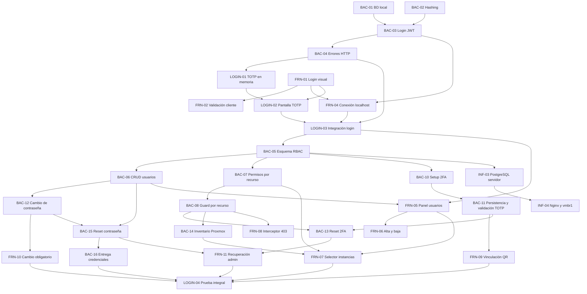

# Plan de próximas tareas

## Criterio de planificación

Este plan parte del estado registrado en `actual.md`: ninguna tarea de `BAC-01` a `BAC-04` ni de `FRN-01` a `FRN-04` está confirmada como terminada. Por eso, primero se debe cerrar el prototipo básico de login con usuario de prueba, JWT y flujo 2FA/TOTP en memoria.

Las fechas y horarios siguientes son una propuesta de ejecución desde el jueves 10/09/2026. Las horas indicadas son horas de trabajo estimadas y las franjas permiten visualizar dependencias y tareas paralelas. Una tarea solo pasa a `terminado.md` cuando se valida su criterio de éxito.

### Decisiones de alcance (Actualizadas al 25/09/2026)

- El 2FA se configura por usuario y cada cuenta conserva su propio secreto TOTP cifrado. No forma parte del rol.
- `ADMIN` y `OPERATOR` determinan qué acciones globales puede realizar una cuenta. `permisos_instancia` determina sobre qué instancias puede actuar un operador y con qué **nivel de acceso (`SEC-04`)**: `FULL_ACCESS` (permite operar ciclo de vida: encender, apagar, reiniciar) o `READ_ONLY` (solo visualización de inventario y telemetría, bloqueando órdenes mutantes con HTTP 403). La eliminación destructiva (`DELETE`) queda restringida exclusivamente al rol `ADMIN`.
- Antes de completar el cambio de contraseña y la verificación o vinculación 2FA, el backend solo debe emitir una sesión o token restringido para continuar el proceso de autenticación, nunca un JWT con acceso completo a la aplicación.
- **RF-12 (organizaciones) queda descartado del MVP.** El sistema se planifica y se implementa como monoorganización; ninguna tarea nueva debe requerir gestión multi-tenant.
- **RF-13 (recuperación de contraseña por el propio usuario) forma parte de la fase base**, complementando el reset administrativo (`BAC-15`).
- **Servidor SMTP real ACTIVADO (`INF-08` / `BAC-16B`):** Se revierte el descarte previo de SMTP. Aprovechando el puerto hexagonal `EmailService` (`BAC-16`), se implementa el adaptador real `SmtpEmailService` para el envío efectivo de correos en desarrollo/producción (credenciales temporales de alta/reset y códigos OTP de recuperación), manteniendo `MockEmailService` únicamente para ejecución de pruebas automatizadas en CI.
- **Implementación de Redis y Optimización de Base de Datos (`INF-06` / `DB-01`):**
  - Se adelanta el despliegue de **Redis** al cierre de la fase base para gestionar el control de sesiones/JTIs con expiración automática por `TTL`, tickets efímeros de autenticación para WebSockets/SSE, bus Pub/Sub entre réplicas y caché de telemetría de Proxmox.
  - En PostgreSQL, se optimiza `sesiones_activas` mediante **índices parciales** (`WHERE activa = true`) y un **worker de purga periódica** que elimina registros inactivos o vencidos para evitar la degradación en cada request autenticado.
  - En la tabla `auditoria` (*append-only*, `FIX-23`), se incorpora **particionamiento trimestral por rango de fechas** (`PARTITION BY RANGE (fecha_hora)`) e indexación compuesta para sostener el crecimiento de registros operativos de las Etapas 1, 2 y 3 sin degradar las consultas ni exportaciones CSV.
- **La auditoría (`RF-08`) y las tareas asíncronas (`RNF-04`) utilizan los modelos reales implementados en la base (`auditoria` y `tareas_asincronas`):** Toda acción de las siguientes etapas debe persistirse sobre estas tablas reales sin crear tablas paralelas (`audit_logs` o `user_instances`).
- **Criterio de cierre de la Fase Base (actualizado el 30/09/2026):** la fase base se cierra cuando están aprobadas, con sus pruebas en verde, estas tareas:
  - `LOGIN-04` ✅ (completada el 01/10/2026, en `terminado.md`).
  - Todas las tareas de `actual.md`: `SEC-03`, `INF-08`, `BAC-16B`, `BAC-17B`, `BAC-18B` (DB-01), `FIX-27` a `FIX-30`, `BAC-21B` (BRG-01) y `BAC-21C` (BRG-02-BAC).
  - Las tareas de la fase base que siguen en este archivo: `FRN-17C` (BRG-02-FRN) y `FIX-31`.

  Las tareas puente `BRG-03`, `BRG-04` y `BRG-05` dependen de tareas de la Etapa 1 (`INF-07`, `BAC-25A`, `FRN-16`, `BAC-22` y `BAC-23A`). Por eso se movieron a `etapa1.md` y **no** bloquean el inicio de la Etapa 1.


> `LOGIN-04` se completó el 01/10/2026 y pasó a [`terminado.md`](terminado.md).


## Fase 3. Despliegue de persistencia y red


## Relación y orden de ejecución



### Tareas que pueden ejecutarse en paralelo

- `BAC-01`, `BAC-02`, `FRN-01` y `FRN-03` no dependen entre sí.
- `FRN-05` puede comenzar con el contrato definido de `BAC-06`, aunque necesita el endpoint para validación final.
- `FRN-06` puede avanzar con datos simulados mientras termina `BAC-06`.
- `BAC-10`/`BAC-11`, `BAC-12` y `BAC-14` pueden desarrollarse en paralelo una vez disponibles sus dependencias.
- `FRN-09` y `FRN-10` pueden maquetarse con contratos simulados, pero requieren `BAC-11` y `BAC-12` para validar los bloqueos de navegación.
- `BAC-13` y `BAC-15` pueden desarrollarse en paralelo; `FRN-11` integra ambas recuperaciones una vez definidos sus contratos.
- `INF-03` debe esperar el esquema de `BAC-05`, pero puede preparar el LXC, la red y los secretos antes de desplegarlo.

### Secuencia crítica

`BAC-01` + `BAC-02` -> `BAC-03` -> `BAC-04` -> `LOGIN-01` + `LOGIN-02` -> `FRN-04` -> `LOGIN-03` -> `BAC-05` -> `BAC-06`/`BAC-07` -> `BAC-08` -> `BAC-10`/`BAC-11` + `BAC-12` + `BAC-14` -> `BAC-13`/`BAC-15` + `FRN-07`/`FRN-09`/`FRN-10` -> `BAC-16`/`FRN-11` -> `LOGIN-04`.

## Resumen para ClickUp

| ID | Área | Asignado | Horas | Fecha propuesta | Dependencias |
|---|---|---|---:|---|---|
| BAC-01 | Backend/Infra | Tayra / Lucas | 2 | 10/09/2026 | - |
| BAC-02 | Backend | Lisandro | 2 | 10/09/2026 | - |
| BAC-03 | Backend | Tayra | 3 | 11/09/2026 | BAC-01, BAC-02 |
| BAC-04 | Backend | Lisandro | 1,5 | 11/09/2026 | BAC-03 |
| LOGIN-01 | Backend | Tayra / Lisandro | 2 | 11/09/2026 | BAC-03, BAC-04 |
| FRN-01 | Frontend | Belinda | 3 | 10/09/2026 | - |
| FRN-02 | Frontend | Belinda | 2 | 10/09/2026 | FRN-01 |
| FRN-03 | Frontend | Cristian / Luz | 3 | 10/09/2026 | - |
| FRN-04 | Frontend | Cristian | 3 | 11/09/2026 | BAC-03, BAC-04, FRN-01 |
| LOGIN-02 | Frontend | Belinda / Luz | 2 | 11/09/2026 | LOGIN-01, FRN-01 |
| LOGIN-03 | Integración | Cristian / Tayra / Lisandro | 2 | 11/09/2026 | FRN-04, LOGIN-02 |
| BAC-05 | Backend | Tayra / Lisandro | 3 | 14/09/2026 | BAC-01, LOGIN-03 |
| BAC-06 | Backend | Lisandro | 4 | 14/09/2026 | BAC-05 |
| BAC-07 | Backend | Tayra | 3 | 15/09/2026 | BAC-05, BAC-06 |
| BAC-08 | Backend | Lisandro | 3 | 15/09/2026 | BAC-07 |
| FRN-05 | Frontend | Belinda | 4 | 14/09/2026 | LOGIN-03, BAC-06 |
| FRN-06 | Frontend | Luz | 3 | 14/09/2026 | FRN-05, BAC-06 |
| FRN-07 | Frontend | Cristian | 4 | 15/09/2026 | FRN-05, BAC-07, BAC-14 |
| FRN-08 | Frontend | Cristian | 2 | 15/09/2026 | BAC-08, FRN-04 |
| BAC-10 | Backend | Tayra | 2 | 16/09/2026 | BAC-05, LOGIN-03 |
| BAC-11 | Backend | Lisandro | 3 | 16/09/2026 | BAC-10, BAC-05 |
| FRN-09 | Frontend | Belinda / Luz | 3 | 16/09/2026 | BAC-10, BAC-11, LOGIN-02 |
| BAC-12 | Backend | Lisandro | 2 | 16/09/2026 | BAC-02, BAC-05, BAC-06 |
| FRN-10 | Frontend | Belinda | 2 | 16/09/2026 | BAC-12, FRN-04 |
| BAC-13 | Backend | Tayra | 2 | 17/09/2026 | BAC-06, BAC-08, BAC-11 |
| BAC-14 | Backend | Tayra | 3 | 17/09/2026 | BAC-08, credenciales Proxmox |
| BAC-15 | Backend | Lisandro | 2 | 17/09/2026 | BAC-06, BAC-12 |
| BAC-16 | Backend/Infra | Lisandro / Nico | 3 | 18/09/2026 | BAC-06, BAC-15, SMTP |
| FRN-11 | Frontend | Luz | 2 | 18/09/2026 | FRN-05, BAC-13, BAC-15 |
| LOGIN-04 | Integración | Cristian / Tayra / Lisandro | 3 | 18/09/2026 | FRN-07, FRN-09, FRN-10, FRN-11, BAC-14, BAC-16 |
| INF-03 | Infraestructura | Lucas / Nico | 3 | 16/09/2026 | BAC-05 |
| INF-04 | Infraestructura | Nico | 3 | 16/09/2026 | INF-03 |
| BAC-17 | Backend | Lisandro | 2 | A definir | BAC-03, BAC-05 |
| FRN-13 | Frontend | Cristian / Belinda | 2 | A definir | BAC-17 |
| BAC-18 | Backend | Tayra | 4 | A definir | BAC-05 |
| BAC-19 | Backend | Lisandro | 2 | A definir | BAC-05, BAC-16 |
| BAC-20 | Backend | Tayra | 2 | A definir | BAC-19, BAC-17 |
| BAC-21 | Backend | Tayra / Lisandro | 2 | A definir | BAC-05 |
| FRN-12 | Frontend | Belinda | 3 | A definir | BAC-19, BAC-20 |
| INF-05 | Infraestructura | Nico | 1,5 | A definir | INF-04 |

**Resultado esperado:** al completar `LOGIN-04` e `INF-04`, el equipo tendrá cerrado el circuito técnico de RF-01 y RF-09: contraseña temporal entregada y reemplazada, 2FA individual persistido, JWT posterior a la verificación, usuarios, roles, recuperación administrativa, permisos binarios por instancia, inventario real y bloqueo por recurso. Con `BAC-17` a `BAC-21`, `FRN-12` e `INF-05` también queda cerrado RF-13 (recuperación de contraseña por el propio usuario), la revocación de sesiones, la base append-only de auditoría (parte de RF-08) y el contrato de eventos que la Etapa 1 y la Etapa 3 van a reutilizar (base de RF-11), sin dejar backfill ni rediseño pendiente. La protección de las operaciones de Proxmox debe validarse antes de habilitar acciones destructivas.

**Fuera de alcance:** no se incluyen permisos granulares por acción porque el requerimiento actual solo define roles y asignación de instancias. Incorporarlos requiere una ampliación explícita del modelo de autorización y nuevos criterios para cada operación. **RF-12 (organizaciones/multi-tenant) queda descartado del MVP** y no debe planificarse en ninguna etapa posterior salvo decisión explícita en contrario.

### 🧱 Bloque 3: Persistencia Definitiva de 2FA y Ciclo de Vida de Credenciales

Este bloque formaliza la seguridad completa (Fase 2) y cierra el hito integral `LOGIN-04`.

#### 1. Tareas de desarrollo paralelo

* **Backend:**
* `BAC-10` y `BAC-11` — Enrolamiento 2FA, QR (`GET /api/auth/2fa/qr`) y persistencia del secreto cifrado con AES-256 (`POST /api/auth/2fa/verify`).


* `BAC-12` — Cambio obligatorio de contraseña temporal (`POST /api/auth/change-password`).


* `BAC-13` y `BAC-15` — Restablecimiento administrativo de 2FA y contraseña (`POST /api/admin/users/{id}/reset-...`).


* `BAC-16` — Entrega segura de credenciales temporales vía SMTP.


* **Frontend:**
* `FRN-09` — Modal obligatorio de vinculación 2FA con escaneo de QR y confirmación.


* `FRN-10` — Pantalla obligatoria de cambio de contraseña cuando `must_change_password: true`.


* `FRN-11` — Acciones de restablecimiento de contraseña y 2FA desde el panel de administración.


#### 🎯 Prueba de Integración final (`LOGIN-04`):

> **Hito:** *Circuito Completo de Seguridad y Autenticación*
> 1. El Admin crea un usuario -> El usuario recibe su clave temporal por correo (`BAC-16`).
> 
> 
> 2. El usuario inicia sesión -> El Front detecta `must_change_password` y lo bloquea hasta que cambie su clave temporal (`FRN-10` / `BAC-12`).
> 
> 
> 3. Pasa al enrolamiento de 2FA: escanea el QR en Google Authenticator (`FRN-09` / `BAC-10`) y confirma su código (`BAC-11`).
> 
> 
> 4. Ingresa al sistema con su JWT definitivo según su rol y permisos de instancias.
> 
> 
> 5. El Admin puede revocarle el 2FA o la clave (`FRN-11` / `BAC-13` / `BAC-15`) forzándolo a reiniciar el ciclo en su próximo acceso.
> 
> 
> 
> 

---

### 📋 Resumen del orden de ejecución para el equipo:

1. **Cerrar Bloque 0:** Resolver el fix de dígitos OTP en `TwoFactor.tsx` (`LOGIN-02` / `LOGIN-03` al 100%).


2. **Asignar Bloque 1:** CRUD de Usuarios y Roles (`BAC-05`, `BAC-06`, `BAC-06B`, `BAC-09` + `FRN-05`, `FRN-06`, `FRN-06B`) -> **Prueba de Integración 1**.


3. **Asignar Bloque 2:** Permisos por Recurso e Inventario (`BAC-07`, `BAC-08`, `BAC-14` + `FRN-07`, `FRN-08`) -> **Prueba de Integración 2**.


4. **Asignar Bloque 3:** 2FA Real, Recuperación y Cambio de Clave (`BAC-10` a `BAC-16` + `FRN-09` a `FRN-11`) -> **Prueba de Integración `LOGIN-04**`.

---

## 🛠️ Defectos Técnicos y Fixes: Distinción entre Cambio y Restablecimiento de Contraseñas

### Contexto de los Flujos de Credenciales

Para evitar la ambigüedad que provocó desalineaciones entre Frontend y Backend, se formaliza la distinción entre los tres flujos de contraseñas:

1. **Cambio Obligatorio de Contraseña (`FRN-10` / `BAC-12`):** Usuario en proceso de login con contraseña temporal (`cambio_contrasena: true`). Requiere sesión activa restringida, exige ingresar `contrasenaActual` y `contrasenaNueva`, e interactúa con `PUT /api/account/password`.
2. **Restablecimiento / Recuperación por Olvido (`FRN-12` / `BAC-19` / `BAC-20` / RF-13):** Usuario anónimo que olvidó su clave. Paso 1: `POST /api/auth/password/forgot` (envía OTP de 6 dígitos al correo). Paso 2 y 3: `POST /api/auth/password/reset` con `{ email, codigo, nuevaContrasena }` (sin contraseña actual). Al finalizar redirige a `/login`.
3. **Restablecimiento Administrativo (`FRN-11` / `BAC-13` / `BAC-15`):** Administrador autenticado con rol `ADMIN` que opera sobre otro usuario desde `/users`. Invoca `POST /api/admin/users/:id/password/reset` (genera nueva clave temporal y envía por correo) y `POST /api/admin/users/:id/2fa/reset` (desvincula TOTP).

---


---

## 🛠️ Fixes detectados en la verificación del 23/09/2026

Surgen de la corrida de `test/back` y `test/front` contra `origin/main` (backend `15032da`, frontend `3192cf4`). El detalle está en [test/informe.md](../test/informe.md). Cada FIX corrige una tarea ya movida a `terminado.md` que tiene un problema; su prueba de aceptación ya existe y hoy falla.

FIX DEL 21 AL 25 (en actual.md)

---

## 🚀 Bloque 4: Infraestructura Real (SMTP y Redis), Corrección de `sesiones_activas` y Optimización de BD

*(Todas las tareas están separadas estrictamente por equipo —**Infraestructura**, **Backend** o **Frontend**— para su asignación directa en ClickUp).*


---

## 🔐 Bloque 5: Cierre de Huecos de la Fase Base

*(Origen: análisis de cierre de la fase base del 26/09/2026. Sus tareas se incorporaron como `FRN-18` (terminada), `BAC-21B`, `BAC-21C` (`actual.md`), `FRN-17C` (este archivo), el criterio de cierre de "Decisiones de alcance" y los ajustes de la Etapa 1 en `etapa1.md`).*


---

## 🌉 Bloque 6: Tareas Puente (Bridge) entre la Fase Base y la Etapa 1 (`etapa1.md`)

*(Tareas puente que pertenecen a la fase base. Las que dependen de tareas de la Etapa 1 — `BRG-03`, `BRG-04` y `BRG-05` — se movieron a `etapa1.md`).*


---

## 🧰 Redis y SMTP: parte local (repo del backend) y parte del servidor (30/09/2026)

`INF-06` e `INF-08` se dividieron en dos tareas cada una:

| Tarea | Quién | Dónde | Destraba |
|---|---|---|---|
| `INF-06A` Redis local | Backend | Repo del backend (`docker-compose.yml`, `.env.example`) | `BAC-17A`, `BAC-17B`, `BAC-21C` |
| `INF-06B` Redis en el servidor | Infraestructura | Servidor (`vmbr1`) | Despliegue en el servidor |
| `INF-08B` Credenciales SMTP | Backend | Repo del backend (`.env.example`, `.env`) | `BAC-16B` |
| `INF-08A` SMTP en el servidor | Infraestructura | Servidor | Envío real en el servidor |

**El backend avanza en local con `INF-06A` e `INF-08B`, sin esperar al servidor.**

---

> `FIX-34` (credenciales reales en `backend/.env.example`) **se eliminó el 01/10/2026**. Las credenciales reales están en el `.env` local de cada desarrollador, en el servidor (`INF-08A`) y en `test/back/smtp-brevo.env`, y autentican contra el relay. `.env.example` queda con valores de ejemplo, como corresponde. Ver `INF-08B` en [`terminado.md`](terminado.md).


---

## 🛠️ Fixes detectados en la verificación del 01/10/2026

---

## 🛠️ Fixes detectados en la verificación del 02/10/2026

> `FIX-41` y `FIX-42` quedaron resueltos en el frontend `6fd2c7c` (PR #72 y #73) y pasaron a [`terminado.md`](terminado.md).

---

## 🛠️ Fixes detectados en la verificación del 03/10/2026

### `FIX-44` - Corregir índice parcial en `sesiones_activas` para incluir `jti_access` y alinear worker de purga (`BAC-18B`) (Backend)

- **Área:** Backend
- **Asignada:** Tayra (autora de `96106a6`)
- **Estimación:** 0,5 h
- **Depende de:** `BAC-18B` (en `terminado.md`).
- **Problema y evidencia:**
  1. `internal/adapters/secondary/postgres/db.go:148` creó el índice parcial como:
     ```sql
     CREATE INDEX IF NOT EXISTS idx_sesiones_activas_vigentes
     ON sesiones_activas (usuario_id, fecha_expiracion)
     WHERE activa = true;
     ```
     Omitió la columna `jti_access`. Como el middleware de autenticación (`AuthMiddleware`) busca las sesiones por `jti_access` para comprobar revocaciones en cada solicitud, el índice no cubre la consulta de alta concurrencia. La suite de pruebas (`cierre_fase_base_acceptance_test.go:396`) falla por no encontrar un índice parcial que cubra `jti_access`.
  2. En `internal/adapters/secondary/postgres/purga_worker.go:39`, el worker usa `ticker := time.NewTicker(w.intervalo)`. La prueba estática de aceptación busca la inicialización con `time.Hour` o equivalente dentro del worker (`time.NewTicker(time.Hour)`).
- **Entregable:**
  1. Actualizar la definición del índice parcial en `db.go` para que indexe `(jti_access, usuario_id)` o `jti_access` con `WHERE activa = true` (por ejemplo `ON sesiones_activas (jti_access, usuario_id) WHERE activa = true;`).
  2. Ajustar `purga_worker.go` para que instancie el ticker con `time.NewTicker(1 * time.Hour)` (o mantenga el default con `time.NewTicker(time.Hour)`).
- **Criterio de éxito:**
  - `TestCierreFaseBase/BAC-18B_indice_parcial_en_sesiones_activas_y_auditoria_particionada_por_trimestre` y `TestCierreFaseBase/BAC-18B_rutina_horaria_que_purga_sesiones_inactivas_o_vencidas_de_sesiones_activas` pasan 100% en verde.

---

## 🛠️ Fixes detectados en la verificación del 06/10/2026

### `FIX-45` - Redirección a `/login` y cierre de sesión local ante 401 en ticket efímero (`FRN-17C`) (Frontend)

- **Área:** Frontend
- **Asignado:** Cristian (autor de PR #80/#81/#82)
- **Estimación:** 0,5 h
- **Depende de:** `FRN-17C` (en `terminado.md`).
- **Problema y evidencia:**
  Al invocar `fetchEventTicket()` o dentro del flujo de reconexión de `useEvents.ts`, cuando el backend responde con estado HTTP `401 Unauthorized` (por sesión revocada o expirada), el cliente continúa reintentando la conexión en bucle en lugar de abortar inmediatamente, limpiar el estado de autenticación local (tokens/storage) y redirigir a la vista de login (`/login`).
  La prueba de aceptación `test/front/events-client.test.tsx:94` (*"si /api/events/ticket responde 401 cierra la sesión local y lleva a /login"*) falla por timeout esperando la navegación hacia `/login`.
- **Entregable:**
  1. En `eventsClient.ts` / `useEvents.ts`, capturar específicamente el error con status `401` proveniente de `POST /api/events/ticket`.
  2. Al recibir `401`, detener inmediatamente los temporizadores de reintento de conexión.
  3. Invocar la limpieza de credenciales locales (ej. `logout()` de auth) y ejecutar la redirección hacia `/login` (vía `window.location.href = '/login'` o router de navegación).
- **Criterio de éxito:**
  - El caso *"si /api/events/ticket responde 401 cierra la sesión local y lleva a /login"* en `test/front/events-client.test.tsx` pasa en verde sin agotar el timeout.

