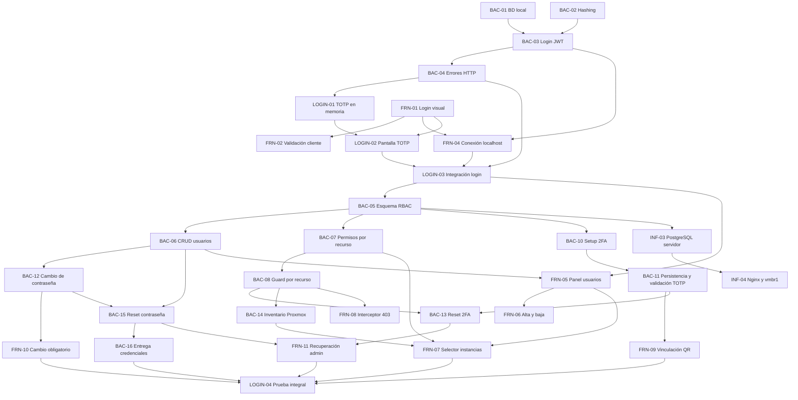

# Plan de próximas tareas

## Criterio de planificación

Este plan parte del estado registrado en `actual.md`: ninguna tarea de `BAC-01` a `BAC-04` ni de `FRN-01` a `FRN-04` está confirmada como terminada. Por eso, primero se debe cerrar el prototipo básico de login con usuario de prueba, JWT y flujo 2FA/TOTP en memoria.

Las fechas y horarios siguientes son una propuesta de ejecución desde el jueves 10/09/2026. Las horas indicadas son horas de trabajo estimadas y las franjas permiten visualizar dependencias y tareas paralelas. Una tarea solo pasa a `terminado.md` cuando se valida su criterio de éxito.

### Decisiones de alcance (Actualizadas al 25/09/2026)

- El 2FA se configura por usuario y cada cuenta conserva su propio secreto TOTP cifrado. No forma parte del rol.
- `ADMIN` y `OPERATOR` determinan qué acciones globales puede realizar una cuenta. `permisos_instancia` determina sobre qué instancias puede actuar un operador y con qué **nivel de acceso (`SEC-04`)**: `FULL_ACCESS` (permite operar ciclo de vida: encender, apagar, reiniciar) o `READ_ONLY` (solo visualización de inventario y telemetría, bloqueando órdenes mutantes con HTTP 403). La eliminación destructiva (`DELETE`) queda restringida exclusivamente al rol `ADMIN`.
- Antes de completar el cambio de contraseña y la verificación o vinculación 2FA, el backend solo debe emitir una sesión o token restringido para continuar el proceso de autenticación, nunca un JWT con acceso completo a la aplicación.
- **RF-12 (organizaciones) queda descartado del MVP.** El sistema se planifica y se implementa como monoorganización; ninguna tarea nueva debe requerir gestión multi-tenant.
- **RF-13 (recuperación de contraseña por el propio usuario) forma parte de la fase base**, complementando el reset administrativo (`BAC-15`).
- **Servidor SMTP real ACTIVADO (`INF-08` / `BAC-16B`):** Se revierte el descarte previo de SMTP. Aprovechando el puerto hexagonal `EmailService` (`BAC-16`), se implementa el adaptador real `SmtpEmailService` para el envío efectivo de correos en desarrollo/producción (credenciales temporales de alta/reset y códigos OTP de recuperación), manteniendo `MockEmailService` únicamente para ejecución de pruebas automatizadas en CI.
- **Implementación de Redis y Optimización de Base de Datos (`INF-06` / `DB-01`):**
  - Se adelanta el despliegue de **Redis** al cierre de la fase base para gestionar el control de sesiones/JTIs con expiración automática por `TTL`, tickets efímeros de autenticación para WebSockets/SSE, bus Pub/Sub entre réplicas y caché de telemetría de Proxmox.
  - En PostgreSQL, se optimiza `sesiones_activas` mediante **índices parciales** (`WHERE activa = true`) y un **worker de purga periódica** que elimina registros inactivos o vencidos para evitar la degradación en cada request autenticado.
  - En la tabla `auditoria` (*append-only*, `FIX-23`), se incorpora **particionamiento trimestral por rango de fechas** (`PARTITION BY RANGE (fecha_hora)`) e indexación compuesta para sostener el crecimiento de registros operativos de las Etapas 1, 2 y 3 sin degradar las consultas ni exportaciones CSV.
- **La auditoría (`RF-08`) y las tareas asíncronas (`RNF-04`) utilizan los modelos reales implementados en la base (`auditoria` y `tareas_asincronas`):** Toda acción de las siguientes etapas debe persistirse sobre estas tablas reales sin crear tablas paralelas (`audit_logs` o `user_instances`).
- **Criterio estricto de Cierre de la Fase Base (Puente a Etapa 1):** La fase base **no** se cierra únicamente con `LOGIN-04`. Para iniciar la ejecución de la Etapa 1 deben estar aprobados: `LOGIN-04`, la totalidad de las tareas pendientes de `actual.md` (`SEC-01`, `SEC-03`, `SEC-04`, `FRN-11`, `FRN-12`, `FIX-17` a `FIX-25`) y las tareas de cierre/puente de este documento (`INF-06`, `INF-08`, `DB-01`, `SEC-04B`, `BRG-01` a `BRG-05`).


### `INF-05` - CORS y TLS en el borde

- **Área:** Infraestructura
- **Asignado:** Nico
- **Estimación:** 1,5 h
- **Ventana propuesta:** A definir (junto con `INF-04`).
- **Depende de:** `INF-04`.
- **Entregable:** whitelist de orígenes permitidos en CORS y certificados TLS configurados en Nginx para todo el tráfico hacia el frontend y la API.
- **Criterio de éxito:** una petición desde un origen no autorizado es rechazada por CORS y el tráfico hacia el sistema se sirve únicamente sobre HTTPS.

### `LOGIN-04` - Prueba integral de autenticación y autorización

- **Área:** Frontend / Backend
- **Asignados:** Cristian, Tayra y Lisandro
- **Estimación:** 3 h
- **Ventana propuesta:** 18/09/2026, 14:00-17:00
- **Depende de:** `FRN-07`, `FRN-09`, `FRN-10`, `FRN-11`, `FRN-12`, `BAC-14`, `BAC-16`, `BAC-17`, `BAC-18`, `BAC-20` y `BAC-21`.
- **Entregable:** pruebas documentadas o automatizadas de creación de usuario, entrega y cambio de clave temporal, enrolamiento y login con TOTP, acceso según rol, filtro por instancias, recuperación administrativa de contraseña y 2FA, recuperación de contraseña por el propio usuario, logout/revocación de sesión y verificación de que las acciones administrativas quedan auditadas.
- **Criterio de éxito:** todos los recorridos válidos terminan con el acceso esperado y los intentos de omitir pasos, usar credenciales anteriores, acceder con otro rol, consultar una instancia no asignada o reutilizar un token revocado son rechazados con códigos HTTP controlados.


### `QA-11` - Re-verificación completa tras el fix crítico

- **Área:** Backend / Frontend
- **Asignados:** Cristian, Tayra y Lisandro
- **Estimación:** 1 h
- **Ventana propuesta:** A definir, después de cerrar los fixes del hito de recursos.
- **Depende de:** `BAC-14`, `FIX-14` y `FIX-16`.
- **Problema:** las pruebas actuales todavía fallan en el circuito de permisos por instancia: contrato de endpoints, autorización por recurso, inventario Proxmox e integración del selector frontend.
- **Entregable:** correr `test/back` completo contra el commit con los fixes aplicados y actualizar el estado real de cada tarea afectada en `terminado.md` (o devolverla a este documento si el criterio de éxito no se cumple).
- **Criterio de éxito:** las suites backend y frontend pasan sin fallos relacionados con el hito de recursos y cada tarea marcada como terminada tiene su criterio de éxito confirmado por pruebas.

## Fase 3. Despliegue de persistencia y red


### `FIX-20` - Sincronización de políticas de complejidad y distinción UX entre Cambio y Restablecimiento (`FRN-10` / `FRN-12`) (Frontend / UX)

- **Área:** Frontend
- **Asignada:** Belinda
- **Estimación:** 1,5 h
- **Ventana propuesta:** A definir (Fase Base / Bloque 3).
- **Depende de:** `FRN-10`, `FRN-12` y `BAC-02`.
- **Problema:**
  1. *Disparidad en reglas de validación:* `ChangePassword.tsx` (`validateChangePasswordFields`, líneas 22-34) valida únicamente que la longitud esté entre 8 y 12 caracteres. Omite las reglas que exige el backend en `crypto.ValidarComplejidadContrasena` (`backend/internal/infrastructure/crypto/password.go:89`): al menos una mayúscula, un número y un carácter especial `!@#$%^&*-_=+`. Si el usuario ingresa una clave que no cumple estas reglas, el cliente la envía y el backend responde 400 `PASSWORD_CHANGE_FAILED`.
     - **Evidencia (23/09/2026):** en `test/front/password-change.test.tsx`, los casos *"no llama a la API si la contraseña nueva no cumple la complejidad del backend (sin mayúscula / sin dígito / sin carácter especial)"* fallan, porque el cliente envía `PUT /api/account/password` con `nueva1234!`, `NuevaClave!` y `Nueva12345`.
  2. *Ambigüedad visual:* Falta claridad en los textos de ayuda de los formularios para distinguir que en el **Cambio** se requiere la clave temporal previa, mientras que en el **Restablecimiento** solo se define una nueva contraseña.
- **Entregable:**
  1. Implementar un validador unificado de contraseñas (`validatePasswordComplexity`) en el archivo existente `frontend/centinela/src/utils/validators.js`, que replique exactamente los criterios del backend:
     - Longitud: 8 a 12 caracteres.
     - Al menos una letra mayúscula.
     - Al menos un dígito numérico.
     - Al menos un símbolo permitido (`[!@#$%^&*-_=+]`).
  2. Integrar el validador unificado en `ChangePassword.tsx` y `RecoverPassword.tsx` (paso 3), mostrando el error junto al campo y textos de ayuda explicativos debajo. `CrearUsuarios.tsx` no lo necesita: desde `BAC-16` la clave temporal la genera el backend y se envía por correo, y los campos de contraseña de esa vista se eliminan en `FIX-24`.
- **Criterio de éxito:** Las validaciones de cliente previenen el envío de contraseñas no conformes; el usuario recibe retroalimentación inmediata; se eliminan los errores 400 por rechazo de complejidad en el backend. Los 3 casos de complejidad de `test/front/password-change.test.tsx` pasan.
- **Nota:** la corrección de la referencia de `FRN-10` a `PUT /api/account/password` en la documentación ya se hizo el 23/09/2026, en `terminado.md`, y no forma parte de este FIX.

## Relación y orden de ejecución



### Tareas que pueden ejecutarse en paralelo

- `BAC-01`, `BAC-02`, `FRN-01` y `FRN-03` no dependen entre sí.
- `FRN-05` puede comenzar con el contrato definido de `BAC-06`, aunque necesita el endpoint para validación final.
- `FRN-06` puede avanzar con datos simulados mientras termina `BAC-06`.
- `BAC-10`/`BAC-11`, `BAC-12` y `BAC-14` pueden desarrollarse en paralelo una vez disponibles sus dependencias.
- `FRN-09` y `FRN-10` pueden maquetarse con contratos simulados, pero requieren `BAC-11` y `BAC-12` para validar los bloqueos de navegación.
- `BAC-13` y `BAC-15` pueden desarrollarse en paralelo; `FRN-11` integra ambas recuperaciones una vez definidos sus contratos.
- `INF-03` debe esperar el esquema de `BAC-05`, pero puede preparar el LXC, la red y los secretos antes de desplegarlo.

### Secuencia crítica

`BAC-01` + `BAC-02` -> `BAC-03` -> `BAC-04` -> `LOGIN-01` + `LOGIN-02` -> `FRN-04` -> `LOGIN-03` -> `BAC-05` -> `BAC-06`/`BAC-07` -> `BAC-08` -> `BAC-10`/`BAC-11` + `BAC-12` + `BAC-14` -> `BAC-13`/`BAC-15` + `FRN-07`/`FRN-09`/`FRN-10` -> `BAC-16`/`FRN-11` -> `LOGIN-04`.

## Resumen para ClickUp

| ID | Área | Asignado | Horas | Fecha propuesta | Dependencias |
|---|---|---|---:|---|---|
| BAC-01 | Backend/Infra | Tayra / Lucas | 2 | 10/09/2026 | - |
| BAC-02 | Backend | Lisandro | 2 | 10/09/2026 | - |
| BAC-03 | Backend | Tayra | 3 | 11/09/2026 | BAC-01, BAC-02 |
| BAC-04 | Backend | Lisandro | 1,5 | 11/09/2026 | BAC-03 |
| LOGIN-01 | Backend | Tayra / Lisandro | 2 | 11/09/2026 | BAC-03, BAC-04 |
| FRN-01 | Frontend | Belinda | 3 | 10/09/2026 | - |
| FRN-02 | Frontend | Belinda | 2 | 10/09/2026 | FRN-01 |
| FRN-03 | Frontend | Cristian / Luz | 3 | 10/09/2026 | - |
| FRN-04 | Frontend | Cristian | 3 | 11/09/2026 | BAC-03, BAC-04, FRN-01 |
| LOGIN-02 | Frontend | Belinda / Luz | 2 | 11/09/2026 | LOGIN-01, FRN-01 |
| LOGIN-03 | Integración | Cristian / Tayra / Lisandro | 2 | 11/09/2026 | FRN-04, LOGIN-02 |
| BAC-05 | Backend | Tayra / Lisandro | 3 | 14/09/2026 | BAC-01, LOGIN-03 |
| BAC-06 | Backend | Lisandro | 4 | 14/09/2026 | BAC-05 |
| BAC-07 | Backend | Tayra | 3 | 15/09/2026 | BAC-05, BAC-06 |
| BAC-08 | Backend | Lisandro | 3 | 15/09/2026 | BAC-07 |
| FRN-05 | Frontend | Belinda | 4 | 14/09/2026 | LOGIN-03, BAC-06 |
| FRN-06 | Frontend | Luz | 3 | 14/09/2026 | FRN-05, BAC-06 |
| FRN-07 | Frontend | Cristian | 4 | 15/09/2026 | FRN-05, BAC-07, BAC-14 |
| FRN-08 | Frontend | Cristian | 2 | 15/09/2026 | BAC-08, FRN-04 |
| BAC-10 | Backend | Tayra | 2 | 16/09/2026 | BAC-05, LOGIN-03 |
| BAC-11 | Backend | Lisandro | 3 | 16/09/2026 | BAC-10, BAC-05 |
| FRN-09 | Frontend | Belinda / Luz | 3 | 16/09/2026 | BAC-10, BAC-11, LOGIN-02 |
| BAC-12 | Backend | Lisandro | 2 | 16/09/2026 | BAC-02, BAC-05, BAC-06 |
| FRN-10 | Frontend | Belinda | 2 | 16/09/2026 | BAC-12, FRN-04 |
| BAC-13 | Backend | Tayra | 2 | 17/09/2026 | BAC-06, BAC-08, BAC-11 |
| BAC-14 | Backend | Tayra | 3 | 17/09/2026 | BAC-08, credenciales Proxmox |
| BAC-15 | Backend | Lisandro | 2 | 17/09/2026 | BAC-06, BAC-12 |
| BAC-16 | Backend/Infra | Lisandro / Nico | 3 | 18/09/2026 | BAC-06, BAC-15, SMTP |
| FRN-11 | Frontend | Luz | 2 | 18/09/2026 | FRN-05, BAC-13, BAC-15 |
| LOGIN-04 | Integración | Cristian / Tayra / Lisandro | 3 | 18/09/2026 | FRN-07, FRN-09, FRN-10, FRN-11, BAC-14, BAC-16 |
| INF-03 | Infraestructura | Lucas / Nico | 3 | 16/09/2026 | BAC-05 |
| INF-04 | Infraestructura | Nico | 3 | 16/09/2026 | INF-03 |
| BAC-17 | Backend | Lisandro | 2 | A definir | BAC-03, BAC-05 |
| FRN-13 | Frontend | Cristian / Belinda | 2 | A definir | BAC-17 |
| BAC-18 | Backend | Tayra | 4 | A definir | BAC-05 |
| BAC-19 | Backend | Lisandro | 2 | A definir | BAC-05, BAC-16 |
| BAC-20 | Backend | Tayra | 2 | A definir | BAC-19, BAC-17 |
| BAC-21 | Backend | Tayra / Lisandro | 2 | A definir | BAC-05 |
| FRN-12 | Frontend | Belinda | 3 | A definir | BAC-19, BAC-20 |
| INF-05 | Infraestructura | Nico | 1,5 | A definir | INF-04 |

**Resultado esperado:** al completar `LOGIN-04` e `INF-04`, el equipo tendrá cerrado el circuito técnico de RF-01 y RF-09: contraseña temporal entregada y reemplazada, 2FA individual persistido, JWT posterior a la verificación, usuarios, roles, recuperación administrativa, permisos binarios por instancia, inventario real y bloqueo por recurso. Con `BAC-17` a `BAC-21`, `FRN-12` e `INF-05` también queda cerrado RF-13 (recuperación de contraseña por el propio usuario), la revocación de sesiones, la base append-only de auditoría (parte de RF-08) y el contrato de eventos que la Etapa 1 y la Etapa 3 van a reutilizar (base de RF-11), sin dejar backfill ni rediseño pendiente. La protección de las operaciones de Proxmox debe validarse antes de habilitar acciones destructivas.

**Fuera de alcance:** no se incluyen permisos granulares por acción porque el requerimiento actual solo define roles y asignación de instancias. Incorporarlos requiere una ampliación explícita del modelo de autorización y nuevos criterios para cada operación. **RF-12 (organizaciones/multi-tenant) queda descartado del MVP** y no debe planificarse en ninguna etapa posterior salvo decisión explícita en contrario.

### 🧱 Bloque 3: Persistencia Definitiva de 2FA y Ciclo de Vida de Credenciales

Este bloque formaliza la seguridad completa (Fase 2) y cierra el hito integral `LOGIN-04`.

#### 1. Tareas de desarrollo paralelo

* **Backend:**
* `BAC-10` y `BAC-11` — Enrolamiento 2FA, QR (`GET /api/auth/2fa/qr`) y persistencia del secreto cifrado con AES-256 (`POST /api/auth/2fa/verify`).


* `BAC-12` — Cambio obligatorio de contraseña temporal (`POST /api/auth/change-password`).


* `BAC-13` y `BAC-15` — Restablecimiento administrativo de 2FA y contraseña (`POST /api/admin/users/{id}/reset-...`).


* `BAC-16` — Entrega segura de credenciales temporales vía SMTP.


* **Frontend:**
* `FRN-09` — Modal obligatorio de vinculación 2FA con escaneo de QR y confirmación.


* `FRN-10` — Pantalla obligatoria de cambio de contraseña cuando `must_change_password: true`.


* `FRN-11` — Acciones de restablecimiento de contraseña y 2FA desde el panel de administración.


#### 🎯 Prueba de Integración final (`LOGIN-04`):

> **Hito:** *Circuito Completo de Seguridad y Autenticación*
> 1. El Admin crea un usuario -> El usuario recibe su clave temporal por correo (`BAC-16`).
> 
> 
> 2. El usuario inicia sesión -> El Front detecta `must_change_password` y lo bloquea hasta que cambie su clave temporal (`FRN-10` / `BAC-12`).
> 
> 
> 3. Pasa al enrolamiento de 2FA: escanea el QR en Google Authenticator (`FRN-09` / `BAC-10`) y confirma su código (`BAC-11`).
> 
> 
> 4. Ingresa al sistema con su JWT definitivo según su rol y permisos de instancias.
> 
> 
> 5. El Admin puede revocarle el 2FA o la clave (`FRN-11` / `BAC-13` / `BAC-15`) forzándolo a reiniciar el ciclo en su próximo acceso.
> 
> 
> 
> 

---

### 📋 Resumen del orden de ejecución para el equipo:

1. **Cerrar Bloque 0:** Resolver el fix de dígitos OTP en `TwoFactor.tsx` (`LOGIN-02` / `LOGIN-03` al 100%).


2. **Asignar Bloque 1:** CRUD de Usuarios y Roles (`BAC-05`, `BAC-06`, `BAC-06B`, `BAC-09` + `FRN-05`, `FRN-06`, `FRN-06B`) -> **Prueba de Integración 1**.


3. **Asignar Bloque 2:** Permisos por Recurso e Inventario (`BAC-07`, `BAC-08`, `BAC-14` + `FRN-07`, `FRN-08`) -> **Prueba de Integración 2**.


4. **Asignar Bloque 3:** 2FA Real, Recuperación y Cambio de Clave (`BAC-10` a `BAC-16` + `FRN-09` a `FRN-11`) -> **Prueba de Integración `LOGIN-04**`.

---

## 🛠️ Defectos Técnicos y Fixes: Distinción entre Cambio y Restablecimiento de Contraseñas

### Contexto de los Flujos de Credenciales

Para evitar la ambigüedad que provocó desalineaciones entre Frontend y Backend, se formaliza la distinción entre los tres flujos de contraseñas:

1. **Cambio Obligatorio de Contraseña (`FRN-10` / `BAC-12`):** Usuario en proceso de login con contraseña temporal (`cambio_contrasena: true`). Requiere sesión activa restringida, exige ingresar `contrasenaActual` y `contrasenaNueva`, e interactúa con `PUT /api/account/password`.
2. **Restablecimiento / Recuperación por Olvido (`FRN-12` / `BAC-19` / `BAC-20` / RF-13):** Usuario anónimo que olvidó su clave. Paso 1: `POST /api/auth/password/forgot` (envía OTP de 6 dígitos al correo). Paso 2 y 3: `POST /api/auth/password/reset` con `{ email, codigo, nuevaContrasena }` (sin contraseña actual). Al finalizar redirige a `/login`.
3. **Restablecimiento Administrativo (`FRN-11` / `BAC-13` / `BAC-15`):** Administrador autenticado con rol `ADMIN` que opera sobre otro usuario desde `/users`. Invoca `POST /api/admin/users/:id/password/reset` (genera nueva clave temporal y envía por correo) y `POST /api/admin/users/:id/2fa/reset` (desvincula TOTP).

---


---

## 🛠️ Fixes detectados en la verificación del 23/09/2026

Surgen de la corrida de `test/back` y `test/front` contra `origin/main` (backend `15032da`, frontend `3192cf4`). El detalle está en [test/informe.md](../test/informe.md). Cada FIX corrige una tarea ya movida a `terminado.md` que tiene un problema; su prueba de aceptación ya existe y hoy falla.

FIX DEL 21 AL 25 (en actual.md)

---

## 🚀 Bloque 4: Infraestructura Real (SMTP y Redis), Corrección de `sesiones_activas` y Optimización de BD

*(Todas las tareas están separadas estrictamente por equipo —**Infraestructura**, **Backend** o **Frontend**— para su asignación directa en ClickUp).*

### `INF-08` - Configuración de servidor/cuenta SMTP y variables de entorno para correo saliente

- **Área:** Infraestructura
- **Asignado:** Nico
- **Estimación:** 1 h
- **Ventana propuesta:** A definir (Cierre de Fase Base).
- **Depende de:** `INF-03`, `INF-04`.
- **Problema y contexto:** Para habilitar el envío real de correos (`RF-09` y `RF-13`) desde el backend, la infraestructura debe proveer las credenciales del relay/servidor SMTP y habilitar la salida de red en los puertos correspondientes (`587` STARTTLS / `465` TLS).
- **Entregable:**
  1. Configurar la cuenta de servicio o relay SMTP e inyectar en el entorno del servidor y en `.env.example` / `docker-compose.yml` las variables: `EMAIL_PROVIDER=smtp`, `SMTP_HOST`, `SMTP_PORT`, `SMTP_USER`, `SMTP_PASS` y `SMTP_FROM`.
  2. Verificar conectividad de red saliente desde el contenedor del backend hacia el host SMTP.
- **Criterio de éxito:** Variables documentadas y conectividad validada desde el contenedor del backend hacia el puerto SMTP sin bloqueos de firewall.

### `BAC-16B` - Adaptador Go `SmtpEmailService` para envío real de credenciales y códigos OTP (`RF-09` / `RF-13`)

- **Área:** Backend
- **Asignado:** Lisandro
- **Estimación:** 2 h
- **Ventana propuesta:** A definir (Cierre de Fase Base).
- **Depende de:** `BAC-16`, `BAC-19`, `INF-08`.
- **Problema y contexto:** `BAC-16` dejó creado el puerto hexagonal `ports.EmailService`, pero solo implementó `MockEmailService` por consola. El backend necesita el adaptador SMTP real para enviar las contraseñas temporales y los códigos de recuperación de 6 dígitos.
- **Entregable:**
  1. Implementar `SmtpEmailService` en `backend/internal/adapters/secondary/email/smtp_service.go` cumpliendo la interfaz `ports.EmailService` (`EnviarCredencialesTemporales` y `EnviarCodigoRecuperacion`) con soporte `STARTTLS`/`TLS`.
  2. En `cmd/api/main.go`, instanciar `SmtpEmailService` cuando `EMAIL_PROVIDER=smtp` y mantener `MockEmailService` cuando `EMAIL_PROVIDER=mock` (usado por los tests automatizados).
  3. Estructurar los cuerpos de correo para alta de cuenta (`RF-09`), reset administrativo (`BAC-15`) y código OTP de 6 dígitos (`RF-13`).
- **Criterio de éxito:** Con `EMAIL_PROVIDER=smtp`, el backend envía correos reales; ante un fallo de entrega aborta la operación y devuelve `502 EMAIL_DELIVERY_FAILED`; la suite de tests sigue pasando en modo `mock`.

### `INF-06` - Despliegue de servicio Redis en Docker Compose y red `vmbr1`

- **Área:** Infraestructura
- **Asignados:** Nico y Lucas
- **Estimación:** 1,5 h
- **Ventana propuesta:** A definir (Cierre de Fase Base, previo a `BAC-17B`).
- **Depende de:** `INF-03` e `INF-04`.
- **Problema y contexto:** Se adelanta el despliegue de Redis al cierre de la fase base para alojar las sesiones activas con expiración automática (`TTL`), los tickets efímeros de WebSockets/SSE y la caché de Proxmox.
- **Entregable:**
  1. Agregar el contenedor `redis:7-alpine` en `docker-compose.yml` y en la red interna `vmbr1`, configurado con contraseña (`REDIS_PASSWORD`), límite de memoria (`maxmemory 256mb`, política `volatile-lru`) y variables `REDIS_ADDR` / `REDIS_PASSWORD` expuestas al contenedor del backend.
- **Criterio de éxito:** Servicio Redis operativo y accesible desde la red interna `vmbr1`, respondiendo `PONG` a `redis-cli PING` con autenticación.

### `BAC-17B` - Corrección de lógica de inserción en `sesiones_activas` (1 sesión = 1 registro) y almacenamiento en Redis con TTL

- **Área:** Backend
- **Asignado:** Lisandro
- **Estimación:** 2,5 h
- **Ventana propuesta:** A definir (Cierre de Fase Base).
- **Depende de:** `INF-06`, `BAC-17`.
- **Problema y diagnóstico en código (`backend/internal/core/services/auth_service.go`):**
  Actualmente el código de `auth_service.go` tiene un diseño ilógico que multiplica las filas en `sesiones_activas` por cada usuario:
  1. En `Login()` (líneas 76-84) inserta la **Fila 1** para el `jwtTemporal` (pre-2FA) con `activa = true`.
  2. En `VerificarTotp()` (líneas 249-313), en vez de transformar esa sesión o eliminar la temporal, deja la **Fila 1** con `activa = true`, inserta la **Fila 2** para el `refreshToken` y encima inserta la **Fila 3** para el `accessToken`. **Un solo inicio de sesión genera 3 filas en la base de datos.**
  3. En `RefrescarToken()` (líneas 388-399), cada vez que el frontend renueva el `accessToken`, el backend hace **otro `INSERT`** (`Fila 4, Fila 5, Fila 6...`) dejando todas las filas de `accessToken` anteriores con `activa = true`.
  4. En `CerrarSesion()` (líneas 433-438), solo pasa a `activa = false` el último `access` y `refresh`, dejando huérfanas la fila pre-2FA y todas las filas de renovaciones intermedias.
- **Entregable (Solución arquitectónica):**
  1. **Regla de oro (1 Sesión de Usuario = 1 único registro activo):**
     - **Paso Pre-2FA (`Login`):** Guardar el `jtiTemporal` exclusivamente en Redis (`SET auth:pre2fa:<jti> <usuario_id> EX 300`) con expiración automática de 5 minutos (o si se usa PostgreSQL, que sea la única fila creada que luego se actualiza en el paso 2FA). **Nunca dejar filas pre-2FA sueltas.**
     - **Paso Post-2FA (`VerificarTotp`):** Consumir y eliminar (`DEL`) el `jtiTemporal` pre-2FA. Crear **1 única sesión** para el navegador del usuario (en Redis `SET auth:session:<session_id> ... EX <ttl>` y **1 sola fila** en `sesiones_activas` que represente la sesión activa, no 2 filas separadas). Actualizar en ese mismo acto `fecha_ultimo_acceso = NOW()` en la tabla `usuarios`.
     - **Paso Renovación (`RefrescarToken`):** **Prohibido hacer `INSERT` en `RefrescarToken`**. Al renovar el token, hacer `UPDATE` sobre el **mismo registro existente** de esa sesión (actualizando el `jti_token` vigente y su `fecha_expiracion` en la fila única y en Redis). Así, aunque un usuario renueve su token 100 veces en el día, sigue ocupando **1 sola fila**.
     - **Paso Cierre (`CerrarSesion` / Expiración):** Eliminar la clave de Redis (`DEL`) y eliminar (`DELETE`) o desactivar esa única fila en `sesiones_activas`.
- **Criterio de éxito:** Un usuario que inicia sesión, verifica 2FA y refresca su token 10 veces genera **exactamente 1 sesión activa** (no 12 filas); al cerrar sesión o vencer el TTL, no quedan filas residuales activas y `fecha_ultimo_acceso` se persiste correctamente en `usuarios`.

### `BAC-18B` - Índice parcial y purga en `sesiones_activas`, y particionamiento trimestral en `auditoria` (PostgreSQL)

- **Área:** Backend
- **Asignada:** Tayra
- **Estimación:** 2 h
- **Ventana propuesta:** A definir (Cierre de Fase Base).
- **Depende de:** `BAC-17B`, `FIX-23`.
- **Problema y contexto:**
  1. Las filas históricas o con `activa = false` en `sesiones_activas` penalizan las lecturas en PostgreSQL si no existe un índice parcial ni una purga de registros vencidos.
  2. La tabla `auditoria` es *append-only* (`FIX-23`, no admite `DELETE` bajo ningún concepto) y en la Etapa 1 registrará múltiples eventos por cada operación de Proxmox VE (`PENDING` y `SUCCESS`/`FAILED`). Sin particionamiento por fechas e índices compuestos, las consultas de `GET /api/admin/audit` y la exportación CSV se degradarán progresivamente.
- **Entregable:**
  1. Crear en PostgreSQL (`init.sql` / migración) el índice parcial para `sesiones_activas`:
     ```sql
     CREATE INDEX IF NOT EXISTS idx_sesiones_activas_vigentes
       ON sesiones_activas (jti_token, usuario_id)
       WHERE activa = true;
     ```
  2. Agregar una rutina de limpieza en el backend (ticker cada 1 hora) que ejecute `DELETE FROM sesiones_activas WHERE activa = false OR fecha_expiracion < NOW();`.
  3. Configurar en PostgreSQL el **particionamiento declarativo trimestral por rango de fechas** sobre la tabla `auditoria` (`PARTITION BY RANGE (fecha_hora)`), creando las particiones trimestrales (`auditoria_2026_q3`, `auditoria_2026_q4`, `auditoria_2027_q1` y `auditoria_default`) junto con los índices compuestos `(fecha_hora DESC, accion, resultado)` y `(usuario_id, fecha_hora DESC)`.
- **Criterio de éxito:** Las sesiones muertas se purgan automáticamente de PostgreSQL; la tabla `auditoria` opera sobre particiones trimestrales manteniendo tiempos de consulta constantes (< 20 ms) e inmutabilidad append-only.

---

## 🔐 Bloque 5: Cierre de Huecos de la Fase Base (`cierre-fase-base.md`)

### `FRN-18` (`SEC-04B`) - Integración en Frontend de niveles de acceso por instancia (`READ_ONLY` / `FULL_ACCESS`)

- **Área:** Frontend
- **Asignados:** Cristian y Belinda
- **Estimación:** 2 h
- **Ventana propuesta:** A definir (inmediatamente posterior a `SEC-03` y `SEC-04`).
- **Depende de:** `SEC-03`, `SEC-04` y `FIX-14`.
- **Problema y evidencia (`cierre-fase-base.md`):** `SEC-04` implementa `nivel_acceso` (`FULL_ACCESS` y `READ_ONLY`) en el backend, pero ninguna tarea de Frontend tenía asignado enviar ese nivel en `PUT /api/admin/users/:id/permissions`, leerlo al abrir la ficha del usuario ni exponerlo en `usePermissions()` (`SEC-03`) para distinguir quién puede solo ver una máquina de quién puede apagarla o reiniciarla.
- **Entregable:**
  1. En `detailsUserPage.tsx` y `rolesAndPermissions.tsx`, leer el `nivelAcceso` de cada instancia desde `GET /api/admin/users/:id/permissions` y enviar `{ vmid, nivelAcceso: 'FULL_ACCESS' | 'READ_ONLY' }` en `PUT /api/admin/users/:id/permissions`.
  2. En el contexto `SEC-03` (`usePermissions()`), agregar el helper `canOperateInstance(vmid: number): boolean` (devuelve `true` solo si es `ADMIN` o si tiene `FULL_ACCESS` sobre ese `vmid`), diferenciándolo de `canAccessInstance(vmid)` (que devuelve `true` tanto para `READ_ONLY` como `FULL_ACCESS`).
- **Criterio de éxito:** El administrador puede asignar y guardar el nivel "Solo lectura" o "Control total" por instancia desde la UI; `canOperateInstance` retorna `false` para instancias en modo `READ_ONLY`.

---

## 🌉 Bloque 6: Tareas Puente (Bridge) entre la Fase Base y la Etapa 1 (`etapa1.md`)

*(Cada necesidad puente detectada en `cierre-fase-base.md` se divide en tareas individuales por área: **Backend**, **Infraestructura** y **Frontend**).*

### `BAC-21B` (`BRG-01`) - Alineación de esquema (`auditoria`/`tareas_asincronas`), rutas de energía (`FULL_ACCESS`), regla de `DELETE` y extensión de `GET /api/instances`

- **Área:** Backend
- **Asignados:** Tayra y Lisandro
- **Estimación:** 2 h
- **Ventana propuesta:** Previo al inicio de `BAC-23B`, `BAC-24A/B` y `BAC-27`.
- **Depende de:** `BAC-14`, `FIX-16`, `SEC-04`, `FIX-23`.
- **Problema y evidencia (`cierre-fase-base.md`):**
  1. `etapa1.md` menciona `audit_logs` y `user_instances`, cuando las tablas reales en `domain/models.go` son `auditoria`, `tareas_asincronas` y `permisos_instancia`.
  2. `GET /api/instances` ya existe (`BAC-14`) y lo consume el selector `FRN-07`. Si se reemplaza su formato en vez de extenderlo, se rompe la pantalla de permisos.
  3. `FIX-16` creó `/api/instances/:vmid/start` y `/stop`, mientras que `BAC-24A` pide `/api/instances/:vmid/status/:action`. Además, falta exigir `FULL_ACCESS` en energía y restringir `DELETE /api/instances/:vmid` solo a `ADMIN`.
- **Entregable:**
  1. Persistir la auditoría de ciclo de vida en la tabla real `auditoria` (guardando `upid`, `action` y `resource_type` en `detalles` JSONB) y el estado de ejecución en `tareas_asincronas`, consultando permisos contra `permisos_instancia`.
  2. Extender `GET /api/instances` de forma 100% retrocompatible: mantener `{ id, name, type, node, status }` y agregar `{ ip, cpuUsage, ramUsage, maxRam, nivelAcceso, activeTask, instancesSummary }`.
  3. Montar `POST /api/instances/:vmid/status/:action` manteniendo alias en `/start` y `/stop`, protegidos con `RequireInstanceAccess(repo, "vmid", "FULL_ACCESS")`. Proteger `DELETE /api/instances/:vmid` (`BAC-24B`) con `RequireRole("ADMIN")` y validación de estado `stopped` (409 Conflict si está encendida).
- **Criterio de éxito:** `GET /api/instances` responde con los campos nuevos sin romper `FIX-14`; un operador `READ_ONLY` recibe 403 en acciones de energía; un `OPERATOR` recibe 403 en `DELETE`; todo se registra en `auditoria` y `tareas_asincronas`.

### `BAC-21C` (`BRG-02-BAC`) - Autenticación de `/api/events` por ticket efímero en Redis, bus Pub/Sub y revocación en vivo

- **Área:** Backend
- **Asignada:** Tayra
- **Estimación:** 2 h
- **Ventana propuesta:** Junto a `BAC-25B` y `BAC-26`.
- **Depende de:** `INF-06`, `BAC-17B`.
- **Problema y evidencia (`cierre-fase-base.md`):** `EventSource` (SSE) y WebSockets no permiten enviar el header `Authorization: Bearer`, y la cookie `HttpOnly` de `SEC-01` solo viaja a `/api/auth`. Además, si se revoca la sesión o un permiso de instancia, las conexiones abiertas deben cerrarse o actualizar su filtro, y el bus de eventos debe usar Redis Pub/Sub para funcionar con más de una réplica.
- **Entregable:**
  1. Crear el endpoint `POST /api/events/ticket` (bajo `RequireAuth`) que guarde en Redis un ticket de un solo uso con TTL de 30 segundos (`SET ws_ticket:<uuid> <usuario_id> EX 30`) y devuelva `{ ticket }`.
  2. En `GET /api/events?ticket=<uuid>`, validar y consumir atómicamente (`GETDEL`) el ticket en Redis antes de abrir el canal SSE/WebSocket.
  3. Publicar los eventos `TASK_FINISHED` de `BAC-25B` mediante **Redis Pub/Sub** (`centinela:events`) y cortar inmediatamente la conexión activa del usuario si recibe un evento de revocación de sesión (`BAC-17`) o recargar su filtro si cambian sus permisos (`BAC-07`).
- **Criterio de éxito:** `/api/events` rechaza con 401 tickets inválidos o reutilizados; al hacer logout o desactivar al usuario, el backend corta el stream inmediatamente.

### `FRN-17C` (`BRG-02-FRN`) - Cliente de eventos con solicitud previa de ticket efímero y reconexión segura

- **Área:** Frontend
- **Asignado:** Cristian
- **Estimación:** 1,5 h
- **Ventana propuesta:** Junto a `FRN-17A`.
- **Depende de:** `BAC-21C` (`BRG-02-BAC`).
- **Problema y contexto:** El hook `useEvents` del frontend no puede pasar el JWT por header en `EventSource`/WebSocket ni exponer el access token largo en la URL. Debe solicitar primero el ticket efímero al backend.
- **Entregable:**
  1. En `useEvents` (`FRN-17A`), antes de abrir la conexión hacia `/api/events`, invocar `POST /api/events/ticket` con el interceptor autenticado (`Bearer`) y conectar a `/api/events?ticket=<uuid>`.
  2. Ante una desconexión de red, solicitar un nuevo ticket efímero aplicando retroceso exponencial; si `/api/events/ticket` responde `401`, disparar el cierre de sesión local y redirigir a `/login`.
- **Criterio de éxito:** El frontend se conecta a `/api/events` usando tickets de un solo uso sin exponer el JWT en la URL y se reconecta pidiendo un ticket fresco.

### `INF-07B` (`BRG-03`) - Configuración de Nginx para WebSocket/SSE (`RNF-06`) y permisos `VM.Allocate` / `VM.Monitor` en Proxmox

- **Área:** Infraestructura
- **Asignado:** Nico
- **Estimación:** 1,5 h
- **Ventana propuesta:** Previo a `BAC-23A`, `BAC-24B` y `BAC-26`.
- **Depende de:** `INF-04`, `INF-05`, `INF-07`.
- **Problema y evidencia (`cierre-fase-base.md`):**
  1. Nginx corta las conexiones de `/api/events` a los 60s o retiene los mensajes SSE en buffer si no tiene configuración específica.
  2. El token de Proxmox de `INF-07` solo tiene `Sys.Audit`, `VM.Audit` y `VM.PowerMgmt`, por lo que Proxmox rechazará `DELETE /api/instances/:id` (requiere `VM.Allocate`) y la lectura de IPs por Guest Agent (requiere `VM.Monitor`).
- **Entregable:**
  1. Agregar en Nginx el bloque `location /api/events` con `proxy_http_version 1.1`, headers `Upgrade` y `Connection`, `proxy_buffering off`, `proxy_cache off` y `proxy_read_timeout 3600s`.
  2. Asignar al API Token de Proxmox VE los privilegios `VM.Allocate` y `VM.Monitor` sobre el nodo/clúster de prueba.
- **Criterio de éxito:** El stream `/api/events` funciona en tiempo real a través de Nginx sin cortes ni buffering; el token de Proxmox permite consultar IPs por Guest Agent y eliminar una VM detenida de prueba.

### `BAC-25C` (`BRG-04-BAC`) - Reanudación de UPIDs en curso al arrancar el Backend (`RNF-04`)

- **Área:** Backend
- **Asignado:** Lisandro
- **Estimación:** 1,5 h
- **Ventana propuesta:** Junto a `BAC-25A/B`.
- **Depende de:** `BAC-25A`, `BAC-21B`.
- **Problema y evidencia (`cierre-fase-base.md`):** Si el backend se reinicia mientras Proxmox ejecuta una orden, el worker en memoria pierde el seguimiento y la tarea queda en `RUNNING`/`PENDING` eternamente.
- **Entregable:**
  1. Al iniciar el backend, consultar en `tareas_asincronas` todas las filas con `estado = 'RUNNING'` y re-encolarlas automáticamente en el Worker Pool (`BAC-25A`) para continuar sondeando `/nodes/{node}/tasks/{upid}/status` hasta su finalización y registro en `auditoria`.
  2. Poblar el campo `activeTask: { upid, action, status } | null` en cada instancia devuelta por `GET /api/instances` cruzando con las tareas en `estado = 'RUNNING'`.
- **Criterio de éxito:** Reiniciar el backend durante una tarea de Proxmox no deja la tarea huérfana: al levantar retoma el sondeo, actualiza `tareas_asincronas` y `auditoria`, y emite `TASK_FINISHED`.

### `FRN-16B` (`BRG-04-FRN`) - Resincronización del estado "Operación en progreso" tras recarga (`F5`) o reconexión

- **Área:** Frontend
- **Asignado:** Cristian
- **Estimación:** 1,5 h
- **Ventana propuesta:** Junto a `FRN-16` y `FRN-17B`.
- **Depende de:** `BAC-25C` (`BRG-04-BAC`), `FRN-16`.
- **Problema y evidencia (`cierre-fase-base.md`):** Si el usuario recarga la página (`F5`) o sufre un microcorte de red mientras una máquina se está encendiendo o apagando, la tabla pierde el estado en memoria y desbloquea los botones antes de que termine la operación, o pierde el evento `TASK_FINISHED`.
- **Entregable:**
  1. En la tabla de inventario (`FRN-16`), inicializar el estado `transitioning` (spinner + botones bloqueados) de cada fila si el ítem recibido de `GET /api/instances` trae `activeTask !== null`.
  2. Al reconectar el canal `/api/events` tras una caída (`FRN-17C`), disparar un refresh silencioso de `GET /api/instances` para sincronizar los estados finales de las máquinas cuyos eventos hayan terminado durante la desconexión.
- **Criterio de éxito:** Al recargar con `F5` en medio de una acción de energía, la fila continúa mostrando el spinner y los controles bloqueados hasta que llega `TASK_FINISHED` o termina la tarea.

### `BAC-22B` (`BRG-05-BAC`) - Agregación de conteo de instancias por estado en `GET /api/node/status` (`RF-02`) y métricas por instancia (`RF-03`)

- **Área:** Backend
- **Asignada:** Tayra
- **Estimación:** 1,5 h
- **Ventana propuesta:** Junto a `BAC-22` y `BAC-23A`.
- **Depende de:** `BAC-22`, `BAC-23A`.
- **Problema y evidencia (`cierre-fase-base.md`):** `RF-02` exige que el endpoint del Dashboard incluya la cantidad de VMs y LXC agrupadas por estado, y `RF-03` exige que cada instancia del inventario informe su uso de CPU y RAM.
- **Entregable:**
  1. En `GET /api/node/status` (`BAC-22`), incluir el resumen `instancesSummary: { vms: { running, stopped, paused, total }, lxc: { running, stopped, paused, total } }`.
  2. En el adaptador de inventario (`BAC-23A`), mapear para cada VM y LXC los campos `cpuUsage` (porcentaje `0-100`), `ramUsage` (bytes/GB usados) y `maxRam` (bytes/GB asignados).
- **Criterio de éxito:** `GET /api/node/status` devuelve el desglose de VMs y LXC por estado cacheado en Redis, y `GET /api/instances` devuelve el consumo de CPU y RAM de cada instancia.

### `FRN-19C` (`BRG-05-FRN`) - Tarjetas de conteo de VMs/LXC con auto-actualización en Dashboard (`RF-02`) y columnas de CPU/RAM en Inventario (`RF-03`)

- **Área:** Frontend
- **Asignadas:** Belinda y Luz
- **Estimación:** 2 h
- **Ventana propuesta:** Junto a las vistas de Dashboard e Inventario de Etapa 1 (renumeradas como `FRN-19A/B` y `FRN-20A/B`).
- **Depende de:** `BAC-22B` (`BRG-05-BAC`).
- **Problema y evidencia (`cierre-fase-base.md`):** El Dashboard no tenía definido el renderizado del conteo de instancias por estado ni cómo actualizarse sin recargar (`RF-02`), y la tabla de inventario no incluía las columnas de CPU y RAM ni la actualización cuando otro usuario cambia el estado de una máquina (`RF-03`).
- **Entregable:**
  1. En el Dashboard (**Belinda**), maquetar las tarjetas de resumen de VMs y LXC (`En ejecución`, `Detenidas`, `Total`) y configurar actualización automática cada 10 segundos (además de revalidar al recibir `TASK_FINISHED`).
  2. En la tabla de inventario (**Luz**), agregar las columnas de uso de CPU (`%`) y RAM (`GB usados / GB totales`), y actualizar el estado de la fila ante cualquier evento `TASK_FINISHED` recibido por `/api/events` aunque la acción la haya iniciado otro usuario.
- **Criterio de éxito:** El Dashboard muestra y refresca sin `F5` las cantidades de VMs y LXC por estado; la tabla de inventario muestra CPU y RAM por instancia y se actualiza en vivo ante cambios de estado globales.