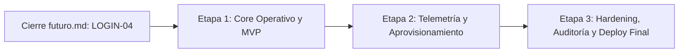

Una vez que terminen **`futuro.md`** (con la prueba integral `LOGIN-04` aprobada y el despliegue de base de datos/proxy de `INF-03`/`INF-04` funcionando), el sistema tiene los cimientos completamente resueltos: autenticación segura, 2FA persistido, usuarios, roles, bloqueo por recursos, auditoría append-only (`BAC-18`) y el contrato base del canal de eventos (`BAC-21`).

**RF-12 (organizaciones / multi-tenant) queda descartado del MVP por decisión del equipo.** Ninguna tarea de las tres etapas siguientes debe reservar `organization_id` en ninguna tabla; si se retoma en el futuro, va a requerir migración y backfill de todo lo ya construido.

**La integración con un servidor SMTP real queda formalmente descartada del alcance del proyecto.** La entrega de correos queda resuelta de forma definitiva mediante el simulador por consola `MockEmailService` (desacoplado a través del puerto `EmailService`), cumpliendo con la política de mínimo privilegio (Zero-Trust), sanitización de logs y control estructurado de errores sin dependencia de infraestructura externa.

A partir de ahí, entran de lleno a **las funcionalidades operativas del hipervisor**. Para no improvisar y tener todo listo en ClickUp antes de que terminen la semana que viene, el trabajo que sigue debe estructurarse en **3 etapas consecutivas** hasta la entrega final:

---

### 🗺️ Visión General de las Etapas Posteriores

---

### 🚀 ETAPA 1: Core Operativo de Proxmox y MVP (El corazón del sistema)

> **Objetivo:** Cumplir el hito del primer entregable funcional. Que un usuario pueda entrar, ver la salud del nodo físico, listar sus máquinas reales y operarlas (prender/apagar) sin romper nada. Esta etapa asume **un único nodo Proxmox fijo**; el soporte multi-nodo (`RNF-07`) no está incluido y, si se necesita para el MVP, requiere modelar el nodo en la base de datos, un selector en el frontend y desacoplar la lógica de servicios del nodo fijo antes de empezar esta etapa.
> 
> 
> **Requerimientos cubiertos:** `RF-02` (Dashboard Host), `RF-03` (Inventario completo), `RF-04` (Ciclo de Vida con UPID) y `RF-11` de forma parcial (notificación de fin de tarea; el motor de alertas por saturación se completa recién en la Etapa 3).
> 
> 

#### 1. Backend (`Tayra` y `Lisandro`):

* **Adaptador de Telemetría del Nodo (`RF-02`):**
* Endpoint `GET /api/node/status` consumiendo `/nodes/{node}/status` de la API de Proxmox.

* Transformación y normalización de métricas (cálculo de % de CPU, conversión de bytes a GB en RAM y disco, uptime). Caché corta en Redis (no en memoria del proceso, para que sobreviva a múltiples réplicas del backend) para no saturar al hipervisor si hay múltiples consultas; el despliegue de Redis se agrega como tarea de infraestructura de esta etapa (ver punto 3).

* **Inventario Unificado Definitivo (`RF-03`):**
* Evolucionar `BAC-14` hacia el endpoint formal `GET /api/instances` que unifique VMs (QEMU) y Contenedores (LXC).

* Debe incluir: ID, nombre, tipo, estado (`running`/`stopped`), IP asignada (vía QEMU Guest Agent) y consumo actual.

* Aplicación estricta del filtrado RBAC: el Operador solo recibe su subconjunto de `user_instances`.

* **Motor de Tareas Asíncronas y Energía (`RF-04` / Crítico):**
* Endpoints de control: `POST /api/instances/{id}/status/{action}` (`start`, `shutdown`, `stop`, `reboot`).

* Captura obligatoria del string **UPID** devuelto por Proxmox.

* *Worker / Task Poller* en segundo plano que sondee periódicamente `/nodes/{node}/tasks/{upid}/status` hasta que termine o falle.

* Servicio de notificación (WebSockets o SSE) que emita el evento de fin de tarea hacia el frontend, usando el esquema de evento genérico ya definido en la fase base (`BAC-21`), porque `RF-11` lo reutiliza en la Etapa 3 para alertas de saturación.

* `DELETE /api/instances/{id}` para eliminar una instancia (VM o LXC), tratada como acción destructiva con confirmación explícita en el frontend y seguimiento asíncrono por UPID igual que el resto de las acciones de ciclo de vida.

#### 2. Frontend (`Belinda`, `Luz` y `Cristian`):

* **Dashboard de Salud Global (`RF-02`):**
* Tarjetas de métricas (gauges / barras de progreso) de CPU, RAM, Almacenamiento y Uptime general del servidor host.

* Semáforo o badge de estado global del hipervisor (Normal / Advertencia / Inaccesible).

* **Vista de Inventario Filtrable (`RF-03`):**
* Tabla interactiva de instancias con badges de estado con código de colores (Verde = *Running*, Rojo/Gris = *Stopped*).

* Filtros dinámicos por nombre, tipo (VM vs LXC) y estado.

* **Controles de Energía Antierror (`RF-04`):**
* Botones de acción rápida con **modales de confirmación explícita** para evitar apagados accidentales.

* Patrón de interfaz *"Operación en progreso"*: al pulsar una acción, el botón entra en estado de carga (spinner), se bloquean los demás botones de esa máquina para evitar órdenes duplicadas y se escucha la resolución del UPID para mostrar un Toast de éxito/fallo.

#### 3. Infraestructura (`Nico` y `Lucas`):

* Asignar los permisos específicos `VM.PowerMgmt` y `Sys.Audit` al API Token de Proxmox con separación de privilegios activa.

* Validar la resolución de nombres y red interna entre el Backend y la API de Proxmox sobre `vmbr1`.

* Desplegar Redis (u otro almacén compartido equivalente) para la caché de estado del nodo, de modo que no dependa de la memoria de un único proceso backend.

> 🎯 **Prueba de Integración Etapa 1 (Hito MVP):**
> Un operador entra al sistema, ve solo las 2 máquinas que tiene asignadas en el inventario. Le da "Start" a una VM: la UI se bloquea con spinner, el Back recibe el UPID de Proxmox, espera la confirmación en segundo plano y la máquina pasa a estado verde con un Toast de éxito en el navegador.
> 
> 

---

### 📈 ETAPA 2: Telemetría Avanzada, Aprovisionamiento y Edición

> **Objetivo:** Dotar a la plataforma de monitoreo en tiempo real y capacidad de gestión de recursos con validación de cuotas.
> 
> 
> **Requerimientos cubiertos:** `RF-05` (Métricas por instancia), `RF-07` (Wizard de creación) y `RF-10` (Edición de recursos).
> 
> 

#### 1. Backend:

* **Streaming de Métricas (`RF-05`):**
* Canal WebSocket `/ws/metrics/{id}` que consuma periódicamente la serie temporal / RRDdata de Proxmox (CPU, RAM, Disco, Red) y la transmita sin sobrecargar la API REST.

* **Decisión de retención:** definir si el histórico corto (2h/24h) se sirve directamente desde el RRDdata que ya mantiene Proxmox o si el sistema necesita almacenamiento propio (por ejemplo, TimescaleDB) para consultas de tendencias más flexibles. Esta decisión condiciona el diseño del endpoint y debe tomarse antes de programarlo.

* **Aprovisionamiento Asistido con Control de Cuotas (`RF-07`):**
* Endpoint `POST /api/instances` para crear VMs o LXCs.

* **Algoritmo de validación de cuotas:** antes de enviar la orden a Proxmox, comprueba la RAM y disco disponibles en el host. Si los recursos no alcanzan, rechaza inmediatamente con `HTTP 409 Conflict` evitando sobreaprovisionar el servidor.

* Asocia automáticamente la nueva instancia creada a la matriz de permisos del creador (`user_instances`).

* **Edición Dinámica de Recursos (`RF-10`):**
* Endpoint `PUT /api/instances/{id}/config` para editar vCPU y RAM.

* Cálculo diferencial ($\Delta\text{RAM}$): valida que el host soporte el incremento solicitado antes de aplicar el cambio.

#### 2. Frontend:

* **Gráficos en Tiempo Real (`RF-05`):**
* Integración de componentes gráficos (Chart.js / Recharts) conectados al canal de WebSockets para mostrar histórico reciente y picos de consumo.

* **Wizard Guiado de 4 Pasos (`RF-07`):**
* Paso 1: Tipo (VM / LXC) $\rightarrow$ Paso 2: Recursos (Sliders de CPU/RAM con barras de cuota disponible en tiempo real) $\rightarrow$ Paso 3: Template/ISO y Red $\rightarrow$ Paso 4: Resumen y confirmación.

* **Validación de red en el Paso 3:** definir si la IP y la puerta de enlace se toman de un pool DHCP administrado por Proxmox o si el backend valida y reserva la IP antes de crear la instancia. Sin esta definición, el paso 3 no puede implementarse de forma consistente con `RF-07`.

* **Modal de Edición de Recursos (`RF-10`):**
* Ajuste de parámetros con advertencias visuales si el cambio exige reinicio de la máquina.

#### 3. Infraestructura:

* Mantener plantillas LXC (ej. Alpine/Debian) e imágenes ISO base optimizadas en los storages de Proxmox.

* Otorgar permisos `VM.Allocate` y `Datastore.AllocateSpace` al token de Proxmox.

---

### 🛡️ ETAPA 3: Auditoría Inmutable, Snapshots, Hardening y Cierre Final

> **Objetivo:** Completar los requerimientos de trazabilidad y respaldo, cerrar las notificaciones por saturación de recursos, auditar la seguridad y dejar el entorno listo para la defensa final.
> 
> 
> **Requerimientos cubiertos:** `RF-06` (Snapshots), `RF-08` (Audit Log inalterable), `RF-11` de forma completa (alertas por saturación y correo) y `RNF-01` a `RNF-06`.
> 
> 

#### 1. Backend:

* **Registro Inmutable de Auditoría (`RF-08`):**
* La tabla `audit_logs` y el interceptor de acciones administrativas (usuarios, roles, permisos, resets) ya existen desde la fase base (`BAC-18`, ver `futuro.md`), para no necesitar backfill. Acá solo falta ampliar el interceptor para cubrir las acciones operativas de Proxmox (energía, creación, borrado, UPID, resultado OK/Fallo).

* Endpoint paginado y filtrable `GET /api/admin/audit-logs`.

* Endpoint de exportación que respete los filtros aplicados.

* **Motor de alertas por saturación (`RF-11`):** evaluador periódico de la salud/consumo del nodo (CPU, RAM, disco) que dispare eventos de alta severidad sobre el mismo canal definido en `BAC-21`, con umbrales configurables y emisión a través del canal en tiempo real y el simulador de correo `MockEmailService`.

* **Puntos de Restauración / Snapshots (`RF-06`):**
* Endpoints para crear (`POST`), listar (`GET`) y revertir (`POST /rollback`) snapshots asociados al ciclo asíncrono de Proxmox.

#### 2. Frontend:

* **Vista de Auditoría (`RF-08`):**
* Tabla exclusiva para Administradores con filtros por usuario, fecha, máquina y tipo de evento.

* **Gestor de Snapshots (`RF-06`):**
* Pestaña dentro del detalle de cada instancia con alertas explícitas en rojo para acciones destructivas (revertir snapshot).

#### 3. Infraestructura y Equipo Completo (Cierre):

* **Configuración Final de Producción:** Nginx reverse proxy con terminación SSL/TLS y soporte completo de encabezados `Upgrade` para WebSockets sin caídas de sesión.

* **Smoke Test y UAT:** Simulación integral punta a punta de todos los casos de uso para la defensa académica.

* **Integración con proveedor SMTP real (Continuación de BAC-16 / Si alcanza el tiempo):**
  - Conectar el backend a un servidor SMTP real (SendGrid, Mailgun o servidor propio) mediante un nuevo adaptador `SmtpEmailService` que reemplace al actual `MockEmailService`.
  - Inyección de variables de entorno reales (`SMTP_HOST`, `SMTP_PORT`, `SMTP_USER`, `SMTP_PASSWORD`, etc.).
  - *Garantía de Arquitectura Hexagonal:* Gracias al puerto `EmailService`, ni la capa de dominio (`AuthService`, `UserService`) ni los handlers HTTP sufrirán ningún cambio; solo bastará con crear el adaptador SMTP y conectarlo en el `main.go`. Si el tiempo no alcanza antes de la entrega final, se deja como se implementó en la fase base (con el simulador de consola `MockEmailService`).

* **Evaluación de almacenamiento seguro de tokens (Mejora post FIX-10):**
  - Se implementó el almacenamiento de los JWT mediante `sessionStorage`.
  - Como mejora de seguridad para evaluar en esta etapa, analizar el uso de cookies `HttpOnly` y `Secure`, principalmente para el `refreshToken`, ya que evita que JavaScript pueda acceder directamente a este token y reduce su exposición ante ataques XSS. Esto requeriría adaptar el manejo del endpoint de refresh en el backend para emitir y leer la cookie.

---

### 📋 Cuadro Resumen de Carga para ClickUp

| Etapa | Foco Funcional | Backlog Backend | Backlog Frontend | Infraestructura |
| --- | --- | --- | --- | --- |
| **Etapa 1** *(Inmediata tras futuro.md)* | **Core MVP Proxmox** (`RF-02`, `RF-03`, `RF-04`, `RF-11` parcial)

 | Poller del host, unificación DTOs instancias, endpoints de energía y borrado, worker de sondeo UPID sobre el canal de eventos de `BAC-21`.

 | Dashboard del nodo, tabla de instancias con filtros, botones antierror y toasts.

 | Permisos `VM.PowerMgmt` y `Sys.Audit` en token Proxmox, despliegue de Redis para caché de estado.

 |
| **Etapa 2** | **Telemetría y Cuotas** (`RF-05`, `RF-07`, `RF-10`)

 | WebSockets de métricas, validación de cuotas libres en host y creación de instancias.

 | Gráficos en vivo (Chart.js), Wizard de 4 pasos con barras de cuota y modal de edición.

 | Storage con ISOs y plantillas LXC livianas.

 |
| **Etapa 3** | **Seguridad y Cierre** (`RF-06`, `RF-08`, `RF-11`, Deploy)

 | Ampliación del interceptor de `audit_logs` a acciones operativas, endpoint de consulta/exportación, motor de alertas por saturación con SMTP, endpoints de snapshots asíncronos.

 | Visor de auditoría con filtros, modales destructivos de snapshot.

 | Nginx con TLS/WSS enrutado y ensayo de demo en vivo.

 |