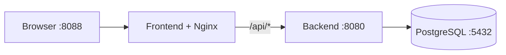

# Manejo del repositorio de integración

Este repositorio guarda una combinación validada del frontend y el backend de El Centinela. Los submódulos fijan commits concretos; no copian ni sincronizan automáticamente el código.

| Componente | Ruta | Repositorio | Rama seguida |
|---|---|---|---|
| Frontend | `frontend` | `https://github.com/luzpacello/centinela-front.git` | `main` |
| Backend | `backend` | `https://github.com/tayraag/centinela-back.git` | `main` |

La aplicación Vite está dentro de `frontend/centinela`. El backend está en la raíz de `backend` y escucha en el puerto `8080`.

## Clonar con los submódulos

```bash
git clone --recurse-submodules https://github.com/micaelaalvaradomendez/centinela.git
cd centinela
```

Si el repositorio ya fue clonado:

```bash
git submodule sync --recursive
git submodule update --init --recursive
```

## Mantener la copia local actualizada

Para traer cambios del repositorio raíz y posicionar los submódulos en los commits registrados:

```bash
git pull --recurse-submodules
git submodule update --init --recursive
```

Para revisar el estado y los commits fijados:

```bash
git status
git submodule status
git diff --submodule=log
git -C frontend log -1 --oneline
git -C backend log -1 --oneline
```

En `git submodule status`, un prefijo `+` indica que el directorio está en un commit diferente del registrado; `-` indica que todavía no fue inicializado.

## Actualizar los punteros manualmente

Comprobar primero que no haya trabajo local dentro de los submódulos:

```bash
git -C frontend status --short
git -C backend status --short
```

Actualizar ambos a sus ramas `main`:

```bash
git submodule update --remote --merge frontend backend
git diff --submodule=log
```

Actualizar solo uno:

```bash
git submodule update --remote --merge frontend
# o
git submodule update --remote --merge backend
```

Después de validar la integración, guardar los punteros nuevos:

```bash
git add frontend backend
git commit -m "chore: actualizar submódulos"
git push origin main
```

No usar `git add .` para esta operación: conviene confirmar explícitamente qué punteros se están publicando.

## Fijar commits específicos

```bash
git -C frontend fetch origin
git -C frontend checkout --detach <SHA_FRONTEND>

git -C backend fetch origin
git -C backend checkout --detach <SHA_BACKEND>

git add frontend backend
git diff --cached --submodule=log
git commit -m "chore: fijar versiones de integración"
git push origin main
```

El estado `detached HEAD` dentro de un submódulo es normal: el repositorio raíz fija un commit, no una rama móvil.

Para descartar una actualización no confirmada y regresar a los commits registrados:

```bash
git submodule update --init --recursive --checkout
```

No ejecutar ese comando si hay cambios sin confirmar dentro de los submódulos.

## Ejecutar el sistema completo con Docker

La integración usa tres contenedores separados:

- `frontend`: compila Vite y sirve el resultado con Nginx.
- `backend`: compila y ejecuta la API Go.
- `db`: ejecuta PostgreSQL 16 y carga `backend/scripts/init.sql`.

Separarlos es conveniente porque reproduce los límites reales de red, permite reiniciar cada servicio por separado y evita instalar Go, Node y PostgreSQL directamente en la máquina. No es obligatorio para desarrollar una pantalla aislada, pero sí es la forma recomendada de validar la integración completa.



Nginx elimina el prefijo `/api`: una petición a `/api/auth/login` llega al backend como `/auth/login`. Esto coincide con `VITE_API_BASE_URL=/api` del frontend y evita configurar CORS para el entorno integrado.

### Arrancar

```bash
./scripts/centinela.sh up
```

La aplicación queda disponible en `http://localhost:8088` y la API también queda expuesta en `http://localhost:8080`. PostgreSQL permanece aislado en la red interna de Compose y el backend lo alcanza mediante el hostname `db`.

### Operaciones disponibles

```bash
./scripts/centinela.sh status
./scripts/centinela.sh logs
./scripts/centinela.sh rebuild
./scripts/centinela.sh down
./scripts/centinela.sh reset
```

`reset` elimina también el volumen de PostgreSQL y todos sus datos locales.

Para personalizar puertos o credenciales de desarrollo:

```bash
cp .env.example .env
```

Los valores incluidos son solo para desarrollo local. No usar esas claves ni contraseñas en pruebas compartidas o producción.

### Comandos Docker equivalentes

```bash
docker compose up --build --detach --wait
docker compose ps
docker compose logs --follow
docker compose down
```

## Validación manual antes de publicar punteros

```bash
docker compose build
(cd backend && go test ./...)
corepack enable
pnpm --dir frontend/centinela install --frozen-lockfile
pnpm --dir frontend/centinela lint
pnpm --dir frontend/centinela build
```

El frontend todavía no incluye Playwright ni otro runner E2E. Por eso, en esta etapa el workflow realiza un smoke test HTTP, no una prueba funcional completa del login y 2FA.

### Pruebas del frontend

```bash
corepack pnpm --dir test/front install
corepack pnpm --dir test/front test
```

La suite contrasta las tareas frontend de `documentacion/actual.md`. Sus resultados de referencia están en `test/front/RESULTADOS.md`.

### Pruebas del backend

```bash
cd test/back
go test -v -count=1 ./...
```

Esta suite valida la API del backend con Docker y PostgreSQL, y corresponde a la carpeta `test/back` del repositorio raíz.

## Workflows comprobados

Al 14/09/2026:

- El backend contiene `.github/workflows/deploy-back-test.yml`.
- Ese workflow se dispara con pushes a `main`, usa un runner `self-hosted`, compila la API y la despliega al CT 102.
- No ejecuta `go test ./...` antes del despliegue.
- No existe `bump-integration.yml` en frontend ni backend.
- El workflow del backend despliega el componente, pero no actualiza este submódulo.

El workflow de integración de este repositorio está en `.github/workflows/integration-tests.yml`. Inicializa los submódulos, construye los tres contenedores, espera sus healthchecks y comprueba el frontend y la ruta de la API a través de Nginx.

## Actualización automática de submódulos

El workflow propuesto originalmente no debe usar `git checkout main && git pull` porque puede guardar un commit distinto de `${{ github.sha }}`. Además, dos pushes simultáneos de frontend y backend pueden intentar modificar `main` al mismo tiempo.

La automatización correcta debe seguir este flujo:

1. Frontend o backend valida su propio commit.
2. El repositorio de origen envía un `repository_dispatch` a `micaelaalvaradomendez/centinela` con `component` y el SHA exacto.
3. Un workflow central usa `concurrency` para serializar las actualizaciones.
4. Hace `git -C "$COMPONENT" fetch origin "$SHA"` y `git -C "$COMPONENT" checkout --detach "$SHA"`.
5. Ejecuta `docker compose up --build --detach --wait` y los smoke tests.
6. Solo si pasan, confirma el puntero y hace push.

Para enviar el evento desde el frontend o backend:

```yaml
- name: Notify integration repository
  env:
    GH_TOKEN: ${{ secrets.INTEGRATION_PAT }}
  run: |
    gh api \
      --method POST \
      repos/micaelaalvaradomendez/centinela/dispatches \
      -f event_type=update-submodule \
      -f client_payload[component]=frontend \
      -f client_payload[sha]="${GITHUB_SHA}"
```

En el backend se cambia `component=frontend` por `component=backend`.

El secret `INTEGRATION_PAT` debe ser un fine-grained token con acceso únicamente a `micaelaalvaradomendez/centinela` y permiso `Contents: Read and write`. Debe guardarse en los repositorios frontend y backend, nunca en un archivo versionado.

## Limitaciones actuales

- El backend no expone `/health`; el entorno Docker comprueba por ahora que acepte conexiones TCP en `8080`.
- PostgreSQL se inicializa y GORM crea las tablas, pero no existe un usuario inicial persistente. Para probar login inmediatamente se necesita un seed o un endpoint de registro compatible.
- El `go.mod` declara Go `1.27.1`, mientras que el README del backend todavía menciona Go 1.22.
- La automatización `repository_dispatch` requiere agregar un workflow en cada repositorio de origen; no puede instalarse únicamente desde este repositorio.

## Regla operativa

Los cambios de código se confirman y publican primero en el repositorio del componente. Este repositorio solo debe guardar punteros a commits existentes, configuración compartida, automatización y pruebas de integración.